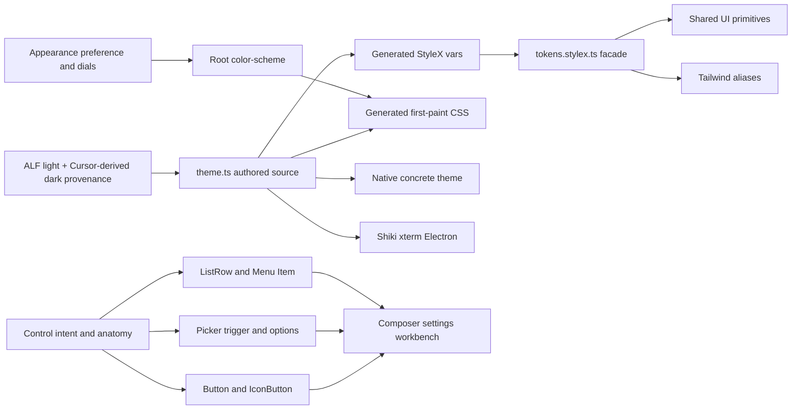

# Canonical styling and component-system migration

## Architecture decisions

- Preserve the accepted palette split. Honk’s light palette follows Bluesky ALF’s default contrast/primary/positive/negative ramps. Dark restores Honk’s prior Cursor-derived palette from git, based on `BioHazard786/cursor-theme-vscode`: `#141414` chrome, `#181818` editor/inset, `#252526` elevation, `#E4E4E4EB` foreground, and `#599CE7` accent. Pin both sources in provenance and do not silently retune either appearance.
- Treat the current visual problem as a component-language problem, not a palette problem. Keep the Bluesky palette; fix the control grammar and state hierarchy. Do not mechanically migrate the conflicts below.
- Known conflicts today:
  - `[packages/ui/src/button.tsx](packages/ui/src/button.tsx)`: `secondary` and `outline` share the same ring/bevel chrome, so settings triggers and composer footer pills read as different species of the same control.
  - `[packages/app/src/composer.tsx](packages/app/src/composer.tsx)`: model preset uses a ghost `Button` trigger plus `footerPillStyle`, then overrides every `Menu.Item` into a two-line card (`height: auto`, custom `presetRowTop` / `presetSub`). Mode uses another ghost pill with per-mode tint in `[packages/app/src/index.css](packages/app/src/index.css)` via `data-mode`.
  - `[packages/ui/src/list-row.tsx](packages/ui/src/list-row.tsx)` vs `[packages/app/src/home.tsx](packages/app/src/home.tsx)`: home reimplements `navRow` with different hover fill (`layer-01` vs `state-hover`), ring shadow, font weight, and `cursor: default`, so project/thread navigation does not match command-menu and directory-picker rows.
  - `[packages/ui/src/menu.tsx](packages/ui/src/menu.tsx)` vs `ListRow`: menu items are compact command rows; list rows are persistent navigation/selection rows. Composer preset options currently sit in the wrong primitive and force one-off layout.
  - `[packages/ui/src/preset-dial.tsx](packages/ui/src/preset-dial.tsx)` is unused while settings still uses ad hoc `Menu` + `Button` steppers (`// @honk/ui has no Slider/Select yet` in `[packages/app/src/settings.tsx](packages/app/src/settings.tsx)`), so preset/model/theme controls have no shared picker language.
- Define primitives by user intent:
  - `Button` / `IconButton`: momentary commands only; primary, neutral, quiet, and destructive emphasis.
  - `Picker`: a value-bearing trigger plus single-choice popup; supports compact and rich two-line options, selected indication, leading icon, trailing metadata, and native presentation later.
  - `ListRow`: persistent collection/navigation rows with leading, title, description, metadata, and selected state.
  - `Menu.Item`: transient commands; compact and normally one line. A menu is not a generic list-row container.
  - Search and mention results may reuse option anatomy, but keep their combobox/listbox focus behavior rather than pretending to be Buttons or Menu items.
- Use a quiet, flat workbench treatment over the existing palette: one hairline or one fill, never a bevel plus competing ring; selected rows use a stable subtle fill, hover is transient, open picker triggers remain visibly open, and focus is distinct from selection. Accent remains reserved for primary intent, focus, and meaningful selection.
- Ship one default `Honk Workbench` theme. Keep `system | light | dark`, with dark mapped to Honk’s existing Cursor-derived palette; do not add a separate dim preference, OpenCode’s theme registry, seed resolver, CSS cache, dual v1/v2 token stacks, or user-imported themes.
- Make `[packages/ui/src/theme.ts](packages/ui/src/theme.ts)` the only authored source for shared concrete colors and cross-platform metrics. Keep the selected ALF light and Cursor-derived dark values local and explicit rather than adding upstream runtime dependencies. Add semantic syntax and terminal/ANSI roles from those accepted palettes so Shiki, xterm, Electron chrome, and native UI do not maintain separate copies.
- Generate both `[packages/ui/src/platform-tokens.stylex.ts](packages/ui/src/platform-tokens.stylex.ts)` and a static first-paint CSS projection from `theme.ts`. Turn `[packages/ui/src/tokens.stylex.ts](packages/ui/src/tokens.stylex.ts)` into the stable public facade that re-exports generated shared variables and owns only web-only concerns such as elevation, motion, z-index, shell, toast, and prose.
- Keep `[packages/ui/src/tailwind.css](packages/ui/src/tailwind.css)` as aliases onto the same `--honk-*` variables. No copied Tailwind palette.
- Styling channels are fixed: shared component internals use StyleX; app layout/composition uses Tailwind; repeated visual recipes move into `@honk/ui`; component-scoped third-party selectors use `*.module.css`; root resets and vendor baseline imports remain plain CSS; JS-only renderers resolve concrete theme values.
- Keep the existing explicit `HonkStyle` primitive boundary instead of introducing a broad Astryx-style `xstyle` prop that would recreate scattered styling ownership.

## 1. Settle the visual component contract

- Inventory every interactive surface in `packages/app` and classify it as command, value picker, persistent row/navigation, transient menu command, or search result. Record intentional exceptions such as Lexical results that must retain editor focus.
- Add a `Controls` matrix to `[packages/ui/dev/main.tsx](packages/ui/dev/main.tsx)` covering `Button`, `IconButton`, `ListRow`, `Menu`, and the new `Picker` side by side. Include light/dark, rest/hover/pressed/focus/open/selected/disabled, icons, long labels, two-line options, narrow width, and keyboard state. Add a real composer-footer fixture because isolated primitives do not expose hierarchy conflicts.
- Tune geometry and state treatment in the gallery before changing app call sites. Preserve the accepted ALF-light/Cursor-dark split; change component anatomy, spacing, typography, radius, border/elevation use, and state hierarchy. Capture the accepted matrix in `[.design/exemplars.md](.design/exemplars.md)`.
- Refactor `[packages/ui/src/button.tsx](packages/ui/src/button.tsx)` so each variant has one distinct purpose. Converge the duplicate `secondary`/`outline` treatments, remove the neutral bevel, and keep call-site styling for layout only—not radius, surface, ring, typography, or state overrides.
- Add a platform-ready `Picker` compound under `[packages/ui/src](packages/ui/src)` using the installed headless primitives after verifying their types. Its public contract expresses selected value, option anatomy, and intent rather than DOM Menu props; web owns anchored popup behavior and native can later map the same contract to a native menu or sheet.
- Tighten `[packages/ui/src/list-row.tsx](packages/ui/src/list-row.tsx)` around persistent row semantics, and keep `[packages/ui/src/menu.tsx](packages/ui/src/menu.tsx)` command-oriented. Share semantic state values through tokens, not by making one over-general component impersonate every control.

## 2. Land the theme and control foundation atomically

- Implement `[packages/ui/scripts/sync-platform-tokens.mjs](packages/ui/scripts/sync-platform-tokens.mjs)` with write and `--check` modes; wire it into `[packages/ui/package.json](packages/ui/package.json)`, root lint, and `check:mobile`.
- In one cutover, remove overlapping shared `defineVars` blocks from `tokens.stylex.ts`, generate the platform binding/static CSS, update `[packages/ui/src/index.ts](packages/ui/src/index.ts)` exports, and keep all app/UI consumers on `@honk/ui/tokens.stylex`.
- Formalize the ALF-light/Cursor-dark mapping before adding roles: record the source for each semantic value and add a parity fixture so generation cannot accidentally change accepted product colors. Add syntax and terminal roles from those palettes, using dedicated Honk values only where neither source has an equivalent and checking text/selection contrast. Update `[packages/app/src/markdown.tsx](packages/app/src/markdown.tsx)` to use dual Honk Shiki themes and `[packages/app/src/workbench-terminal.tsx](packages/app/src/workbench-terminal.tsx)` to use the full theme, react to appearance changes, and honor code font size.
- Keep the control token set small and semantic: geometry shared by the control families plus surface/state roles for rest, hover, press, open, selected, disabled, and focus. Do not create component-name aliases or a second palette to make migration easier.
- Copy OpenCode’s no-flash idea without duplicating colors: add a tiny blocking appearance preload before the stylesheet in `[packages/app/index.html](packages/app/index.html)` that restores `color-scheme`; let generated static token CSS paint the root. Rename the stale `honk:app-next:*` storage key in `[packages/app/src/appearance-store.ts](packages/app/src/appearance-store.ts)`.
- Derive Electron’s initial/runtime background and native theme source from the same theme through `[packages/desktop/src/window/desktop-window.ts](packages/desktop/src/window/desktop-window.ts)`, the existing preload bridge, and appearance actions. Keep `[packages/mobile/src/ui.tsx](packages/mobile/src/ui.tsx)` on `resolveNativeTheme()` rather than CSS parsing.

## 3. Prove the system in the composer and settings

- Replace `[packages/app/src/composer.tsx](packages/app/src/composer.tsx)`’s `footerPillStyle`, custom `locationChip`, bespoke model-menu row styles, and the `index.css` mode-chip override. Use `Picker` for model preset and project location, a purpose-built quiet mode control for the cycling mode action, canonical `IconButton` for attachment/send, and one consistent footer height and baseline.
- Replace `[packages/app/src/home.tsx](packages/app/src/home.tsx)`’s bespoke `navRow` with canonical `ListRow` (or a thin `NavRow` variant that shares the same state tokens) so project/thread navigation matches command-menu and directory-picker rows.
- Make the model picker the rich-option acceptance case: provider icon, preset label, main variant metadata, Main/Sidekick description, and selected indicator must remain legible without turning every option into a card. Trigger and popup must handle long model names and narrow composer widths.
- Replace settings’ raw `navButton` with canonical persistent rows and its Theme/Density/provider choice menus with `Picker`. Keep momentary actions such as Save, Reset, Refresh, and Disconnect as Buttons.
- Bring composer `/` and `@` result rows onto the option anatomy without changing Lexical’s focus-retention and listbox keyboard behavior.
- Only after these real composites look coherent should the primitives be declared canonical for the rest of the migration.

## 4. Make the canonical path enforceable

- Extend the existing `[.design/oxlint-plugin.mjs](.design/oxlint-plugin.mjs)` rules to reject duplicate `defineVars`, null StyleX overrides, unapproved inline host styling, raw values outside sanctioned token/intrinsic files, and new styling systems.
- Add deterministic checks against app-level visual overrides on shared interactive primitives: no call-site radius/surface/ring/typography/state styling on Button, Picker, ListRow, or Menu items; wrappers may own layout. Reject new raw `<button>` implementations where a canonical primitive fits, with explicit exceptions for focus-sensitive editor/listbox behavior.
- Replace stale `packages/app-next` scopes with `packages/app` and add `packages/mobile`-appropriate coverage in `[.oxlintrc.json](.oxlintrc.json)`, `[.design/oxlintrc.json](.design/oxlintrc.json)`, and `[.design/lint.mjs](.design/lint.mjs)`. Keep `.design/lint.mjs` for repository/cross-file invariants; use Oxlint for AST-local rules.
- Extend `[stylelint.config.mjs](stylelint.config.mjs)` to enforce the escape-hatch policy: modules for component-scoped third-party selectors, tokenized declarations, and no product component selectors in global CSS.
- Write `[docs/stylex-migration.md](docs/stylex-migration.md)` as the component decision table, ownership contract, and migration ledger, including the source split: Bluesky ALF for light palette/mobile prior art, Honk git plus Cursor Theme for dark palette, OpenCode for workbench semantic layering/no-flash behavior, and Astryx for StyleX migration enforcement. Update `[.design/README.md](.design/README.md)`, `[.design/exemplars.md](.design/exemplars.md)`, `[packages/ui/AGENTS.md](packages/ui/AGENTS.md)`, and the styling skills so examples and checks describe the same system.

## 5. Migrate in dependency order

- App leaves first: replace duplicate action/row/picker chrome, then convert layout-only StyleX in `[workbench-tasks.tsx](packages/app/src/workbench-tasks.tsx)`, `[workbench-files.tsx](packages/app/src/workbench-files.tsx)`, `[workbench-changes.tsx](packages/app/src/workbench-changes.tsx)`, `[directory-picker.tsx](packages/app/src/directory-picker.tsx)`, and `[update-pill.tsx](packages/app/src/update-pill.tsx)` to Tailwind composition while preserving dynamic/intrinsic values explicitly.
- Shared/native leaves next: finish platform-resolved Text, Button, Field/TextField, Picker, ListRow, Checkbox, and Switch APIs under `[packages/ui/src](packages/ui/src)`, then replace duplicate wrappers in `[packages/mobile/src/ui.tsx](packages/mobile/src/ui.tsx)` and migrate mobile screens leaf-first.
- Ownership cleanup: convert Sonner restyling to `[packages/ui/src/toast.module.css](packages/ui/src/toast.module.css)`, keep xterm’s vendor baseline global, move scoped xterm/Sonner DOM overrides into modules, and consolidate repeated attachment, field, overlay, and control chrome into shared primitives.
- App composites last: migrate `[home.tsx](packages/app/src/home.tsx)`, `[command-menu.tsx](packages/app/src/command-menu.tsx)`, `[composer.tsx](packages/app/src/composer.tsx)`, `[thread.tsx](packages/app/src/thread.tsx)`, `[workbench.tsx](packages/app/src/workbench.tsx)`, `[settings.tsx](packages/app/src/settings.tsx)`, and onboarding only after their leaves and shared APIs are stable.

## 6. Agent and verification contract

- Give each agent one semantic component family—not an arbitrary file batch—the canonical gallery fixture, forbidden escape hatches, and a checklist: preserve behavior; use the right control for the intent; no component-chrome overrides; no raw values; no new globals; no duplicate tokens; update the ledger.
- Require before/after evidence for each wave: light/dark, desktop/narrow, hover/focus/pressed/disabled, overlays, long content, and iOS/Android for native leaves. Treat unplanned drift from the accepted ALF-light/Cursor-dark baseline as a regression. Compare computed CSS/DOM where selector behavior is complex; manually inspect theme branches and third-party internals.
- For controls, verify the full cluster as well as isolated stories: model picker next to mode/location/attachment/send, settings navigation next to settings controls, and selected rows next to hovered rows. A primitive passing alone does not prove the composition is coherent.
- Per wave, run the package typecheck, token `--check`, Oxlint/design lint, Stylelint for touched CSS, and only the specific tests added or changed. Use an already-running gallery/app for visual QA; ask before starting a dev server.
- Finish by removing temporary exceptions and stale `app-next` references, then run repository typecheck and lint once the migration ledger is complete.
