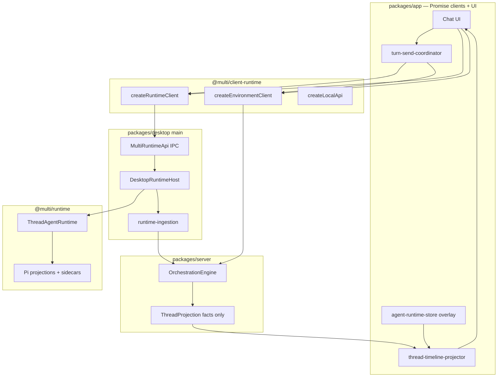

# Chat Foundation Integrated + Dual SDK UI Boundaries

This plan replaces the older incremental duplicate-user-bubble plan with a stricter boundary rewrite from [`dual_sdk_ui_boundaries_61c82fb4.plan.md`](dual_sdk_ui_boundaries_61c82fb4.plan.md).

The objective is still the chat foundation end state: duplicate user rows, git dual-path rows, pending-row storage, server `chatTimelineRows`, and renderer-side semantic row synthesis should become illegal states. The deletion target is broader now: old chat merge helpers are deleted together with renderer-side runtime ingestion and runtime fallback paths that violate the Pi-core boundary.

## Core Invariant

Pi is the agent engine. Multi extends Pi through `@multi/runtime`. The app never imports Pi, never synthesizes durable orchestration facts from runtime streams, and never sends a turn by hand from UI components.

## Boundary Rules

| Package | Allowed | Delete / forbid |
|---------|---------|-----------------|
| `packages/app` | `@multi/contracts`, `@multi/client-runtime`, `@multi/shared`, React stores for UI state | Pi imports, `@multi/runtime`, server imports, Effect services, IPC channel strings, renderer orchestration ingestion |
| `packages/client-runtime` | Promise clients for `MultiRuntimeApi`, `EnvironmentApi`, `LocalApi` | Pi, server internals, UI state |
| `packages/runtime` | Pi SDK imports, projections, `ThreadAgentRuntime`, sidecars | React, app stores, desktop IPC details |
| `packages/desktop` | `@multi/runtime`, IPC, runtime ingestion, Effect runtime services | Pi types in renderer/preload |
| `packages/server` | durable orchestration facts and projections | Pi execution, runtime display rows, `chatTimelineRows` |

App uses two agent-adjacent SDK surfaces:

| API | Transport | Owns |
|-----|-----------|------|
| `MultiRuntimeApi` | Electron IPC | Pi execution: `sendTurn`, `abort`, `hydrateThread`, credentials, host events |
| `EnvironmentApi` | WebSocket RPC | Durable orchestration facts, projects, git, terminal, thread snapshots |
| `LocalApi` | IPC | Shell/local UI operations only, not agent/environment proxying |

## Chat Foundation Invariants

The final system must make these states impossible:

- Two visual user rows for one send.
- Git action prompt plus separate `customType: "git-agent-action"` chat row.
- Runtime user echo appending a second committed message.
- Pending/send-intent row storage deciding durable transcript content.
- Completed work group plus synthetic `Thinking`/waiting for the same active status surface.
- Runtime-only user-only display timeline replacing committed transcript on reload.
- Server `chatTimelineRows` competing with app projector rows.
- Renderer store dispatching orchestration persistence commands from Pi runtime streams.
- UI components manually dual-writing WS and IPC send paths.

## Durable Identity

One `MessageId` is assigned at send and used everywhere:

1. `coordinateTurnSend` receives `clientMessageId`.
2. `EnvironmentApi.orchestration.dispatchCommand({ type: "thread.turn.start", messageId: clientMessageId, ... })`.
3. `MultiRuntimeApi.sendTurn({ clientMessageId, ... })`.
4. `@multi/runtime` persists `CLIENT_MESSAGE_ID_SIDECAR_TYPE = "multi.client-message-id"` beside Pi JSONL user entries.
5. Session-tree projection emits `clientMessageId`; app merge aliases runtime user facts to existing committed rows.

Old Pi JSONL without sidecars is handled by enrichment alias rules, not timestamp/text display dedupe.

## Target UI Shape

`thread-timeline-projector.ts` is the only semantic row projector.

Inputs:

- committed `ChatMessage[]`, entries, activities, proposed plans from `EnvironmentApi`
- runtime display overlay from `MultiRuntimeApi` host events
- `ThreadSendIntent[]` for local in-flight sends
- active turn state for waiting-row eligibility

Output:

- ordered `TimelineEntry[]`
- stable row ids, especially `message:${MessageId}`
- explicit `kind: "waiting"` entries when no current status surface exists

`MessagesTimeline` virtualizes and renders rows only. It does not synthesize semantic waiting rows, dedupe user messages, filter git custom rows, or merge runtime/committed transcript branches.

## Build Order

### P0 — Boundary Contract

Write or update architecture documentation:

- `packages/app/ARCHITECTURE.md`
- `packages/server/README.md`
- import/ownership table from this plan

Add or extend boundary checks so they fail on:

- Pi imports outside `@multi/runtime`
- `@multi/runtime` imports in app
- app imports from server internals
- Effect service usage in React stores or UI modules

### P1 — Client Runtime And Fallback Deletion

Create or centralize `@multi/client-runtime`:

- `createRuntimeClient`
- `createEnvironmentClient`
- `createLocalApi`

Delete:

- `fallbackRuntimeApi`
- silent empty runtime host behavior
- scattered `window.multiRuntime` / `readNativeRuntimeApi` reads outside bootstrap/client construction

`readMultiRuntimeApi()` should require a desktop host and fail loudly when unavailable. Browser fallback stubs are out of scope for this app path.

### P2 — Turn Coordinator

Add `packages/app/src/lib/turn-send-coordinator.ts`.

Every send path calls `coordinateTurnSend`:

- composer send
- shell-host git actions
- queued sends and retry
- draft promotion
- worktree prep
- inline edit
- plan follow-up

Delete inline dual-write sequences from `chat-view.tsx`, `shell-host.tsx`, and `chat-send-queue-dispatch.ts`.

Coordinator responsibilities:

1. create/use one `clientMessageId`
2. write `ThreadSendIntent`
3. dispatch durable turn start through `EnvironmentApi`
4. call runtime `sendTurn` through `MultiRuntimeApi`
5. reconcile failure and retry without creating a second user row

### P3 — Runtime Identity And Desktop Ingestion

Keep the chat-foundation identity work:

- Pi JSONL client-message-id sidecars in `@multi/runtime`
- sidecar hydration in session-tree projection
- runtime user echo aliasing in app merge

Move ingestion ownership:

- add `packages/desktop/src/runtime/runtime-ingestion.ts`
- desktop main consumes `AgentRuntimeEvent` / session-tree completions from `DesktopRuntimeHost`
- desktop main writes durable facts through `EnvironmentApi` / WS dispatch commands

Delete from renderer/app stores:

- `persistRuntimeSessionTreeToOrchestration`
- `persistRuntimeEventToOrchestration`
- `dispatchRuntimePersistenceCommand`
- any `api.orchestration.dispatchCommand` path whose source is Pi runtime event persistence

After this, `agent-runtime-store.ts` is overlay/subscription state only.

### P4 — Single UI Projector

Keep and harden `thread-timeline-projector.ts` as the only semantic timeline module.

It owns:

- committed message/proposed-plan/work ordering
- runtime display overlay replacement rules
- `ThreadSendIntent` materialization
- runtime task/subagent rows
- waiting row eligibility
- suppressing runtime user-only regressions

Delete or avoid:

- `buildChatDisplayTimeline`
- `runtime-display-timeline` app merge helpers
- timestamp/text user dedupe as a display correctness mechanism
- semantic row synthesis in `MessagesTimeline`

Renderer-owned code that stays:

- virtualizer measurement/cache
- stable row object reuse
- presentational row rendering
- subagent tray UI fed from typed subagent store

### P5 — Server Facts Only

Server stores and exports durable facts only:

- messages
- entries
- activities
- proposed plans
- session metadata

Delete:

- `attachChatTimelineRows`
- `deriveChatTimelineRows`
- `OrchestrationChatTimelineRow`
- `OrchestrationThread.chatTimelineRows`
- shared `chat-timeline-derivation`

Branch navigation order is derived in the app projector from messages + entries, not a server display row list.

### P6 — Legacy Deletion Checklist

Before completion, grep source and delete or justify every hit:

- `PendingTimelineRow`
- `pending-thread-send-store`
- `pending-timeline-rows`
- `chat-display-timeline`
- `chat-view-timeline-cache`
- `runtime-display-timeline` app helper
- `runtimeDisplayRegressedToUserOnly`
- `dedupeUserMessagesByTimestampText`
- `chatTimelineRows`
- `OrchestrationChatTimeline`
- `RuntimeDisplayTimelineCustomMessageItem`
- renderer-side runtime persistence dispatch helpers
- `fallbackRuntimeApi`
- raw `window.multiRuntime` reads outside bootstrap/client-runtime

Intentional exceptions:

- Pi/session-tree raw `custom-message` facts may remain in contracts/runtime if Pi emits them.
- Git-agent product UI may remain on the user message row.
- Pending approval/user-input concepts are unrelated and should not be renamed/deleted.

## Verification Gate

Automated:

1. focused runtime sidecar/display tests
2. focused app tests for:
   - `thread-sync`
   - `thread-send-intent-store`
   - `chat-drafts`
   - `agent-runtime-store`
   - `thread-lifecycle`
   - `thread-timeline-projector`
   - `timeline-render-items`
   - `timeline-rows`
   - `tool-message`
   - turn coordinator tests once added
   - client-runtime/fallback deletion tests once added
3. focused desktop ingestion tests once added
4. focused server projection/decider tests
5. `pnpm run typecheck`

Manual:

- force reload a `new-thread-draft:*` git-action thread
- confirm one user bubble per send
- confirm no stacked Commit & Push row
- confirm no post-hydration row remount flicker
- confirm renderer store does not persist Pi runtime events to orchestration

Git:

- no commit until the user explicitly asks
- before any commit, inspect status and stage explicit paths only

## Completion Criteria

- App send paths use `coordinateTurnSend`.
- Runtime and environment clients are centralized.
- No app fallback runtime host remains.
- Pi imports exist only where allowed.
- No orchestration `dispatchCommand` from app stores for Pi runtime persistence.
- Runtime ingestion has moved out of renderer stores.
- Server no longer exposes chat timeline display rows.
- One projector owns semantic chat rows.
- `MessagesTimeline` renders only.
- Runtime custom git-action facts do not render as separate UI rows.
- Legacy display/pending/dedupe surfaces are deleted.
- Full typecheck and focused suites pass.
- Manual live reload gate passes or is explicitly deferred by user.

## Design Bias

Deletion beats compatibility. If a surface exists only to reconcile two old writers, remove the old writer and delete the reconciliation surface. Preserve behavior only when it belongs to the new boundaries: Pi execution in runtime/desktop, durable facts in server, turn coordination in app, and semantic chat rows in the projector.
