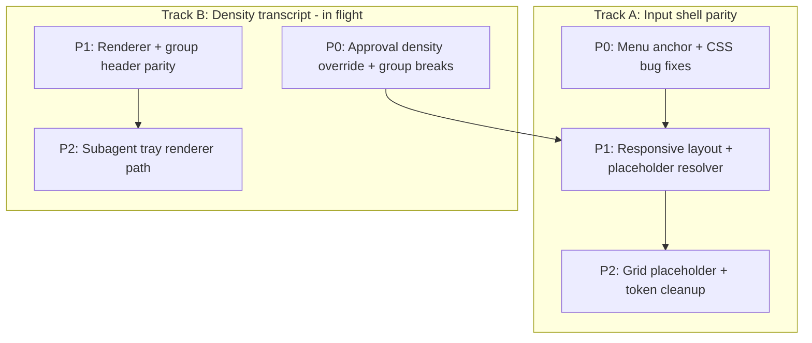

# Honk Composer Improvement Plan (Council Decision)

## Council consensus

Five research passes on Honk vs Cursor agreed on:

1. **Stay Lexical** — Honk’s chat composer (`[prompt-editor/index.tsx](packages/app/src/components/chat/composer/prompt-editor/index.tsx)`) already mirrors Cursor’s **IDE/Lexical** path. Do **not** migrate to TipTap or maintain two editor stacks.
2. **Already at parity** — 1×1 caret menu anchor, fixed top-start popover with shift-only collision, compact pill radius (`9999px`), `840px` chat column (`--agent-window-chat-max-width`), content-driven bar/pane expansion.
3. **Largest gaps** — width-correlated layout (no `isNarrow` @ 448px, no toolbar tiers @ 200/260/300), placeholder priority order (generating/worktree beat mode strings), menu `anchorRevision` not wired, broken context-bar scroll-hide selector, absolute vs grid placeholder.
4. **Separate track** — tool-call density / transcript parity (in-flight in git) is **above** the input box; finish P0 density wiring before composer chrome polish.
5. **Explicitly defer** — Cursor model picker UI, Claude Code strings, `new_placeholder` experiment flag, TipTap `ui-prompt-input`, explore grouping at Detailed/Balanced.




---

## Track B first (finish in-flight density — P0)

Unblocks stable transcript chrome before composer layout changes. Council + existing plan `[.cursor/plans/tool_call_density_parity_e4386db1.plan.md](.cursor/plans/tool_call_density_parity_e4386db1.plan.md)`.


| Task                                                 | File(s)                                                                                          | Why                                          |
| ---------------------------------------------------- | ------------------------------------------------------------------------------------------------ | -------------------------------------------- |
| Wire `approval` → `resolveEffectiveToolCallDensity`  | `[tool-message.tsx](packages/app/src/components/chat/message/tool-message.tsx)`                  | Pending approvals must force detailed layout |
| Break activity groups when step has pending approval | `[timeline-render-items.ts](packages/app/src/components/chat/timeline/timeline-render-items.ts)` | Cursor `zIb` behavior                        |
| Fix preview flash while turn active                  | `[step-renderer.tsx](packages/app/src/components/chat/timeline/step-renderer.tsx)`               | Collapsed preview must not unmount mid-run   |


Tests: extend `[timeline-render-items.test.ts](packages/app/src/components/chat/timeline/timeline-render-items.test.ts)`, `[tool-renderer.test.tsx](packages/app/src/components/chat/message/tool-renderer.test.tsx)`.

---

## Track A — P0: Ship-blocking composer fixes

Low-risk, high-signal fixes the council flagged as broken or incomplete.

### 1. Wire menu `anchorRevision` to reposition

`[command-menu/menu.tsx](packages/app/src/components/chat/composer/command-menu/menu.tsx)` receives `anchorRevision` from `[input.tsx](packages/app/src/components/chat/composer/input.tsx)` but does not consume it. Cursor equivalent: MutationObserver → `updateFloating()`.

- Destructure `anchorRevision` in `ComposerCommandMenuPositioned`
- Pass to Base UI positioner (e.g. `data-anchor-revision` on `PopoverPopup` or documented reposition hook)
- **Do not** `key={anchorRevision}` (jitter; see AGENTS.md)

### 2. Menu width/height parity

In `[command-menu/menu.tsx](packages/app/src/components/chat/composer/command-menu/menu.tsx)`:

- Unify slash + mentions to **300px** (`w-[300px]`)
- Align inner `CommandList` max-height with outer **342px** shell (remove redundant `20rem` cap)
- Add `data-menu-direction="up"` when `side="top"`

### 3. Fix context bar scroll-hide selector mismatch

`[conversation.css](packages/app/src/styles/conversation.css)` targets `[data-composer-context-usage-bar]` but `[context-usage-bar.tsx](packages/app/src/components/chat/composer/context/context-usage-bar.tsx)` renders `data-composer-thread-status-bar`.

- Align attribute name **or** update CSS selector
- Decide with product: keep Honk’s `agentWindowUsageSummaryDisplay` setting vs Cursor scroll-only behavior (council: fix selector regardless)

### 4. Harden menu anchor observer mount

`[prompt-editor/index.tsx](packages/app/src/components/chat/composer/prompt-editor/index.tsx)` — `ComposerMenuAnchorObserverSync` may miss mount if ref is null on first effect. Retry when span attaches (layout effect or ref callback).

### 5. Update AGENTS.md

- Fix path: `slash-menu.tsx` → `[command-menu/menu.tsx](packages/app/src/components/chat/composer/command-menu/menu.tsx)`
- Document DOM-range caret anchoring (not ProseMirror `coordsAtPos`)

---

## Track A — P1: Core composer parity

### 1. Responsive center pane (`isNarrow` @ 448px)

**Problem:** With panels open (260 + 300), center can be ~280px; Honk has zero narrow handling. Shell collapse (`[shell.css](packages/app/src/styles/shell.css)`) uses window totals (620/900/980), not center pane.

**Implementation:**

- Add `useComposerPaneWidth` (or `ResizeObserver` on `main[data-component="chat-panel"]` / composer form root) in `[chat-view.tsx](packages/app/src/components/chat/view/chat-view.tsx)`
- Expose `isComposerNarrow = width < 448` to `[input.tsx](packages/app/src/components/chat/composer/input.tsx)`
- Set `data-composer-narrow` on composer shell for CSS hooks

**Behavior when narrow:**

- Force **pane layout** (`isDockComposerExpanded`) even for single-line prompts — bar mode’s `max-w-[46%]` left cluster overflows below ~400px
- Apply toolbar tier rules (below)

### 2. Toolbar container queries (200 / 260 / 300px)

Cursor measures composer container (`Ep().width`); Honk should use `@container` on `[data-chat-input-footer]` or composer shell.


| Width       | Behavior                                                                                                                  |
| ----------- | ------------------------------------------------------------------------------------------------------------------------- |
| **< 300px** | Icon-only agent mode label (`[input.tsx](packages/app/src/components/chat/composer/input.tsx)` `ComposerAgentModePicker`) |
| **< 260px** | Hide context ring + percent on status bar; interaction chip text → icon/badge                                             |
| **< 200px** | Collapse model/agent controls into overflow menu; icon-only send/stop                                                     |


Replace blunt `max-w-[46%]` in toolbar left cluster with container-driven rules in `[conversation.css](packages/app/src/styles/conversation.css)`.

Context ring: council split — either move ring into bottom toolbar (Cursor parity) **or** apply same hide rules to `[context-usage-bar.tsx](packages/app/src/components/chat/composer/context/context-usage-bar.tsx)`. **Recommendation:** keep status bar, apply `<260px` hide to ring/percent only (preserve branch/execution labels as Honk differentiator).

### 3. Placeholder state machine

Extract inline 24-line ternary in `[input.tsx](packages/app/src/components/chat/composer/input.tsx)` (~L2292) to pure resolver:

**New file:** `[resolve-composer-placeholder.ts](packages/app/src/components/chat/composer/resolve-composer-placeholder.ts)`

**Priority (council-adopted, Honk-aware):**

```
override → suggestions (future) → queue edit → questionnaire →
debug repro (future) → approval → plan follow-up (Honk) →
worktree → preparing worktree → generating → inline-edit →
disconnected → mode fallback → compact "Send follow-up"
```

**Wire new inputs:**

- `isTurnRunning` → `"Add a follow-up"` (beats mode strings)
- `isPreparingWorktree` → placeholder (not footer-only)
- `hasConversationHistory` from `[chat-view.tsx](packages/app/src/components/chat/view/chat-view.tsx)`
- `isInWorktree` from execution mode / env props
- Optional `placeholder?: string` on `[input-contract.ts](packages/app/src/components/chat/composer/input-contract.ts)`

**Approval parity:** consider removing `isComposerApprovalState` from editor `disabled` (Cursor keeps input live; placeholder guides action).

**Tests:** `[resolve-composer-placeholder.test.ts](packages/app/src/components/chat/composer/resolve-composer-placeholder.test.ts)` — priority ordering edge cases.

### 4. Dynamic timeline bottom reserve

`[chat-view.tsx](packages/app/src/components/chat/view/chat-view.tsx)` uses fixed `DOCKED_COMPOSER_TIMELINE_RESERVE_PX = 96`. Measure composer stack height (queue panel, plan tray, expanded editor) and pass dynamic `bottomClearancePx` to timeline.

---

## Track A — P2: Polish and token alignment

### 1. Grid placeholder (optional Lexical parity)

Cursor’s 200% grid + `left:-100%` in `[prompt-editor/index.tsx](packages/app/src/components/chat/composer/prompt-editor/index.tsx)` + `[conversation.css](packages/app/src/styles/conversation.css)`:

- Enables multiline placeholder wrap in expanded mode
- Shares padding with editor (no ellipsis truncation on long strings)

Current overlay uses `white-space: nowrap; text-overflow: ellipsis` — fine for pill, wrong for expanded.

### 2. Shell padding/radius tokens

In `[conversation.css](packages/app/src/styles/conversation.css)`:

- Compact thread shell: `8px 10px 6px` (asymmetric bottom, Cursor parity)
- Alias `--honk-composer-radius-expanded` → shared `--conversation-surface-border-radius` (single token for message + composer corners)
- Consolidate expanded editor padding to one token `8px 12px` (remove scattered `px-3 pt-2` in `[input.tsx](packages/app/src/components/chat/composer/input.tsx)`)

### 3. Header chrome container rules

`[chat-header.tsx](packages/app/src/components/chat/view/chat-header.tsx)` declares `@container/header-actions` but has no rules. Add tiered hide for branch/env controls when header container < ~360px.

### 4. Suggest-next-prompt (defer product)

Cursor `zf()` / `cursor.composer.suggestNextPrompt` — phase 3 only if product wants it. Resolver already has hook points.

---

## What NOT to do


| Defer                                              | Reason                                                     |
| -------------------------------------------------- | ---------------------------------------------------------- |
| TipTap for chat composer                           | Wrong stack; plan editor TipTap stays isolated             |
| Cursor model picker                                | Honk uses Deep/Smart/Rush — only port responsive collapse |
| Claude Code / background-agent placeholder strings | No Honk surface                                           |
| `new_placeholder` experiment flag                  | Honk uses unified string by default                       |
| Moving branch labels into toolbar                  | Honk product choice                                       |
| 20-agent binary RE per release                     | Behavior reference only; symbols change each Cursor build  |


---

## Verification


| Phase            | Command                                                                                                                        |
| ---------------- | ------------------------------------------------------------------------------------------------------------------------------ |
| All code changes | `pnpm run typecheck` from repo root                                                                                            |
| New/edited tests | Run specific test from package root per AGENTS.md                                                                              |
| Manual           | Resize center pane < 448px with both panels open; verify pane layout + toolbar tiers; open `/` and `@` menus at viewport edges |


---

## Council vote summary


| Member      | Top priority                                                         |
| ----------- | -------------------------------------------------------------------- |
| UI parity   | Toolbar breakpoints + fix context-bar selector                       |
| Placeholder | Extract resolver; `isTurnRunning` + worktree branches                |
| Responsive  | `isNarrow` 448px on center pane; force pane layout                   |
| Menu anchor | Wire `anchorRevision`; 300px width; 342px height alignment           |
| Phasing     | Finish density P0 first; composer shell P0→P1→P2; no stack migration |


**Recommended execution order:** Track B P0 → Track A P0 → Track A P1 → Track B P1 → Track A P2 → Track B P2.