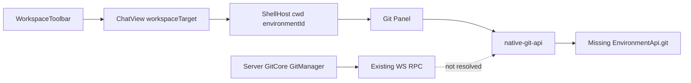

# Git Environment API Plan

## Diagnosis

Runtime logs show GitCore is not the failing layer:

- `ShellHost` and `ChatView` receive the selected workspace cwd after switching.
- `native-git-api.ts` reports `hasRuntimeGit:false` and `hasEnvironmentGit:false`, so the app has no Git candidate to call.
- `desktopBridge.runtime` only exposes agent runtime methods; `LocalApi` intentionally excludes Git.
- Server-side Git still lives behind `GitCore`, `GitManager`, and `GitStatusBroadcaster` in `packages/server/src/ws.ts`.

The broken boundary is: app workbench code resolves Git through `native-git-api.ts`, but the new desktop/runtime path does not expose an `EnvironmentApi.git` surface there.

## Approach

Keep GitCore server-side. Do not add Git to `desktopBridge.runtime` or `LocalApi`. Instead, make workbench APIs resolve through an explicit backend environment API boundary.

- Treat `[packages/server/src/git/GitCore.ts](packages/server/src/git/GitCore.ts)` and `[packages/server/src/git/GitManager.ts](packages/server/src/git/GitManager.ts)` as the source of truth.
- Preserve the existing efficient status stream in `[packages/server/src/git/GitStatusBroadcaster.ts](packages/server/src/git/GitStatusBroadcaster.ts)`.
- Make `[packages/app/src/lib/native-git-api.ts](packages/app/src/lib/native-git-api.ts)` stop meaning “desktop native bridge” and instead resolve “selected environment Git API”. Prefer renaming or wrapping it as `environment-git-api` to reduce confusion.
- If local desktop still uses WS for environment services, that is acceptable: ensure the primary environment connection is available before Git/files/terminal panels ask for `EnvironmentApi.git`.
- If WS is unavailable for a build mode, add a typed HTTP fallback for unary Git calls later; keep streaming status on WS/SSE, not repeated large polling.

## Implementation Steps

1. Revert speculative websocket fallback in `[packages/app/src/lib/native-git-api.ts](packages/app/src/lib/native-git-api.ts)` and keep the native-candidate logging until verification.
2. Introduce a small resolver, probably in `[packages/app/src/environment-api.ts](packages/app/src/environment-api.ts)` or a new `environment-git-api.ts`, that resolves Git by environment id using the registered environment connection, with a primary-environment fallback only when the ids match the primary descriptor.
3. Update `[packages/app/src/lib/git-status-state.ts](packages/app/src/lib/git-status-state.ts)`, `[packages/app/src/lib/git-react-query.ts](packages/app/src/lib/git-react-query.ts)`, and `[packages/app/src/hooks/use-environment-git.ts](packages/app/src/hooks/use-environment-git.ts)` to use that resolver consistently.
4. Keep data efficient:
  - Status stream sends summary plus changed file rows, not patches.
  - File patches stay lazy through `getFilePatch` when a file expands.
  - Branches stay paginated/searchable through `listBranches`.
  - Diff/PR/stacked actions remain explicit user-triggered calls.
5. Add focused tests for:
  - Git API unavailable when no environment API exists.
  - Git resolves when primary environment connection exists.
  - Workspace switching updates the workbench cwd/environment target.
6. Verify with the current debug flow, then remove instrumentation once logs prove:
  - selected cwd is `/Users/workgyver/Developer/multi`,
  - Git client resolves non-null,
  - `isGitRepo:true`,
  - branch controls render.

## Opencode Reference

From the `opencode` mirror, the useful pattern is not “desktop preload exposes Git”; it is server/service ownership of heavy local operations with typed API boundaries:

- `packages/opencode/src/server/routes/instance/httpapi/groups/instance.ts` exposes VCS status/diff as server routes.
- `packages/opencode/src/file/watcher` and service layers keep watch/event work out of UI components.
- Git diff/status are requested as explicit API operations, with large data such as raw diffs fetched on demand.

That maps well to our current server-side `GitCore`/`GitStatusBroadcaster`: keep computation in the backend, stream small status updates, and lazy-load expensive details.