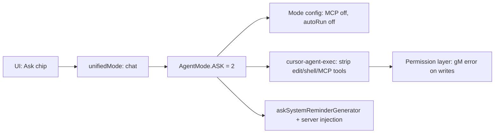
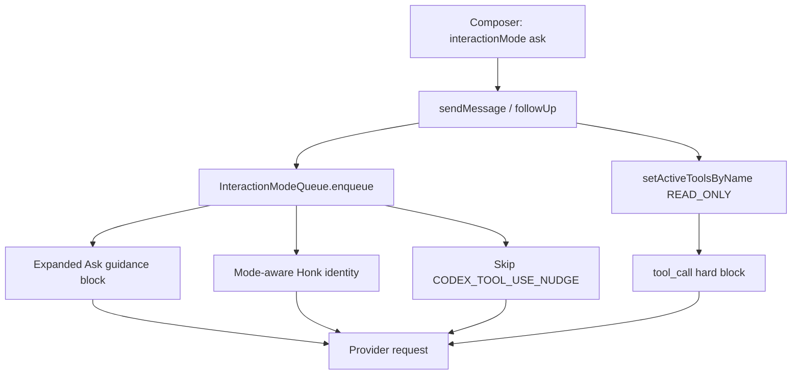

# Honk Ask Mode — Cursor Parity Plan

## What Cursor Ask Mode Actually Is

Cursor does **not** use an `ask` UI id. Ask mode is internally `**unifiedMode: "chat"`**, mapped to proto `**AGENT_MODE_ASK` (2)**.




### Layer 1 — Workbench (`[workbench.desktop.main.js](file:///Applications/Cursor.app/Contents/Resources/app/out/vs/workbench/workbench.desktop.main.js)`)

Builtin mode config (~line 11763):

- `id: "chat"`, `name: "Ask"`
- `shouldAutoApplyIfNoEditTool: false`, `autoRun: false`
- `enabledMcpServers: []` — MCP disabled for chat/edit
- Placeholder: *"Ask questions without making changes..."*
- Description: *"Explores the codebase and answer questions without making edits."*

Client-side read-only tool allowlist `vyc` (~line 11722):

`WEB_SEARCH`, `WEB_FETCH`, `LIST_DIR`, `RIPGREP_SEARCH`, `SEMANTIC_SEARCH_FULL`, `FILE_SEARCH`, `GLOB_FILE_SEARCH`, `READ_FILE`, `READ_LINTS`, `SEARCH_SYMBOLS`, `GO_TO_DEFINITION`, `AWAIT`, `GET_MCP_TOOLS` (meta only; MCP execution blocked)

Terminal in Ask: only bare `ls` passes client routing (`LLd`).

### Layer 2 — Agent runtime (`[cursor-agent-exec/dist/main.js](file:///Applications/Cursor.app/Contents/Resources/app/extensions/cursor-agent-exec/dist/main.js)`)

When `mode === ASK` and `enableFilterEditToolsInAskMode` (default **true**):


| Category                      | Behavior                                                                                                                       |
| ----------------------------- | ------------------------------------------------------------------------------------------------------------------------------ |
| Read/search/web               | Registered                                                                                                                     |
| Edit/write/delete/apply-patch | **Omitted from tool list**                                                                                                     |
| Shell                         | **Omitted** (or readonly-only with sandbox + flag)                                                                             |
| MCP instructions              | **Suppressed**                                                                                                                 |
| Failed write attempt          | `"You are in ask mode and cannot run non read-only tools. Ask the user to switch to agent mode if edits are required."` (`gM`) |


`askSystemReminderGenerator` hook exists but **defaults to `""` in the bundle** — the live `"Ask mode is active..."` reminder is server-injected. The **explore subagent** carries the richest bundled read-only prompt:

```text
=== CRITICAL: READ-ONLY MODE - NO FILE MODIFICATIONS ===
This is a READ-ONLY exploration task. You are STRICTLY PROHIBITED from:
- Creating new files ...
- Modifying existing files ...
- Deleting ...
- Running ANY commands that change system state
Your role is EXCLUSIVELY to search and analyze existing code.
```

Subagents support `effective_readonly` and `use_ask_mode_for_subagent` proto fields.

---

## What Honk Has Today

Honk uses `**AgentInteractionMode = "ask"**` (orthogonal to `AgentMode` rush/smart/deep/composer).

**Enforcement** in `[packages/runtime/src/thread-agent-runtime.ts](packages/runtime/src/thread-agent-runtime.ts)`:

```2064:2070:packages/runtime/src/thread-agent-runtime.ts
    case "ask":
      return [
        "## Honk Interaction Mode: Ask",
        "Answer the user directly. Do not change files, run mutating shell commands, create commits, or perform long-running actions.",
        "Only read-only tools are enabled in this mode: read, grep, find, ls, and ask_question.",
        "Use read-only inspection only when it is needed to answer accurately.",
      ].join("\n");
```

**Tool allowlist:** `read`, `grep`, `find`, `ls`, `ask_question` only.

**UI** already mirrors Cursor copy (placeholder, chip, `/ask`, palette) in `[input.tsx](packages/app/src/components/chat/composer/input.tsx)`, `[command-menu/menu.tsx](packages/app/src/components/chat/composer/command-menu/menu.tsx)`.

---

## Gap Analysis (Prompts + Behavior)

### Prompt gaps (primary)


| Cursor behavior                                              | Honk today                                                                                                                                            | Gap                                                               |
| ------------------------------------------------------------ | ----------------------------------------------------------------------------------------------------------------------------------------------------- | ----------------------------------------------------------------- |
| Explicit `READ-ONLY MODE` block with enumerated prohibitions | 4 generic lines                                                                                                                                       | **Thin guidance** — model not told *how* to explore vs answer     |
| Explore subagent specialist identity                         | No ask-specific exploration persona                                                                                                                   | **No delegation pattern** for broad codebase questions            |
| `isEagerEditingModel` anti-over-edit nudge                   | Absent in ask                                                                                                                                         | **Missing "don't implement when asked to explain"**               |
| Mode-aware base identity                                     | `[HONK_SYSTEM_PROMPT_IDENTITY](packages/runtime/src/thread-agent-runtime.ts)` always says *"executing commands, editing code, and writing new files"* | **Contradicts ask mode**                                          |
| Codex tool-use nudge                                         | `[CODEX_TOOL_USE_NUDGE](packages/runtime/src/codex-runtime-policy-extension.ts)` always appended for rush/deep                                        | **Tells model to use shell/apply_patch while tools are disabled** |
| Citation / code-reference conventions                        | Not in ask guidance                                                                                                                                   | Cursor explore subagent expects file:line references              |
| `ask_question` usage rules                                   | Global tool guidelines only                                                                                                                           | No ask-mode-scoped "when to clarify vs infer"                     |


### Enforcement gaps


| Cursor                                                    | Honk                                                                                                                                                                  | Gap                                                           |
| --------------------------------------------------------- | --------------------------------------------------------------------------------------------------------------------------------------------------------------------- | ------------------------------------------------------------- |
| Tools stripped at registration + permission errors (`gM`) | `setActiveToolsByName` only (soft hide)                                                                                                                               | **No execution-time block** if model hallucinates a tool call |
| Every turn gets ask policy                                | `queueIntoActiveRun` sets `interactionMode = null` for mode queue (~~783–785); follow-ups via `submitNextQueuedComposerFollowUpWithPiFollowUp` skip profile (~~1383+) | **Queued follow-ups can run with full agent tools**           |
| MCP disabled at mode config                               | MCP tools not in allowlist but not explicitly disabled/guided                                                                                                         | **No explicit MCP-off instruction**                           |


### Tool policy gaps


| Cursor ask allowlist                                   | Honk ask allowlist     | Notes                                                                |
| ------------------------------------------------------ | ---------------------- | -------------------------------------------------------------------- |
| semantic search, web search/fetch, read_lints, symbols | None of these          | Honk Pi session may not expose all; audit registered tools and align |
| subagent (readonly explore)                            | `subagent` excluded    | Cursor keeps Task tool with readonly children                        |
| bash (restricted `ls` only)                            | bash excluded entirely | OK for parity; document in prompt                                    |


### Subagent gaps

- `[subagent-extension.ts](packages/runtime/src/subagent-extension.ts)`: children always `interactionMode: "agent"` — full write posture if subagent were reachable.
- `[subagent-profiles.ts](packages/runtime/src/subagent-profiles.ts)`: `librarian`/`oracle` `READONLY_TOOLS` includes `bash` — inconsistent with ask semantics.

---

## Recommended Implementation

### Phase 1 — Prompt parity (highest ROI, matches your ask)

**File:** `[packages/runtime/src/thread-agent-runtime.ts](packages/runtime/src/thread-agent-runtime.ts)`

Replace the 4-line `interactionModeGuidance("ask")` block with a Cursor-shaped prompt (~15–25 lines), structured like the explore subagent:

1. **Header:** `## Honk Interaction Mode: Ask` + one-line role (*explore codebase and answer questions without making changes*)
2. **Critical read-only section** — explicit prohibitions mirroring Cursor explore subagent (no write/edit/delete/mv/cp/redirects/state-changing shell)
3. **Behavior rules:**
  - Answer directly when context suffices; use read-only tools only when needed for accuracy
  - Do not be over-eager to implement — explanations and exploration first
  - Prefer citing code with `startLine:endLine:filepath` blocks
  - Use `ask_question` only when blocked on a user decision (not for trivia)
4. **Explicit exclusions:** no subagent fan-out, no MCP mutations, no browser automation that changes state
5. **Mode switch hint:** tell user to switch to Build/Plan if they want edits (mirrors Cursor `gM` message intent)

**Also in same file / extensions:**

- `**createHonkSystemPromptIdentityExtension`:** when `interactionMode === "ask"`, use a read-only identity string (*"You help users understand their codebase by reading and searching — you do not modify files or run mutating commands"*) instead of the edit-capable default.
- Pass interaction mode into identity extension (consume from same `InteractionModeQueue` or thread-scoped mode on `before_agent_start`).

**File:** `[packages/runtime/src/codex-runtime-policy-extension.ts](packages/runtime/src/codex-runtime-policy-extension.ts)`

- Gate `CODEX_TOOL_USE_NUDGE` on `policy.interactionMode !== "ask"` (and optionally `"plan"`).
- Thread `interactionMode` through `AgentModelPolicy` if not already present on the policy object passed to this extension.

**Optional:** Add ask-mode-scoped `promptGuidelines` on `ask_question` in `[desktop-agent-extensions.ts](packages/runtime/src/desktop-agent-extensions.ts)` (pattern from `[plan-extension.ts](packages/runtime/src/plan-extension.ts)`).

### Phase 2 — Enforcement parity

**File:** `[packages/runtime/src/thread-agent-runtime.ts](packages/runtime/src/thread-agent-runtime.ts)`

1. **Fix follow-up path:** In `submitNextQueuedComposerFollowUpWithPiFollowUp`, before `session.followUp`:
  - `interactionModeQueue.enqueue(item.interactionMode)`
  - `applyInteractionModeToolProfile(session, item.interactionMode)`
  - Restore baseline tools in follow-up completion handler (mirror `sendMessage` `finally`)
2. **Fix `queueIntoActiveRun`:** Enqueue interaction mode even when streaming into active run so guidance applies on the child turn.
3. **Hard tool block:** Add `tool_call` interceptor (pattern in Pi extension tests) that rejects non-allowlisted tools in ask/plan with Cursor-style message:
  > *You are in ask mode and cannot run non read-only tools. Switch to Build mode if edits are required.*

### Phase 3 — Tool allowlist alignment

**File:** `[packages/runtime/src/thread-agent-runtime.ts](packages/runtime/src/thread-agent-runtime.ts)` — `READ_ONLY_MODE_TOOLS`

Audit Pi-registered tools at session creation, then expand allowlist to match Cursor's read-only set where Honk has equivalents:

- Keep: `read`, `grep`, `find`, `ls`, `ask_question`
- Add if registered: `read_lints` (or Honk equivalent), any semantic/codebase search tool names
- Explicitly **exclude** in guidance + tests: `bash`, `edit`, `write`, `subagent`, `browser_`*, `mcp__*`, `create_plan`, `apply_patch`

**File:** `[packages/runtime/src/subagent-extension.ts](packages/runtime/src/subagent-extension.ts)`

- When parent `interactionMode === "ask"`: either block `subagent` entirely **or** allow only `librarian`/`oracle` with parent ask mode propagated (`interactionMode: "ask"` on child runtime).

**File:** `[packages/runtime/src/subagent-profiles.ts](packages/runtime/src/subagent-profiles.ts)`

- Remove `bash` from `READONLY_TOOLS` for librarian/oracle (true read-only recon).

### Phase 4 — Tests

**File:** `[packages/runtime/test/thread-agent-runtime.interaction-mode.test.ts](packages/runtime/test/thread-agent-runtime.interaction-mode.test.ts)`

Add coverage for:

- Expanded ask guidance strings (READ-ONLY section, no-edit nudge)
- Ask identity does not mention editing
- Codex nudge suppressed in ask
- Tool execution block message for disallowed tools
- Queued follow-up retains ask tool profile
- Explicit denial of `subagent`, `bash`, `edit` in ask

### Phase 5 — UI polish (lower priority)

- `[settings-panels.tsx](packages/app/src/components/settings/settings-panels.tsx)`: per-mode descriptions (match Cursor *"Explores the codebase..."*)
- `[use-handle-new-thread.ts](packages/app/src/hooks/use-handle-new-thread.ts)`: honor `preferences.interactionMode` default
- `[interaction-modes.ts](packages/app/src/components/chat/composer/interaction-modes.ts)`: optional ask auto-suggest heuristics (*"how does"*, *"explain"*, *"what is"*)

No `SwitchMode` tool needed — Honk already has chip, `/ask`, palette, and Shift+Tab cycle.

---

## Architecture After Changes




---

## Out of Scope (unless you want them)

- Recreating Cursor's server-injected `askSystemReminderGenerator` pipeline (Honk owns prompts client-side — better to inline the explore-subagent template)
- Cursor Composer provider–specific ask paths (`[cursor-composer-provider.ts](packages/runtime/src/cursor-composer-provider.ts)`) — only if composer agent mode needs separate handling
- External `.md` prompt files — inline TS strings match current Honk conventions

---

## Success Criteria

1. Ask-mode system prompt explicitly forbids edits with Cursor-level specificity (not 4 lines).
2. No contradictory prompts (identity + Codex nudge) in ask mode.
3. Queued follow-ups cannot escape read-only tool profile.
4. Disallowed tool calls fail with a clear, Cursor-like error.
5. Tests lock the above behavior.

