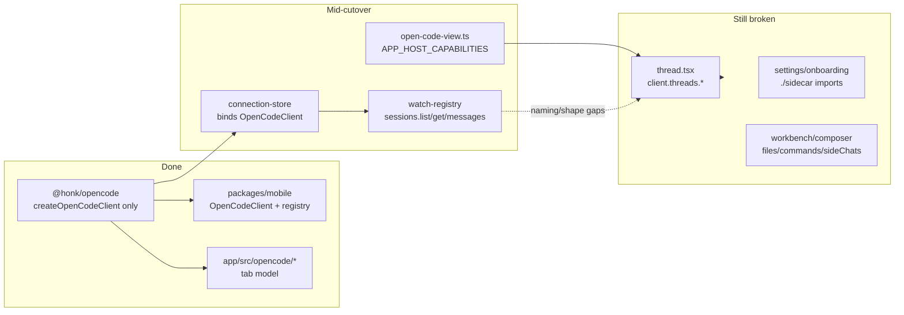

# OpenCode-only client cutover

## Current state

- **Package:** sole surface is `[packages/opencode](packages/opencode)` (`.`, `./host`, `./native`, `./pairing`). No `compat` / `v2` / `protocol`. Boundary script enforces `sdk.v2` only.
- **Mobile:** already on `OpenCodeClient`; no compat imports left. Lifecycle ops gated via `OPEN_CODE_SESSION_CAPABILITIES`.
- **App:** adapter layer exists (`[open-code-view.ts](packages/app/src/open-code-view.ts)`, `[watch-registry.ts](packages/app/src/watch-registry.ts)`, `[connection-store.ts](packages/app/src/connection-store.ts)`), but product UI still imports deleted `./sidecar` and calls `client.threads.`* / host-only APIs.

**Chosen product rule:** hard-gate unavailable protocol ops (archive, rename, remove, fork/side-chat, slash commands, file browse/status, provider OAuth). Keep panels only if they can show a clear unavailable/empty state without fake APIs. Matches `[docs/opencode-shell.md](docs/opencode-shell.md)` §6–7.

**Delegation:** prefer GPT 5.6 Sol (`gpt-5.6-sol-xhigh`) for implementation slices when quota allows; otherwise implement directly.

## Phase 1 — Finish app binding layer

1. **Kill leftover sidecar imports**
  Replace every `from "./sidecar"` with `@honk/opencode` and/or `[open-code-view.ts](packages/app/src/open-code-view.ts)` types (`AppSessionSummary`, `ThreadViewState`, `PromptSendFile`, `ComposerCommand`, `AppProvider*`, workbench node types). Ensure `sidecar.ts` stays deleted.
2. **Normalize watch/bind names**
  In `[watch-registry.ts](packages/app/src/watch-registry.ts)` / `[use-sdk-watch.ts](packages/app/src/use-sdk-watch.ts)`: keep `bindOpenCodeClient` / `getBoundOpenCodeClient` as canonical; remove or thin-alias `bindHonkClient` / `getBoundHonkClient` / `useThreadWatch` so call sites agree.  
   Align inventory shape: either populate `sideChats` via `projectSideChats()` in the registry, or stop reading `state.sideChats` in thread/workbench and gate fork UI.
3. **Session mutations through helpers**
  Replace `client.threads.send|interrupt|setTitle|…` with:
  - `client.sessions.prompt` / `interrupt` / `switchAgent` / `switchModel`
  - helpers already in `[open-code-view.ts](packages/app/src/open-code-view.ts)` (`sendSessionPrompt`, `appSessionState`, …)
  - title rename: gate on `APP_HOST_CAPABILITIES.rename` (false)

## Phase 2 — Capability-gate host-only surfaces

Use `[APP_HOST_CAPABILITIES](packages/app/src/open-code-view.ts)` everywhere:

| Surface                        | Files                                                                                                                            | Behavior                                                                                   |
| ------------------------------ | -------------------------------------------------------------------------------------------------------------------------------- | ------------------------------------------------------------------------------------------ |
| Archive restore/list           | `[settings.tsx](packages/app/src/settings.tsx)`                                                                                  | Hide or disable Archived panel actions                                                     |
| Provider OAuth                 | `[settings.tsx](packages/app/src/settings.tsx)`, `[onboarding.tsx](packages/app/src/onboarding.tsx)`                             | `providers.list` for inventory; disable connect/OAuth flows                                |
| Files / changes                | `[workbench-files.tsx](packages/app/src/workbench-files.tsx)`, `[workbench-changes.tsx](packages/app/src/workbench-changes.tsx)` | Unavailable empty states; no `listFiles`/`readFile`/`fileStatus`                           |
| Slash commands / `@` file find | `[composer.tsx](packages/app/src/composer.tsx)`                                                                                  | Gate `listCommands` / `findFiles`; keep prompt + attachments that map to `sessions.prompt` |
| Side chats                     | `[thread.tsx](packages/app/src/thread.tsx)`, `[workbench.tsx](packages/app/src/workbench.tsx)`                                   | Gate create/remove; no `createSideChat`                                                    |

Do not reintroduce a SidecarClient or call non-`sdk.v2` endpoints from `@honk/opencode`.

## Phase 3 — Thread / home / tabs consistency

1. **Thread page** (`[thread.tsx](packages/app/src/thread.tsx)`): consume `useSessionWatch` / `SessionWatchState` (via thin adapter if needed) instead of `ThreadState` from sidecar. Wire send/interrupt/permissions/questions to `sessions.`*.
2. **Home / command menu / notifications / tab sync**: already partly on session inventory; finish field renames (`sessions` not `threads`) and status mapping via `appSessionSummary` / `tabStatusFromSummary`.
3. **Leave** `[packages/app/src/opencode/](packages/app/src/opencode)*` as the clean parallel tab model (already OpenCode vocabulary). Do not merge it into the legacy `/thread/$id` router in this pass unless typecheck forces a touch.

## Phase 4 — Verify

1. `pnpm --filter @honk/opencode typecheck` (boundary must stay green)
2. `pnpm --filter @honk/app typecheck`
3. `pnpm --filter @honk/mobile typecheck` (smoke; expect already clean)
4. Grep guard: no `./sidecar`, `@honk/opencode/compat`, `createSidecarClient`, `client.threads.`

## Out of scope

- Implementing rename/archive/fork/files/commands in the protocol client
- Full router cutover from `/thread/$id` to `/server/.../session/...`
- T3Code protocol import or product vocabulary
- Restoring `@honk/opencode/compat`

