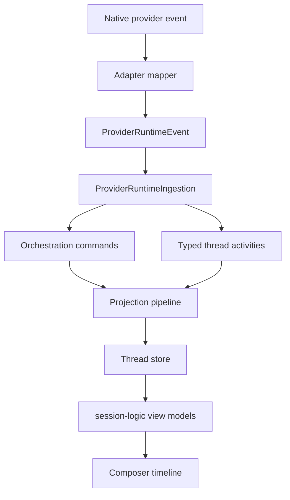

# Orchestration cleanup plan

## Context

`composer-chat-document-fix.md` correctly names projected thread state as the source of truth for composer chat. The cleanup plan should precede the chat polish phases because provider adapters currently emit a broad `ProviderRuntimeEvent` vocabulary, while `ProviderRuntimeIngestion.ts` maps only part of it into orchestration commands and `OrchestrationThreadActivity` rows. The immediate problem is not adapter count. The problem is that the central protocol is too loose to make every adapter prove the same output.

throughput checkpoint: read-only planning; five `composer-2.5-fast` subagents completed; no code edits; plan artifact only.

## Scope

In scope:

- Provider adapter output mapping for built-in drivers under `[packages/server/src/provider/](packages/server/src/provider/)`.
- Canonical runtime event contracts in `[packages/contracts/src/provider-runtime.ts](packages/contracts/src/provider-runtime.ts)`.
- Orchestration activity contracts in `[packages/contracts/src/orchestration.ts](packages/contracts/src/orchestration.ts)`.
- Runtime ingestion in `[packages/server/src/orchestration/ProviderRuntimeIngestion.ts](packages/server/src/orchestration/ProviderRuntimeIngestion.ts)`.
- Projection and read-model paths in `[packages/server/src/orchestration/ProjectionPipeline.ts](packages/server/src/orchestration/ProjectionPipeline.ts)`, `[packages/server/src/orchestration/ThreadProjection.ts](packages/server/src/orchestration/ThreadProjection.ts)`, and `[packages/server/src/orchestration/projector.ts](packages/server/src/orchestration/projector.ts)`.
- App consumers in `[packages/app/src/environments/runtime/service.ts](packages/app/src/environments/runtime/service.ts)`, `[packages/app/src/environments/runtime/orchestration-event-effects.ts](packages/app/src/environments/runtime/orchestration-event-effects.ts)`, `[packages/app/src/session-logic.ts](packages/app/src/session-logic.ts)`, and composer timeline files.
- Provider observability logs in `[packages/server/src/provider/EventNdjsonLogger.ts](packages/server/src/provider/EventNdjsonLogger.ts)`.
- Adapter and ingestion conformance fixtures.

Out of scope:

- Rewriting provider SDK clients.
- Rich text composer parity.
- Cursor visual parity CSS.
- Cloud-agent-only timeline rows.
- Product changes to provider capabilities.

Definition of done:

- Every built-in adapter has a documented native-to-canonical mapping.
- Ingestion has an explicit handled and ignored event list.
- Activity kinds are typed enough that app consumers stop parsing unknown payloads by convention.
- Subagent, task, tool, approval, user-input, and assistant message paths can be verified with shared fixtures.
- Composer timeline work no longer needs provider-specific exceptions.

## Target data flow




## Approach

Use a contract-first cleanup. Do not centralize provider code into a giant cross-provider switch. Centralize the vocabulary and tests.

Phase order should be small and shippable. First make the current output visible. Then type the contract. Then migrate ingestion and app consumers. Then add conformance fixtures across adapters. Only after that should `composer-chat-document-fix.md` proceed with timeline and subagent UI fixes.

## Alternatives considered

- Centralize all adapter mapping in one mapper package. Reject this. It would reduce file count but increase provider coupling and make native protocol quirks harder to isolate.
- Keep `OrchestrationThreadActivity.kind` as a free string and document conventions. Reject this. It preserves the current failure mode.
- Build a strict activity union first, then migrate all consumers at once. Reject this as too wide. Use an inventory and conformance phase first.
- Add provider-specific cases in `session-logic.ts`. Reject this. Composer should consume projected local state only.

## Phase 1. Inventory current adapter output

Goal:

- Produce a durable mapping document that lists what each adapter emits today and which ingestion handlers consume it.

Changes:

- Add a planning or docs artifact under the orchestration plan area. It should list `codex`, `claudeAgent`, `cursor`, `cursorSdk`, and `opencode`.
- Capture native source names from `RuntimeEventRawSource` and emitted `ProviderRuntimeEvent.type` values.
- Mark each runtime event as command-producing, activity-producing, assistant-message-producing, ignored, or unhandled.
- Include log stream coverage for native, canonical, and orchestration logs.

Data structures:

- `AdapterRuntimeMapping`: driver, native source, runtime event type, payload owner, ingestion output, consumer.

Verification:

- Static. `pnpm run typecheck` after any docs-adjacent type imports or scripts.
- Runtime. No runtime check for docs-only phase. The plan should flag this as read-only evidence.
- Evidence. See `[orchestration-runtime-mapping.md](orchestration-runtime-mapping.md)`.

Primary files:

- `[packages/contracts/src/provider-runtime.ts](packages/contracts/src/provider-runtime.ts)`
- `[packages/server/src/provider/CodexAdapter.ts](packages/server/src/provider/CodexAdapter.ts)`
- `[packages/server/src/provider/ClaudeAdapter.ts](packages/server/src/provider/ClaudeAdapter.ts)`
- `[packages/server/src/provider/CursorAdapter.ts](packages/server/src/provider/CursorAdapter.ts)`
- `[packages/server/src/provider/CursorSdkAdapter.ts](packages/server/src/provider/CursorSdkAdapter.ts)`
- `[packages/server/src/provider/OpenCodeAdapter.ts](packages/server/src/provider/OpenCodeAdapter.ts)`
- `[packages/server/src/orchestration/ProviderRuntimeIngestion.ts](packages/server/src/orchestration/ProviderRuntimeIngestion.ts)`

## Phase 2. Define the central activity vocabulary

Goal:

- Replace free-string activity interpretation with a local activity-kind registry and typed payload families.

Changes:

- Add `OrchestrationThreadActivityKind` and payload schemas in `[packages/contracts/src/orchestration.ts](packages/contracts/src/orchestration.ts)`, or a sibling contracts file if that keeps the file readable.
- Start with existing kinds only. Include `approval.*`, `user-input.*`, `runtime.*`, `task.*`, `tool.*`, `subagent.*`, `context-window.updated`, `context-compaction`, provider failure kinds, and checkpoint failure kinds.
- Keep a typed escape hatch only for deliberately ignored telemetry if needed. Do not use it for chat timeline data.

Data structures:

- `OrchestrationThreadActivityKind`.
- `OrchestrationThreadActivityPayloadByKind`.
- `TypedOrchestrationThreadActivity`.

Verification:

- Static. `pnpm --filter @multi/contracts test` and `pnpm run typecheck`.
- Runtime. Decode representative persisted activities through the updated schema in contract tests.

Primary files:

- `[packages/contracts/src/orchestration.ts](packages/contracts/src/orchestration.ts)`
- `[packages/contracts/test/orchestration.test.ts](packages/contracts/test/orchestration.test.ts)`

## Phase 3. Extract ingestion mapping into a registry

Goal:

- Make runtime-event handling explicit and auditable.

Changes:

- Extract `runtimeEventToActivities` from `[ProviderRuntimeIngestion.ts](packages/server/src/orchestration/ProviderRuntimeIngestion.ts)` into a mapper module.
- Add a closed list for handled runtime events and intentionally ignored runtime events.
- Stop mapping `tool.summary` to `task.completed`. Add a dedicated summary activity kind.
- Keep assistant message deltas and proposed-plan writes as orchestration commands, not activities.
- Remove or justify the no-op `processDomainEvent` subscription.

Data structures:

- `RuntimeEventIngestionRule`.
- `IgnoredProviderRuntimeEventType`.
- `RuntimeEventToActivityResult`.

Verification:

- Static. `pnpm --filter usemulti exec vitest run test/orchestration/ProviderRuntimeIngestion.test.ts` and `pnpm run typecheck`.
- Runtime. Replay a canonical fixture through ingestion and inspect emitted orchestration events in order.

Primary files:

- `[packages/server/src/orchestration/ProviderRuntimeIngestion.ts](packages/server/src/orchestration/ProviderRuntimeIngestion.ts)`
- `[packages/server/test/orchestration/ProviderRuntimeIngestion.test.ts](packages/server/test/orchestration/ProviderRuntimeIngestion.test.ts)`

## Phase 4. Harden adapter mapping boundaries

Goal:

- Keep provider quirks inside adapters and keep orchestration payloads local.

Changes:

- Normalize `requestType` to `requestKind` at adapter or runtime-boundary level.
- Strip raw provider blobs from activity payloads used by composer. Keep raw data in native logs only.
- Preserve `providerThreadId` only inside `RuntimeSubagentRef` and documented provider refs.
- Align Cursor ACP and Cursor SDK capability differences in a small matrix, not scattered conditions.
- Add adapter-level tests for `opencode`, `cursor`, and `cursorSdk` where coverage is currently thin.

Data structures:

- `ProviderMappingCapability`.
- `RuntimeSubagentRef` remains the provider identity carrier.
- `ProviderRefs` remains the raw correlation carrier.

Verification:

- Static. Adapter-specific vitest runs for touched provider tests and `pnpm run typecheck`.
- Runtime. Adapter replay tests should emit canonical `ProviderRuntimeEvent[]` without ingestion involved.

Primary files:

- `[packages/server/src/provider/ProviderAdapter.service.ts](packages/server/src/provider/ProviderAdapter.service.ts)`
- `[packages/server/src/provider/CodexAdapter.ts](packages/server/src/provider/CodexAdapter.ts)`
- `[packages/server/src/provider/ClaudeAdapter.ts](packages/server/src/provider/ClaudeAdapter.ts)`
- `[packages/server/src/provider/CursorAdapter.ts](packages/server/src/provider/CursorAdapter.ts)`
- `[packages/server/src/provider/CursorSdkAdapter.ts](packages/server/src/provider/CursorSdkAdapter.ts)`
- `[packages/server/src/provider/OpenCodeAdapter.ts](packages/server/src/provider/OpenCodeAdapter.ts)`
- `[packages/server/test/provider/](packages/server/test/provider/)`

## Phase 5. Unify app-side activity consumers

Goal:

- Make composer timeline derivation consume typed local activities with no provider-specific payload guessing.

Changes:

- Update `[packages/app/src/session-logic.ts](packages/app/src/session-logic.ts)` to switch on typed activity kinds.
- Move shared pending approval and user-input derivation into a reusable contracts or shared helper if server and app still need the same state.
- Keep subagent logs derived from `subagent.*` activities.
- Keep snapshot fetch in `[subagent-preview-tray.tsx](packages/app/src/components/chat/composer/subagent-preview-tray.tsx)` as reconcile only after the activity path is complete.
- Wire `deleteToolCall` only if there is a real activity kind for delete semantics. Otherwise delete the dead UI branch in a later refactor.

Data structures:

- `WorkLogEntry`.
- `WorkLogSubagent`.
- `PendingApproval`.
- `PendingUserInput`.
- `ToolDisplayArtifact`.

Verification:

- Static. `pnpm --filter @multi/app exec vitest run src/session-logic.test.ts` and `pnpm run typecheck`.
- Runtime. Use the UI control skill to verify a running thread timeline with tools, approvals, and a subagent tray after implementation.

Primary files:

- `[packages/app/src/session-logic.ts](packages/app/src/session-logic.ts)`
- `[packages/app/src/session/subagents.ts](packages/app/src/session/subagents.ts)`
- `[packages/app/src/components/chat/timeline/timeline-rows.ts](packages/app/src/components/chat/timeline/timeline-rows.ts)`
- `[packages/app/src/components/chat/timeline/messages-timeline.tsx](packages/app/src/components/chat/timeline/messages-timeline.tsx)`
- `[packages/app/src/components/chat/composer/subagent-preview-tray.tsx](packages/app/src/components/chat/composer/subagent-preview-tray.tsx)`

## Phase 6. Add adapter conformance fixtures

Goal:

- Make every adapter prove native-to-canonical output and make ingestion prove canonical-to-orchestration output.

Changes:

- Add a conformance directory under server tests.
- Add native-to-canonical scenarios for all five built-in adapters.
- Add canonical-to-orchestration scenarios shared across adapters.
- Add projection golden checks for thread messages, activities, session, proposed plans, and shell pending flags.
- Keep legacy alias normalization in compatibility tests only.

Data structures:

- `CanonicalRuntimeScenario`.
- `ExpectedOrchestrationDelta`.
- `ProjectionGoldenSlice`.

Verification:

- Static. `pnpm --filter usemulti exec vitest run test/conformance` and `pnpm run typecheck`.
- Runtime. Replay canonical fixtures through `OrchestrationEngine` and `ProjectionPipeline` with no provider process.

Primary files:

- `[packages/server/test/conformance/](packages/server/test/conformance/)`
- `[packages/server/test/integration/TestProviderAdapter.integration.ts](packages/server/test/integration/TestProviderAdapter.integration.ts)`
- `[packages/server/test/fixture/provider-runtime.ts](packages/server/test/fixture/provider-runtime.ts)`

## Phase 7. Refresh composer chat parity plan

Goal:

- Update `composer-chat-document-fix.md` so the chat plan depends on the cleaned orchestration contract.

Changes:

- Move orchestration cleanup ahead of screenshot-level UI work.
- Keep P0 UI items that do not depend on provider mapping, such as expanded work groups and subagent focus state.
- Gate subagent tray streaming, task card semantics, and shell output preview on the typed activity contract.

Data structures:

- No new runtime data structures.

Verification:

- Static. Markdown review only.
- Runtime. Not applicable for the plan update.

Primary files:

- `[composer-chat-document-fix.md](composer-chat-document-fix.md)`

## Project verification

Use these as final checks after implementation phases land:

```bash
pnpm run typecheck
pnpm --filter @multi/contracts test
pnpm --filter usemulti exec vitest run test/orchestration/ProviderRuntimeIngestion.test.ts
pnpm --filter usemulti exec vitest run test/provider
pnpm --filter usemulti exec vitest run test/conformance
pnpm --filter @multi/app exec vitest run src/session-logic.test.ts
pnpm --filter @multi/app exec vitest run src/environments/runtime/orchestration-event-effects.test.ts
pnpm --filter @multi/app exec vitest run src/components/chat/timeline/timeline-rows.test.ts
```

Runtime verification should use the `control-ui` skill once chat surfaces are touched. Exercise a real or replayed thread with assistant streaming, shell command output, file changes, approval, user input, subagent activity, and proposed plan output.

## Implementation guidance

Apply these poteto-mode non-negotiables during implementation:

- Use the **how** skill before changing each unfamiliar subsystem.
- Use the **interrogate** skill before shipping if the activity-union design is contested.
- Run `/deslop` on each diff before commit.
- Apply the **unslop** skill to docs, plans, PR descriptions, and comments.
- Use **show-me-your-work** if the implementation spans multiple PRs.
- Use Cursor's built-in **babysit** skill after opening a PR.

Principles that shaped this plan:

- **Redesign From First Principles** changed the plan from patching `session-logic.ts` to making projected orchestration state the central contract.
- **Type System Discipline** changed the activity model from free strings and unknown payloads to a typed kind registry.
- **Boundary Discipline** changed adapter work into native-to-canonical translation only, with provider raw data kept at the edge and in logs.
- **Minimize Reader Load** changed the plan away from one giant adapter switch and toward small per-layer contracts.
- **Laziness Protocol** kept the phases scoped to existing event families before adding new concepts.
- **Outcome-Oriented Execution** made the plan remove transitional compatibility once callers migrate, rather than layering shims.
- **Build the Lever** added adapter conformance fixtures so future providers reuse the same checks.
- **Prove It Works** requires replaying real canonical event sequences through ingestion, projection, and app derivation, not just compiling.

