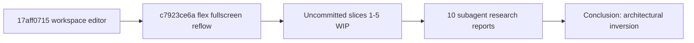
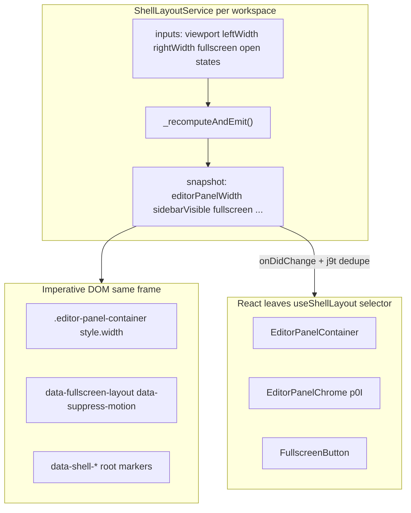

# Cursor Shell Parity — Postmortem, Revert Strategy, and Rewrite Spec

## Executive verdict

**Do not revert the whole branch or `17aff0715`.** That commit is the workspace editor / file editor / `workspace-editor-store` foundation — unrelated product work that must stay.

**Do not “start from scratch” on the repo.** Start from scratch on **shell layout architecture only**.

**Recommended baseline (your choice confirmed):**
1. **Keep** [`17aff0715`](17aff0715) — workspace editor + store
2. **Keep** [`c7923ce6a`](c7923ce6a) — “Refine workbench fullscreen reflow” (flex reflow replaces overlay)
3. **Revert uncommitted shell files** back to `c7923ce6a` — discard slice 1–5 WIP that contradicted itself
4. **Keep** all other uncommitted work (browser rework, honkkit tokens outside shell, composer, etc.)

Optional: reverting `c7923ce6a` alone is **not recommended**. It restores the **absolute overlay** fullscreen model. Keep `c7923ce6a` for **left-sidebar-mounted + workbench flex direction**, but **must replace** its center `flex-grow:0; width:0` collapse — council verified Cursor **unmounts** center in React (`!editorPanelFullscreen && centerBoundary`), not flex-tween.

---

## Council verification (5 subagents, pixel-level)

Verified against live `/Applications/Cursor.app/.../workbench.desktop.main.js` + `.css`.

| Council | Focus | Verdict |
|---|---|---|
| [Width model](085e4dac-5114-459e-acca-4cd9d783a326) | `_buildSnapshot`, `c0I`, center gating | Claims 1–4 **CONFIRMED** with nuance |
| [Tab tokens](4ccdf7bb-973e-4ec6-bf44-24f2929542e1) | 35/25/24px, gaps, borders | Core geometry **CONFIRMED**; Honk 34/22 **WRONG** |
| [Title row](45dd149c-36d5-41bf-9f6d-e53906e28427) | `p0I` cluster slots, `HBo`, `zS` | All 6 structural claims **CONFIRMED** |
| [TrailingSection](b52ef6e0-d08b-4ad9-a5db-92dc500616d5) | Bar topology, end gutter | Topology **CONFIRMED**; end gutter **32px** |
| [uxe / re-render](2b30029d-fd86-4d32-ba4f-59164ed08082) | Subscription graph | **NUANCE** on "shell roots omit fullscreen" |

### Width model — pixel truth

**Fullscreen width (CONFIRMED with nuance):**
```ts
const fullscreenActive = editorPanelFullscreen && editorPanelVisible;
const effectiveDockedSidebarWidth =
  sidebarVisible && !sidebarOverlayMode ? storedSidebarWidth : 0;
const editorPanelWidth = fullscreenActive
  ? Math.max(0, window.innerWidth - effectiveDockedSidebarWidth)
  : ratioPaneSize; // from responsive layout engine, NOT subtraction
```

**`c0I` container (CONFIRMED):**
- Fullscreen: `style.width = undefined`, `data-fullscreen-layout`, resize sash hidden
- Non-fullscreen: `style = { width: editorPanelWidth, minWidth: 384 }`
- CSS: `.editor-panel-container[data-fullscreen-layout] { flex: 1; min-width: 0; }`

**Center panel (CONFIRMED — contradicts c7923ce6a):**
```js
// GlassRoot vDI — center unmounted, not flex-collapsed
!editorPanelFullscreen && $(centerPanelBoundary)
```
Honk must **delete** `.agent-window__center { transition: flex-grow … }` and the fullscreen `flex-grow:0; width:0` block. Replace with React unmount or `display:none` boundary.

**`u0I` edge case:** returns `null` when `editorPanelPendingResize` (window-grow animation) — separate from fullscreen.

### Tab bar tokens — pixel truth

| Token | Cursor exact | Honk today | Status |
|---|---|---|---|
| Bar height | **35px** (`--tab-system-height`) | 34px | WRONG |
| Container pad | **5px** | undefined | MISSING |
| Tab height | **25px** (`calc(100% - 10px)`) | 22px | WRONG |
| Trailing lg (TrailingSection) | **24×24px** | 22px | WRONG |
| Tab-actions lg | **24×25px** (bar-relative height) | — | plan missed split |
| Section padding | **4px 8px** | 8px on whole row | PARTIAL |
| Trailing section gap | **0** | 2px action gap | WRONG |
| Tab gap | **1px** (`--tab-gap`) | 1px | OK |
| Tab max-width | **200px** | 200px | OK |
| Stable icon tab | **25×25**, `padding:0`, `aspect-ratio:1` | 22×22 stacked pad | WRONG |
| Stable active bg (`simple-tabs`) | **tertiary** | quaternary | WRONG |
| Bar border-bottom | **none** | Honk `border-b` | WRONG |
| Subchrome row | **36px**, 1px top+bottom, pad `0 8px 0 6px`, gap **4px** | 32px bottom-only | WRONG |
| End gutter (hide) | **32px** = 8px section pad-right + 24px button | ~30px (22+8) | WRONG |

**`tab-stable-end-margin` nuance:** CSS var = 5px on `simple-tabs`, but **editor cluster overrides to `margin-left: 0`** on `[data-has-stable]` scrollable. Do not use for right-side hide clearance.

**`data-show-border` on TrailingSection:** attribute set in JS when tabs scrollable; **no matching CSS rule in shipped bundle** — do not implement scroll border until rule found.

### Title row — pixel truth (full cluster order)

**CONFIRMED order:** `[lT, zS, $p, cy]` = leading → title+divider → stable tabs → dynamic tabs.

**`lT` (leading):** `HBo` + `.editor-panel-tab-bar-sidebar-controls` when `X = fullscreen && (!sidebarVisible || overlayMode)`.

**`zS` (title):** `a0I` + `<hr class="ui-tab-system-tabs__section-divider">` when `J = editorPanelFullscreen` — **React mount/unmount**, not CSS visibility in Cursor.

**`.chat-title-tab-row` in cluster:**
- `max-width: 10.5rem`
- `margin-left: spacing-1-75` (~7px); `margin-right: spacing-0-25` (1px)
- `flex: 0 1 auto; height: 100%`
- Environment chip **inside** `.chat-title-tab-trigger` (icon + optional label)
- Trigger `gap: 8px`; title ellipsis on `.chat-title-tab-title`

**Honk title strategy (resolved):** Cursor uses `J ? mount : null` inside `p0I` (accepts bar re-render). Honk's stricter goal: **always mount** title + `<hr data-shell-fullscreen-chat-title>` + CSS visibility off root attr — valid Honk improvement, not Cursor mirror. Wire the dead `shell.css` rules; remove `useWorkspaceFullscreenTarget` from header.

### TrailingSection — pixel truth

**CONFIRMED:** `O7e.Bar` = exactly `[tabCluster, TrailingSection]`; `rightInsetPx:0` → `paddingRight:0`.

**Trailing order:** status → reconnect → `div.editor-panel-overflow-action` (**+ menu only**) → remote → fullscreen → hide (last).

**End gutter math:** section `padding-right: 8px` + lg button `24px` = **32px** total from bar right edge.

Honk inverts overflow-action (wraps hide, not `+`) and splits `trailing` + `end` slots — **WRONG**.

### Re-render model — pixel truth

**On `setEditorPanelFullscreen` toggle, Cursor re-renders:**
- `vDI` (GlassRoot) — **includes fullscreen**; unmounts center
- `u0I/c0I` — width + `data-fullscreen-layout`
- `p0I` — full editor chrome via `f0I`
- Agent overlay wrapper

**Does NOT re-render (usually):**
- Agent sidebar `XwI` — selector omits fullscreen
- Center `VwI` — unmounted upstream, not flex-hidden

**Dedupe:** `j9t` (not `V9t`) — structural equality on selector output.

**`nOv` triggers:** `agentId change OR fullscreen change` → `data-suppress-motion` on `.editor-panel-container`.

**Fullscreen button:** React conditional icon inside `p0I` (`arrows-expand/contract-simple`). Honk CSS dual-glyph is valid stricter optimization.

**Plan correction:** "Shell roots omit fullscreen" → split into:
- GlassRoot / Honk shell row: **must** gate center on fullscreen
- Agent list column / `LeftAside`: **omit** fullscreen from selector
- Editor panel chrome (`p0I`): **subscribe** via `f0I`

---

## Contradictions resolved (plan fixes from council)

| Old plan claim | Council finding | Updated plan |
|---|---|---|
| Keep c7923ce6a center flex-collapse | Cursor unmounts center | **Keep commit for sidebar/workbench**; **replace center CSS** with React unmount |
| `innerWidth - dockedLeftWidth` | Needs visible gate + overlay logic | Use `effectiveDockedSidebarWidth` formula above |
| `tab-stable-end-margin` for right gutter | 0px in editor cluster | Use trailing section 8px pad + 24px button = **32px** |
| Trailing lg uniformly 24×24 | Tab-actions are 24×25 | Split tokens: `--honk-workbench-trailing-action-size: 24px`, tab height 25px |
| Title React-gated only | Cursor yes; Honk CSS path valid | **Honk default: CSS visibility** (zero header re-render goal) |
| Global zero re-render | `p0I` re-renders in Cursor | Target: **outer shell + agent list stable**; editor chrome may re-render |
| `data-show-border` scroll separator | No CSS in bundle | Defer / omit until verified |


## What happened — timeline



### Phase 0 — Design intent ([`docs/cursor-shell-parity-redesign.md`](docs/cursor-shell-parity-redesign.md))

Goals locked before coding:
- **Zero top-nav re-render** on fullscreen toggle
- **Reflow, not overlay** — collapse center (and originally left sidebar), workbench grows
- Imperative `data-shell-fullscreen-target` on `.agent-window` via `ShellFullscreenLayer`

### Phase 1 — Committed: `17aff0715` “Add workspace editor and runtime updates”

Introduced:
- [`packages/app/src/stores/workspace-editor-store.ts`](packages/app/src/stores/workspace-editor-store.ts) — `fullscreenByWorkspaceKey`, `toggleFullscreen`, `useWorkspaceFullscreenTarget`
- File editor / Monaco / project panels
- Initial shell refactor in [`app.tsx`](packages/app/src/components/shell/shell/app.tsx): `RightAside` / `RightAsideFrame` / `RightWorkbenchContent` split, `ShellFullscreenLayer` writing root attr
- Fullscreen CSS in [`shell.css`](packages/app/src/styles/shell.css) using **absolute overlay** on workbench

**State at end:** Multiple React leaves subscribed to `useWorkspaceFullscreenTarget` (toggle, frame, center, left aside).

### Phase 2 — Committed: `c7923ce6a` “Refine workbench fullscreen reflow”

Changed 4 files only. Key shift in [`shell.css`](packages/app/src/styles/shell.css):

| Before (`c7923ce6a^`) | After (`c7923ce6a`) |
|---|---|
| `position: absolute; inset: 0` overlay | `flex: 1 1 auto; width: auto` reflow |
| Collapsed **left sidebar** to `width: 0` | **Left sidebar untouched** (Cursor agent-list parity) |
| Center not explicitly collapsed | Center `flex-grow: 0; width: 0` |

Also refined `ShellFullscreenLayer` / component subscriptions in [`app.tsx`](packages/app/src/components/shell/shell/app.tsx).

**Still missing:** explicit `editorPanelWidth` computation, `data-fullscreen-layout` CSS rule, tab-system structure, token parity.

### Phase 3 — Uncommitted WIP (slice refactor — **to be discarded**)

Attempted “Cursor uxe-per-leaf” refactor without a layout service. Major moves:

| Slice | Intent | Outcome |
|---|---|---|
| 1 | Fullscreen toggle owns subscription → reverted to zero-subscription CSS glyph swap | Toggle OK; contradicted later research |
| 2 | `ShellLeftToggleButton` leaf-owned | Reasonable pattern |
| 3 | Delete `ShellLayoutController`; distribute width attrs to `LeftAside` / `RightAsideFrame` | **Inverted Cursor** — no single recompute owner |
| 4 | Drop absolute `ShellHeaderControls` | Incomplete |
| 5 | Option B fullscreen title in tool island | **Broken** — CSS Option B in `shell.css` unwired; TSX uses React conditional + `useWorkspaceFullscreenTarget` in header |

**Runtime symptoms (user-reported):**
- Severe layout shift on fullscreen toggle
- Apparent chrome re-renders
- Tab hover misalignment, vertical seam in header row

**Debug evidence (session `282d3b`):**
- `RightWorkbenchFullscreenToggle` — zero re-render after CSS swap (good)
- `RightWorkbenchHeader` — re-renders on toggle via `useWorkspaceFullscreenTarget` (bad; contradicts `shell.css` Option B comments)
- Root cause of shift: outer aside goes `flex:1` while inner `.agent-window__workbench-body` stays on stored `~500px` CSS var until `width:100%` rule applies

### Phase 4 — Research (10 subagents, all complete)

Converged diagnosis: **Honk inverted Cursor’s ownership model.**

---

## The one fundamental error

From [Architecture gap](1730bc0a-0da5-4a60-a8ee-2ec4ad4cf6cb):

> Honk deleted the central layout controller and made **CSS + a side-channel DOM layer (`ShellFullscreenLayer`)** the geometry engine. Cursor keeps **`glassLayoutService._recomputeAndEmit()`** — one snapshot, imperative container width, root markers, and **narrow `uxe` selectors per leaf**.

Honk optimized for “AppShell never re-renders” by:
- Splitting Zustand (`shell-panels-store` + `workspace-editor-store`)
- Imperative `querySelector` patches in `ShellFullscreenLayer`
- Flex redistribution as primary sizing mechanism
- Per-leaf root attribute writes (`data-shell-left-presentation`, `data-shell-right-intent`)

Cursor does the opposite: **computed pixel width first**, then attribute/CSS, then **targeted React re-renders** on editor-panel leaves only.

### Contradiction to resolve in the rewrite

Early design doc + Honk comments claim **global zero React re-render**. Subagent research shows Cursor **does** re-render:
- `u0I/c0I` (`.editor-panel-container`) on width + fullscreen
- `p0I` (tab bar chrome) on `f0I` selector including `editorPanelFullscreen`
- Fullscreen button via conditional icon inside `p0I`

**Correct parity target:** shell roots (`AgentWindow`, center chat) stay stable; **editor-panel leaves** may re-render with narrow selectors + dedupe — not zero React globally.

---

## Research synthesis by area

### Width / layout shift — [Width reflow](e8efe179-32f4-43ee-b9c3-aae1c1ae3dd6)

Cursor:
```text
editorPanelWidth = innerWidth - effectiveDockedSidebarWidth  // when fullscreen
c0I: style.width = fullscreen ? undefined : `${editorPanelWidth}px`
     data-fullscreen-layout = fullscreen
     data-suppress-motion = nOv(fullscreen) || nOv(agentId)
```

Honk gap: stored `--honk-shell-right-workbench-width` (~500px) fights `flex:1; width:auto`; inner body lags on old var → **visible jump**.

**Fix:** atomic width recompute in layout service; hide center structurally (not flex-tween); align aside + body to same px on frame 0.

### Tab bar structure — [p0I structure](33cc326d-1151-43a4-aae3-af051d46337f), [End padding](737aa32e-8cfa-435e-98db-a9fb4eb6c15d)

Cursor `O7e` hierarchy:
```text
Root → Group → Bar[ tabCluster(flex:1) | TrailingSection(shrink:0) ] → Content
```

Honk `WorkbenchChromeRow`: one row, **three slots** (content | trailing | end), hide in wrong `editor-panel-overflow-action` wrapper, drag spacer outside `Tabs`, no tab manager.

**Fix:** single `TrailingSection` with order `[+, fullscreen, hide]`; `rightInsetPx:0`; trailing section padding `4px 8px` is the right gutter.

### Fullscreen title row — [Title composition](88e44990-33fc-4967-bbe4-2a10040a79ee)

Fullscreen one-row header lives in **tab cluster**, not `.editor-panel-tab-header-row` (36px subchrome).

Order when `J && (!sidebarVisible || overlay)`:
`HBo traffic spacer` → sidebar controls → `chat-title-tab-row` (10.5rem) + env chip → section divider → stable tabs → dynamic tabs

**Gate:** Honk default = CSS visibility on always-mounted title + `<hr>` (stricter than Cursor `J ? mount : null`). Cursor-canonical alternative = React conditional inside memo leaf that alone subscribes to fullscreen (accepts `p0I`-level re-render).

### Fullscreen button — [Fullscreen button](5c2643e7-2aac-42e7-91ff-d6c0db83959)

Cursor: `uxe(f0I)` → conditional `arrows-expand/contract-simple`, size lg (24px), labels “Enter/Exit Full Screen”.

Honk CSS zero-subscription swap is a deliberate micro-optimization, not Cursor-canonical for this control.

### Motion suppress — [nOv](5472de58-2320-480d-81ea-973a478fb32d)

`nOv(value)` = true for **one React commit** when `editorPanelFullscreen` or `agent.header.id` changes.

Honk fires `data-suppress-motion` on **every** store write + 2×rAF clear — over-broad.

### Tokens — [CSS tokens](2744eadf-b758-4182-b375-92e11f0229ba)

| Token | Cursor | Honk (c7923ce6a + WIP) |
|---|---|---|
| Bar height | 35px | 34px |
| Tab height | 25px (bar − 2×5px padding) | 22px tied to action size |
| Trailing action | 24×24 lg | 22px |
| Action gap | 1px | 2px |
| Tool island border-bottom | none | Honk adds `border-b` |
| Subheader row | 36px, top+bottom border | 32px, bottom only |

### Stable tab hover — [Tab icons](05fadfde-2625-4889-bcc1-86b6d863f1ed)

Misalignment root cause: 22px buttons with stacked `px-8` + `px-3` padding; `data-stable` in CSS but `data-tab-system` in DOM; cluster `h-action-size self-center` instead of `height:100%` stretch.

### Subscription graph — [uxe graph](6a68ed06-ca82-44eb-8a67-722ee843d99e) + council

On `setEditorPanelFullscreen`:
- **Re-renders:** GlassRoot `vDI` (unmounts center), `u0I/c0I`, `p0I`, agent overlay
- **Does not:** agent sidebar `XwI` (selector omits fullscreen)

Honk immediate fix before full service: remove `useWorkspaceFullscreenTarget` from `RightWorkbenchHeader`; wire CSS title visibility (`data-shell-fullscreen-chat-title`).

---

## Revert procedure (shell-only, per your choice)

Reset these paths to `c7923ce6a` (discard uncommitted shell WIP):

```bash
git checkout c7923ce6a -- \
  packages/app/src/components/shell/shell/app.tsx \
  packages/app/src/components/shell/shell/right-workbench-header.tsx \
  packages/app/src/styles/shell.css \
  packages/app/src/stores/shell-panels-store.ts \
  packages/app/src/stores/workspace-editor-store.ts \
  packages/honkkit/src/workbench-chrome-row.tsx \
  packages/honkkit/src/workbench-button.tsx
```

**Review before reverting** (may contain mixed intent):
- [`packages/app/src/components/shell-host.tsx`](packages/app/src/components/shell-host.tsx) — `threadTitle` prop chain; revert only if purely slice-5
- [`packages/app/src/components/shell/agents/sidebar/view-model.ts`](packages/app/src/components/shell/agents/sidebar/view-model.ts) — check if unrelated to fullscreen

**Do not touch:** new browser files (`browser-panel.tsx`, etc.), composer changes, honkkit non-workbench files, docs research.

After revert: `pnpm run typecheck` to ensure shell-host / header props still align.

---

## Canonical target architecture



### `ShellLayoutService` responsibilities

Single owner per workspace (Honk equivalent of `glassLayoutService`):

**Inputs:** `innerWidth`, left panel width + presentation (inline/overlay/collapsed), right panel width + open, `editorPanelFullscreen` preference, route thread/git focus.

**`_buildSnapshot()` outputs:**
- `editorPanelWidth` — ratio-based normally (`ratioPaneSize` from responsive layout); when `editorPanelFullscreen && editorPanelVisible`: `max(0, innerWidth - effectiveDockedSidebarWidth)` where `effectiveDockedSidebarWidth = sidebarVisible && !overlayMode ? storedSidebarWidth : 0`
- `editorPanelFullscreen`, `sidebarVisible`, `sidebarOverlayMode`
- `editorPanelVisible`, `editorPanelPendingResize`, `maxEditorPanelWidth` (min **384px**)

**`_recomputeAndEmit()`:**
1. Build immutable snapshot
2. Imperatively write `.editor-panel-container` inline width (or clear when fullscreen + `data-fullscreen-layout`)
3. Set root markers (`data-shell-fullscreen-target`, left presentation)
4. Fire `onDidChange(snapshot)` for React subscribers

**Replace:** `ShellFullscreenLayer` as geometry authority (may remain as thin DOM writer called *from* service, not from broad Zustand subscriptions).

### `useShellLayout(selector)` 

Honk `uxe`: `useSyncExternalStore` + structural equality (`j9t`-style) on selector output. Leaves subscribe to slices only.

### Editor panel chrome (`p0I` equivalent)

Refactor [`right-workbench-header.tsx`](packages/app/src/components/shell/shell/right-workbench-header.tsx) + [`workbench-chrome-row.tsx`](packages/honkkit/src/workbench-chrome-row.tsx):

1. **Bar** = exactly 2 children: `tabCluster` + `TrailingSection`
2. **TrailingSection** order: status (if any) → `+` → fullscreen → hide
3. **Tab cluster** slots:
   - `lT`: `HBo` traffic spacer (`fillHeight`, runtime width var) + `.editor-panel-tab-bar-sidebar-controls` when `fullscreen && (!sidebarVisible || overlay)`
   - `zS`: `.chat-title-tab-row` (10.5rem, ml ~7px, mr 1px) + env chip inside trigger + `<hr class="ui-tab-system-tabs__section-divider">` — CSS visibility (Honk) or `J ? mount : null` (Cursor)
   - `$p`: stable tabs → `cy`: dynamic tabs (drag spacer inside tabs scroller)
4. Remove `end` slot; merge into single `TrailingSection`; overflow-action wraps **`+` only**
5. Fullscreen toggle: Honk CSS dual-glyph (current) **or** `useShellLayout(s => s.editorPanelFullscreen)` + conditional icon (Cursor-faithful)

### CSS / tokens pass ([2744eadf](2744eadf-b758-4182-b375-92e11f0229ba))

Update [`shell.css`](packages/app/src/styles/shell.css) tokens:
- `--honk-workbench-chrome-row-height: 35px`
- `--honk-workbench-tab-container-padding: 5px`
- `--honk-workbench-tab-height: calc(100% - 2 * var(--honk-workbench-tab-container-padding))` → **25px**
- `--honk-workbench-trailing-action-size: 24px` (TrailingSection lg; tab-actions lg height = 25px)
- `--honk-workbench-chrome-action-gap: 1px` (icon clusters only; trailing section `gap: 0`)
- `--honk-workbench-trailing-section-padding: 4px 8px` (end gutter = 8px + 24px = **32px**)
- Remove tool island `border-b`
- Add `.editor-panel-container[data-fullscreen-layout] { flex: 1; min-width: 0; }`
- **Do not** implement `tab-stable-end-margin` on editor cluster scrollable (Cursor sets **0** there)
- Stable icon tab: `data-stable`, `padding: 0`, `aspect-ratio: 1`, active `bg-tertiary` in simple-tabs
- Subchrome: **36px**, `0 8px 0 6px` pad, **4px** gap, top+bottom 1px border

### Motion (`nOv` parity)

In editor panel container leaf:
```ts
const suppressMotion = useChangedThisRender(fullscreen) || useChangedThisRender(activeThreadId);
```
Set `data-suppress-motion` on `.editor-panel-container` only — not on every panel store write.

### Center panel

**Unmount structurally** when fullscreen — match Cursor `!editorPanelFullscreen && centerBoundary` in GlassRoot. **Delete** c7923ce6a center flex-collapse + `flex-grow` transition. Do not use `inert` on a flex-collapsed center column.

---

## Implementation sequence (after shell revert)

| Step | Work | Key files |
|---|---|---|
| 0 | Shell-only git revert to `c7923ce6a` | listed above |
| 1 | `ShellLayoutService` + `useShellLayout` + `j9t` dedupe | new `shell-layout-service.ts`, wire in `app.tsx` |
| 2 | Width model + `data-fullscreen-layout` + **unmount center** | `app.tsx`, `shell.css` — remove center flex-collapse |
| 3 | `nOv` suppress-motion (`agentId \| fullscreen`) | container leaf only |
| 4 | `TrailingSection` topology; overflow-action on `+`; end gutter 32px | `workbench-chrome-row.tsx`, `right-workbench-header.tsx` |
| 5 | Full cluster: `HBo`, title row (10.5rem + margins + env + hr), CSS visibility | `right-workbench-header.tsx`, `shell.css` |
| 6 | Fullscreen toggle (keep CSS swap or Cursor icon leaf) | toggle component |
| 7 | Stable tab `data-stable` 25×25 + cluster `height:100%` stretch | `workbench-button.tsx`, `workbench-tabs.tsx`, `shell.css` |
| 8 | Token alignment (35/25/24/1px/36px subchrome) | `shell.css`, `tabs.tsx` |
| 9 | Remove dead CSS, floating toggle when bar open, center flex-grow rules | `shell.css`, `app.tsx` |
| 10 | Runtime verification | no layout shift; end gutter 32px; DevTools |

Each step: `pnpm run typecheck`; manual fullscreen toggle check.

---

## What NOT to do again

- Patch flex rules without computed width ownership
- CSS Option B visibility while TSX uses React conditional on the same nodes
- Split trailing into `trailing` + `end` + absolute `ShellHeaderControls` for the same controls
- Claim global zero re-render — target **narrow leaf subscriptions** like Cursor
- More incremental slice band-aids on the current `ShellFullscreenLayer`-as-authority model

---

## Open decisions (defaults chosen)

| Decision | Recommendation |
|---|---|
| Revert `c7923ce6a`? | **No** — keep for sidebar-mounted + workbench flex; **replace center flex-collapse** |
| Revert `17aff0715`? | **No** |
| Center in fullscreen | **React unmount** (Cursor `vDI`), not flex `width:0` |
| Fullscreen title | **CSS visibility** (Honk zero-header-rerender) — wire existing `shell.css` rules |
| Fullscreen toggle | **Keep CSS dual-glyph** (Honk stricter) or Cursor icon leaf — either OK |
| Tab manager registry | Defer full `O7e.Content` registry; fix Bar/TrailingSection structure first |
| Left sidebar in fullscreen | Keep mounted (correct since `c7923ce6a`) |
| `data-show-border` on trailing | **Defer** — attribute exists in JS, no CSS in bundle |
