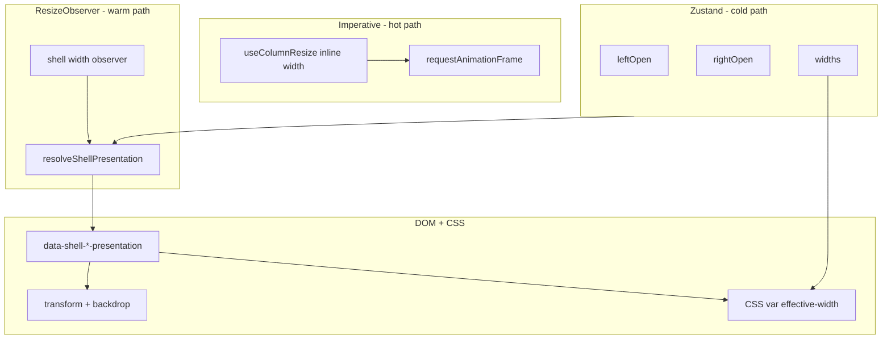

# Smooth Responsive Shell Layout

## Council decision

All five subagents agree on diagnosis and direction:

**Root bug:** `[shell.css](packages/app/src/styles/shell.css)` `@container` rules at 620/900/980px force-hide panels while `[shell-panels-store.ts](packages/app/src/stores/shell-panels-store.ts)` keeps `leftOpen` / `rightOpen` true. Toggles update Zustand but CSS wins — sidebar appears "broken" on small screens.

**Smoothness principle (Cursor model):** Cursor does **not** drive layout through React/Zustand on the hot path. It uses:

- **Persisted intent** (`Mu.`* storage keys) — what the user chose
- **Imperative layout service** (`workbenchGrid.layout()`, inline sash sizes) — geometry on every frame
- **CSS classes** on `.monaco-workbench` — visibility presentation
- **Commit-only persistence** — save on pointer-up / shutdown, not on window resize

Multi already mirrors the hardest part in `[use-column-resize.ts](packages/app/src/components/shell/shell/use-column-resize.ts)`: rAF-throttled inline `style.width` during drag, Zustand commit only on pointer-up. **Do not replace this with React width state.**

What Multi should change:


| Layer          | Today                            | Target                                                                               |
| -------------- | -------------------------------- | ------------------------------------------------------------------------------------ |
| Zustand        | Intent + widths (good)           | **Intent only** — `leftOpen`, `rightOpen`, `leftW`, `rightW`, tabs                   |
| ResizeObserver | Absent for shell                 | **Presentation only** — map width → `inline` / `overlay` / `collapsed`               |
| CSS            | Force-hide at breakpoints        | **Presentation attrs** — overlay transform, no `visibility:hidden` while intent open |
| React          | Re-renders on every toggle/width | **Minimal** — update attrs when presentation *enum* changes, not every px            |





---

## Target behavior matrix

Breakpoints reuse existing numbers (620 / 900 / 980) so the change is behavioral, not a new product spec:


| Shell width          | Left (`leftOpen=true`)        | Right (`rightOpen=true`)         | Secondary rail (`open=true`)                     |
| -------------------- | ----------------------------- | -------------------------------- | ------------------------------------------------ |
| **Wide** (>980)      | Inline column, resizable sash | Inline column                    | Inline column                                    |
| **Medium** (621–980) | Inline column                 | Overlay drawer (transform slide) | Overlay or collapsed inline                      |
| **Narrow** (≤620)    | Overlay drawer                | Overlay drawer                   | Collapsed; toggle opens overlay inside workbench |


**Rules:**

- Never `visibility:hidden` while user intent is open — use overlay instead
- Center `[main[data-component="chat-panel"]](packages/app/src/components/shell/shell/app.tsx)` keeps full width when overlays closed
- Do **not** auto-`setLeftOpen(false)` on shrink — preserve intent across resize (Cursor pattern)
- Debounce presentation mode exit ~150–250ms when width hovers at threshold (Cursor Glass uses 250ms)

---

## Phase 0 — Fix the bug (ship first)

### 1. Pure presentation resolver

**New:** `[packages/app/src/components/shell/shell/shell-layout.ts](packages/app/src/components/shell/shell/shell-layout.ts)`

```ts
export const SHELL_BREAKPOINTS = { leftOverlay: 620, rightOverlay: 900, secondaryRailOverlay: 980 } as const;
export type PanelPresentation = "inline-expanded" | "overlay-expanded" | "collapsed";

export function resolveShellPresentation(input: {
  shellWidth: number;
  leftOpen: boolean;
  rightOpen: boolean;
  secondaryRailOpen: boolean;
}): { left: PanelPresentation; right: PanelPresentation; secondaryRail: PanelPresentation };
```

**New:** `[packages/app/src/components/shell/shell/use-shell-layout.ts](packages/app/src/components/shell/shell/use-shell-layout.ts)`

- `ResizeObserver` on `.agent-window` ref
- Update React state **only when presentation enum changes** (not every pixel)
- Optional trailing debounce (~150ms) when exiting overlay → inline

### 2. Remove broken CSS force-hides

**Edit:** `[packages/app/src/styles/shell.css](packages/app/src/styles/shell.css)`

Delete blocks at lines 446–477 (`@container max-width: 980/900/620` that set `visibility: hidden`).

Replace with presentation-driven rules:

```css
.agent-window[data-shell-left-presentation="overlay-expanded"] .agent-window__sidebar {
  /* fixed panel; flex slot width 0 */
}
.agent-window[data-shell-left-presentation="collapsed"] .agent-window__sidebar {
  /* existing collapsed behavior */
}
```

### 3. Wire presentation in AppShell

**Edit:** `[packages/app/src/components/shell/shell/app.tsx](packages/app/src/components/shell/shell/app.tsx)`

- Add `agentWindowRef` on `.agent-window`
- Set `data-shell-left-presentation`, `data-shell-right-presentation` from resolver
- Keep `data-shell-left-intent` / `data-shell-right-intent` as raw Zustand intent
- Fix **a11y**: `aria-hidden`, `inert`, sash mount based on **effective** presentation, not intent alone
- Left overlay: portal or fixed panel with `{props.left}` content; inline flex slot `width: 0` in overlay mode
- Backdrop click → `shellPanelsActions.setLeftOpen(false)`; `Escape` when overlay active

### 4. Tests

**New:** `[packages/app/src/components/shell/shell/shell-layout.test.ts](packages/app/src/components/shell/shell/shell-layout.test.ts)` — resolver matrix at boundary widths

**Verify:** `pnpm run typecheck`

**Phase 0 acceptance:**

- 500px viewport + `leftOpen=true` → sidebar visible (overlay), toggle works
- No case where intent open + panel invisible

---

## Phase 1 — Smooth UI polish

Council identified jank sources beyond the CSS bug. Fix in this order:

### A. Single width authority (sash drag)

**Edit:** `[use-column-resize.ts](packages/app/src/components/shell/shell/use-column-resize.ts)`

After pointer-up (and when collapsing), `**elementRef.current.style.removeProperty("width")`** so CSS vars on `.agent-window` drive steady-state width. Sticky inline width today fights collapse and causes center reflow bugs.

### B. Overlay motion — transform, not width

**Edit:** `[shell.css](packages/app/src/styles/shell.css)` + optional Multikit sheet

- Overlay panels: `transform: translateX(±100%) → 0`, `transition: transform 200ms cubic-bezier(0.19,1,0.22,1)` (match existing right inline easing)
- Backdrop: `opacity` fade 200ms, `bg-black/32 backdrop-blur-sm` (mirror `[dialog.tsx](packages/multikit/src/dialog.tsx)`)
- `**motion-reduce:transition-none`** on all shell motion (already used on asides)
- Disable `backdrop-filter` on `.multi-shell-sidebar` during `data-resizing` / transition (glass recomposite jank)

**New tokens in** `[packages/multikit/src/styles.css](packages/multikit/src/styles.css)`:

```css
--z-index-shell-overlay-backdrop: 45;
--z-index-shell-overlay-panel: 48;
/* titlebar controls stay at 50 */
--motion-duration-drawer: 200ms;
```

Consider thin Multikit `**Sheet**` primitive (Dialog-backed side panel) rather than ad-hoc markup — reuses Base UI enter/exit (`data-starting-style` / `data-ending-style`).

### C. Right workbench — stop unmounting on close

**Edit:** `[app.tsx](packages/app/src/components/shell/shell/app.tsx)` `RightAside`

Today `runtimeValue ? <TabsRoot>… : null` **unmounts** git/files/terminal on close. Mirror left sidebar: keep mounted, use `opacity` + `inert` + zero inline width. Removes `snapTransition` need for hide/show teardown.

Remove or narrow `[snapTransition](packages/app/src/components/shell/shell/app.tsx)` (lines 279–289) — only snap on inline↔overlay mode cross, not every toggle.

### D. Left collapse choreography

**Edit:** `[shell.css](packages/app/src/styles/shell.css)` + `LeftAside`

Defer `visibility: hidden` until width transition completes (or use `opacity` + `pointer-events: none` only). Current instant `visibility:hidden` on `data-state=collapsed` kills visible shrink animation.

### E. Secondary rail transition target

**Edit:** `[right-workbench-layout.tsx](packages/app/src/components/shell/shell/right-workbench-layout.tsx)`

Move `transition-[width]` to `.multi-shell-secondary-rail` (width-bearing node), not inner flex child.

### F. Reduce React subscriptions on resize

- Presentation hook updates shell root only
- Do not store `shellWidth` in Zustand
- Do not `key={width}` on chat/workbench children

**Phase 1 acceptance:**

- Resize 1200→500px: overlay slides, backdrop fades, no flash
- Sash drag: `transition-none`, no transform fight
- `prefers-reduced-motion`: instant snap, behavior preserved
- Right panel open/close does not remount heavy panels

---

## Phase 2 — Store hygiene + integration

**Edit:** `[shell-panels-store.ts](packages/app/src/stores/shell-panels-store.ts)`

- Per-workspace `rightW` everywhere (today `useRightWidth()` is global-only)
- Route-driven `resolveEffectiveRightOpen` → transient overlay flag, not persisted `rightOpen`

**Edit:** `[chat-header.tsx](packages/app/src/components/chat/view/chat-header.tsx)`

- Align mobile toggle with same presentation semantics (not orphaned `md:hidden` vs 620px breakpoint)

**Edit:** `[right-workbench-layout.test.tsx](packages/app/src/components/shell/shell/right-workbench-layout.test.tsx)`

---

## Phase 3 — Composer narrow tiers (follow-on PR)

After shell fix, center pane width is trustworthy. Add container `ResizeObserver` on composer shell for toolbar squeeze (Cursor uses container width, not viewport). Separate from shell work; aligns with existing `--max-width-agent-chat` in `[index.css](packages/app/src/index.css)`.

---

## Anti-patterns (council veto list)

- Store `layoutMode` / `isNarrow` in Zustand
- Auto-`setLeftOpen(false)` on window shrink
- Re-add `@container visibility:hidden` while intent open
- Animate overlay panel **width** (layout thrash + glass blur cost)
- Pipe sash `pointermove` into Zustand
- Re-render chat subtree on every ResizeObserver tick

---

## PR strategy


| PR      | Scope   | Outcome                                     |
| ------- | ------- | ------------------------------------------- |
| **PR1** | Phase 0 | Sidebar/workbench toggles work at any width |
| **PR2** | Phase 1 | Smooth overlay motion + sash/width fixes    |
| **PR3** | Phase 2 | Store/route polish                          |
| **PR4** | Phase 3 | Composer container squeeze                  |


---

## Verification

```bash
pnpm run typecheck
pnpm --filter @multi/app exec vitest run packages/app/src/components/shell/shell/shell-layout.test.ts
```

Manual matrix: 1400 / 850 / 500px — toggle left, toggle right, drag sash, Escape, scrim, reduced motion, Electron titlebar controls still reachable (`no-drag` on overlay panel).