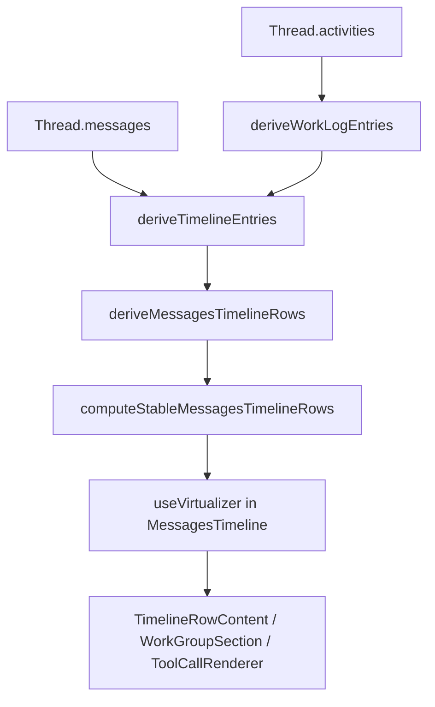
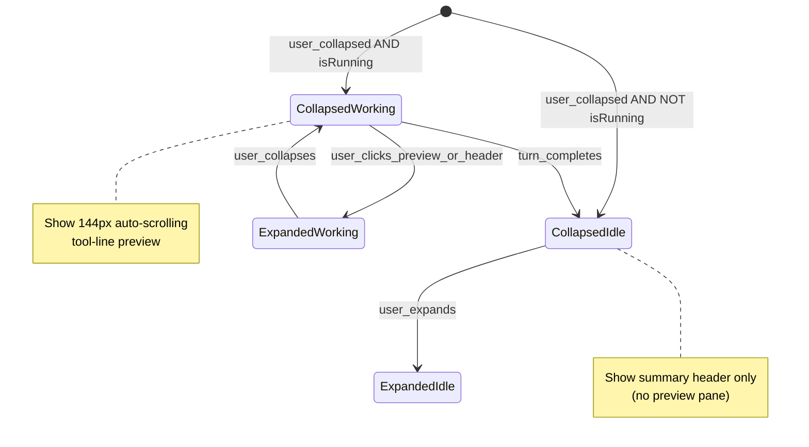

# Update specs/todo.md for Cursor timeline parity

## Goal

Rewrite the timeline-related content in [specs/todo.md](specs/todo.md) so it is the single source of truth for mimicking Cursor’s agent activity timeline. Remove the reducer suggestion. Anchor the spec in:

- Screenshots (collapsed “Worked for 46s”, grouped “Edited 7 files…”, per-tool lines, inline diff, **live “Exploring” preview while collapsed**)
- Cursor bundle dissection (`workbench.desktop.main.js` / injected CSS in JS)
- Current Multi implementation in `packages/app/src/components/chat/timeline/`

User chose **todo-only** placement (no `specs/timeline.md`).

---

## 0. Styling rules ([AGENTS.md](AGENTS.md) — write into TIMELINE spec)

Cursor bundle class names (`ui-step-group-preview`, `ui-collapsible`, `ui-tool-call-line`, BEM `__stats`, etc.) are **dissection labels only**. Do **not** port them into Multi.

| Do                                                                                                                                                                                                          | Don't                                                                                                 |
| ----------------------------------------------------------------------------------------------------------------------------------------------------------------------------------------------------------- | ----------------------------------------------------------------------------------------------------- |
| Tailwind utilities on JSX or `**cva` variants\*\* (follow [tool-renderer.tsx](packages/app/src/components/chat/message/tool-renderer.tsx): `toolCallLineVariants`, `toolCallLineActionVariants`, …)         | `*_CLASSNAME` string constants or decorative class buckets                                            |
| Shared rhythm in [conversation.css](packages/app/src/styles/conversation.css) as `**--chat-timeline-`\* tokens\*\* (e.g. `--chat-timeline-work-preview-max-height: 144px`, `--chat-timeline-step-gap: 6px`) | New `ui-`_ or `composer-_` CSS files mimicking Cursor                                                 |
| `**data-*` for tests and state\*\* (existing: `data-assistant-work-group`, `data-tool-call-line`, `data-chat-timeline-scroll`; add e.g. `data-work-group-preview`, `data-work-preview-scrollable`)          | Copying Cursor attribute names as implementation requirement (`data-group-loading` is reference only) |
| Small focused components (`WorkGroupPreview`, `WorkGroupSummaryLine`) owning layout                                                                                                                         | One mega `className` template literal shared across files                                             |

**Preview pane (collapsed + running):** implement as a component with Tailwind + token, e.g. `max-h-(--chat-timeline-work-preview-max-height) overflow-y-auto overscroll-y-contain` on the scroll host, not a `UI_STEP_GROUP_PREVIEW_CLASS` constant.

**Parity checklist wording in todo.md:** describe behavior (“144px auto-scrolling preview when collapsed and running”), not Cursor CSS class names.

---

## 1. Remove stale guidance

Delete from **Optional follow-ups**:

```text
- Timeline override pruning via reducer if timeline state grows further
```

Replace with an explicit **non-goal**:

- Do **not** add `useReducer` for timeline UI. Scroll + row list stay on `@tanstack/react-virtual`; collapse stays ephemeral `useState<Set<string>>`; derivations stay pure functions + `useMemo` + structural sharing (`computeStableMessagesTimelineRows`).

---

## 2. Add `TIMELINE` to Tracks line

Extend the track legend in [specs/todo.md](specs/todo.md):

```text
`TIMELINE` Cursor-style activity log (virtualized, grouped work rows)
```

---

## 3. New section: `## TIMELINE — Cursor parity`

Structure the section as **reference + checklist** (all in todo.md).

### 3.1 Architecture (Multi today — keep)

Document the intended stack (no new code in this task):



| Layer               | File                                                                                     | Responsibility                                              |
| ------------------- | ---------------------------------------------------------------------------------------- | ----------------------------------------------------------- |
| Activity → work log | [session-logic.ts](packages/app/src/session-logic.ts)                                    | `WorkLogEntry`, tool lifecycle collapse by `toolCallId`     |
| Entries → rows      | [timeline-rows.ts](packages/app/src/components/chat/timeline/timeline-rows.ts)           | Consecutive `work` grouping, `summarizeWorkGroup`, duration |
| List + scroll       | [messages-timeline.tsx](packages/app/src/components/chat/timeline/messages-timeline.tsx) | `useVirtualizer`, sticky user rows, `collapsedWorkGroupIds` |
| Tool lines          | [tool-renderer.tsx](packages/app/src/components/chat/message/tool-renderer.tsx)          | `data-tool-call-line-*`, per-tool expand + inline diff      |
| Tokens              | [conversation.css](packages/app/src/styles/conversation.css)                             | `--chat-timeline-row-gap: 12px`, conversation font vars     |

**State rules (write into spec):**

- **Derived:** `timelineEntries` → `rows` (never mirror in component state).
- **Ephemeral UI only:** `collapsedWorkGroupIds` (inverted: id in set = collapsed). Not persisted.
- **Imperative:** scroll refs + `MessagesTimelineController` (stick-to-bottom).
- **Prune “overrides”** with pure functions + stable row reuse, not a reducer.

### 3.2 Cursor reference map (from bundle)

Point readers at dissection sources (for agents, not runtime):

- JS: `/Applications/Cursor.app/Contents/Resources/app/out/vs/workbench/workbench.desktop.main.js`
- CSS: same tree; most timeline classes are **injected in JS**, not `workbench.desktop.main.css`

| Cursor UI (screenshots)                                        | Cursor mechanism                                                         | Multi equivalent                                                           |
| -------------------------------------------------------------- | ------------------------------------------------------------------------ | -------------------------------------------------------------------------- |
| `Worked for 46s` + chevron                                     | Turn chapter `zMr` + `Gbf` duration; `UJi` collapsible                   | `WorkGroupSection` “Worked for {formatDuration}”                           |
| Narrative block + metadata (“Explored 15 files, 21 searches…”) | `ui-step-group-header` via `trp` + `R$v`/`q$v`/`Kip`                     | `WorkGroupSummaryLine` (`summary.action` + `summary.details` + stats)      |
| `Thought briefly`                                              | `v0t` action `"Thought"` + `NMd` details `"briefly"` if duration < 500ms | `ThinkingStatus` — **gap:** `"Thinking - {task}"`, no brief-duration copy  |
| `Edited todo.md +2 -2`                                         | `ui-edit-tool-call` + `Mee` action/details + `__stats`                   | `ToolCallRenderer` edit case + `data-tool-call-line-*`                     |
| Inline diff on expand                                          | `VirtualizedDiff` in `ui-edit-tool-call`                                 | `InlineToolDiff` in tool-renderer                                          |
| Per-step list under group                                      | `rrp` / `fos` with `--step-gap: 6px`                                     | Expanded work group: `gap-0.5` tool rows                                   |
| Combined summary when collapsed                                | Group header shows action + metadata + `+N -M`                           | **gap:** collapsed shows only duration header; summary hidden until expand |
| Turn-level hide of intermediate AI                             | `DMk` chapters + `rix` `shouldHide`                                      | **not implemented**                                                        |
| List virtualization                                            | `virtualized-composer-messages-*` + pair grouping                        | `@tanstack/react-virtual` + `VIRTUAL_ROW_GAP_PX = 12`                      |
| **Live preview while collapsed + running**                     | `data-group-loading` + `ui-step-group-preview`                           | **gap:** collapsed work group renders **nothing** until user expands       |

### 3.2.1 Loading preview while collapsed (new — from screenshot)

Cursor keeps the transcript **visible and updating** even when the user has collapsed a working group (e.g. header shows `Exploring` while `Read` / `Grepped` lines stream in underneath). This is **not** the same as “expand to see tools”; it is a dedicated **preview lane** tied to `row.isRunning`.

**Bundle behavior (`z$v` + `fos`):**

| Attribute / API                      | Meaning                                                                                                                      |
| ------------------------------------ | ---------------------------------------------------------------------------------------------------------------------------- |
| `data-group-loading={true}`          | Active turn’s group is still running (`loading: q` where `q = e && M === b`)                                                 |
| `ui-step-group-preview`              | Fixed-height scroll host (`maxHeight: Vxp` → **144px**), `autoScrollToBottom: true`, `scrollTrigger` on new steps            |
| `data-preview-scrollable`            | `false` until content exceeds 144px (ResizeObserver on preview); when `false`, **header is hidden** and only preview shows   |
| `data-preview-scrollable=true`       | Fade mask on top 32px of viewport (`linear-gradient` on `.ui-scroll-area__viewport`)                                         |
| Click preview                        | `onClick={() => expand(true)}` — preview is a tap target to fully open the group                                             |
| Header when loading + not scrollable | CSS: `[data-group-loading][data-preview-scrollable=false]` hides `.ui-step-group-header` collapsible until preview overflows |

**Screenshot mapping:**

- Top: completed `Thought for 1s` blocks with narrative + subagent chips (`Composer 2.5`, `Fast`).
- Middle: `**Exploring`\*\* header with live `Read …` / `Grepped …` lines — preview content under a collapsed/working group.
- Bottom: `**Thinking**` collapsible (chevron) with streaming detail — separate from step-group preview but same “show work while collapsed” principle.

**Multi gap:** `WorkGroupSection` only renders children when `expanded === true`. While collapsed, **no preview**, so running exploration/commands are invisible unless the user expands. Stick-to-bottom on the virtual list does not substitute for in-group preview.

**Spec target (todo.md):**

- When `work` row has `isRunning: true` and user has collapsed the group (`collapsedWorkGroupIds.has(id)`):
  - Always render `**WorkGroupPreview`** (new component): fixed **max-height** via `--chat-timeline-work-preview-max-height` (144px), **full chat lane width\*\* (same `max-w-agent-chat` — “fixed width” = bounded preview height, not narrow column). Markup: `data-work-group-preview=""` on scroll host.
  - **Auto-scroll preview to bottom** on each new `groupedEntries` tail (mirror `autoScrollToBottom` + `scrollTrigger`; implement with ref + `useLayoutEffect` on entry count / last entry id, not reducer).
  - Show **live tool lines** (`ToolCallMessage` / minimal density) inside preview, not only the summary header.
  - Progressive header: `Exploring` / `Editing` / `Running` from `summary.action` while running; hide duplicate summary header until `data-work-preview-scrollable="true"` (optional parity — mirror Cursor gate via tokenized CSS, not `.ui-step-group-header` selectors).
  - Click preview → expand group (`onToggleExpanded`).
- **Virtualizer:** preview lives **inside** the measured work row; `estimateSize` must account for preview height (144px + header) when `isRunning && collapsed` so scroll position and stick-to-bottom stay correct.
- **Do not** require expand to see activity during an active turn; collapsing is a **display preference**, not a pause on updates.



### 3.3 Component hierarchy and props (spec contract)

Document the render tree agents must preserve:

```
MessagesTimeline (props: timelineEntries, isWorking, activeTurnStartedAt, timelineControllerRef, …)
  └─ virtual row wrapper (data-index, measureElement, pb row gap)
       └─ TimelineRowContent { row, workGroupExpanded, onToggleWorkGroupExpanded }
            ├─ HumanMessage / AssistantMessage
            ├─ WorkingStatusRow
            └─ WorkGroupSection { row, expanded, onToggleExpanded }
                 ├─ header button: "Worked for …" + chevron (rotate-90 when open)
                 ├─ when collapsed AND row.isRunning:
                 │    └─ WorkGroupPreview (Tailwind + --chat-timeline-work-preview-max-height; data-work-group-preview)
                 │         └─ ToolCallMessage[] (live tail; reuse existing tool line cva + data-tool-call-line-*)
                 ├─ when collapsed AND NOT row.isRunning:
                 │    └─ WorkGroupSummaryLine (summary + stats only)
                 └─ when expanded:
                      ├─ WorkGroupSummaryLine { summary: WorkGroupSummary }
                      └─ ToolCallMessage[] → ToolCallRenderer (conversationDensity="minimal")
```

`**WorkGroupSummary` shape\*\* (already in [timeline-rows.ts](packages/app/src/components/chat/timeline/timeline-rows.ts)):

- `action`: verb (`Explored`, `Edited`, `Ran`, `Working`/`Worked`)
- `details`: comma-separated counts (`countLabel` pluralization)
- `additions` / `deletions`: optional aggregate diff stats

`**ToolCallRenderer` line contract\*_ (behavioral parity with Cursor tool lines; styling via existing `cva` + `data-tool-call-line-`_):

- `data-tool-call-line-action` — darker secondary (`text-multi-fg-secondary`)
- `data-tool-call-line-details` — tertiary metadata
- `data-tool-call-line-chevron` — adjacent to text cluster, **not** `justify-between` / `ml-auto` (see [implementation-notes.md](implementation-notes.md) and browser test)
- Flex: `inline-flex`, `gap-1`, `whitespace-nowrap`, ellipsis on details
- Diff stats: `text-multi-diff-addition` / `text-multi-diff-deletion`, tabular-nums

### 3.4 Copywriting rules (from Cursor `NMd`, `iap`, `Kip`)

Add normative bullets to todo:

| Pattern           | Rule                                                                                                                                            |
| ----------------- | ----------------------------------------------------------------------------------------------------------------------------------------------- |
| Group header verb | Past tense when complete (`Explored`, `Edited`, `Ran`); progressive when running (`Exploring`, `Editing`, `Running`)                            |
| Metadata          | Comma-separated counts; pluralize (`1 file` vs `2 files`) via existing `countLabel`                                                             |
| Duration header   | `Worked for {duration}`; sub-minute formatting via `formatDuration` / align with Cursor `Gbf` (<60s → `Ns`, else compact units)                 |
| Thinking          | Cursor: `Thought` + `briefly` (<500ms) or `for {duration}`; Multi target: collapsible thinking row matching `v0t`, not `Thinking - task` inline |
| Commands          | `Ran` / `Running` + `N command(s)`                                                                                                              |
| Exploration       | `Explored` + `N files, M searches, …` (include web search/fetch when present — already in `summarizeExploration`)                               |
| Fallback          | `Worked N steps` when kinds are mixed — keep, do not guess file/read labels                                                                     |
| Per-tool lines    | `Grepped`/`Read`/`Edited {basename}` + per-file `+n -m` on the line, not only on group header                                                   |

### 3.5 Spacing and collapse semantics

| Token / behavior        | Cursor                                                      | Multi today                                         | Spec target                                                                               |
| ----------------------- | ----------------------------------------------------------- | --------------------------------------------------- | ----------------------------------------------------------------------------------------- |
| Step gap                | `--step-gap: 6px`                                           | `gap-0.5` (~2px) inside group                       | Align inner tool gap to **6px** (CSS var)                                                 |
| Row gap                 | ~0 between grouped tools                                    | `--chat-timeline-row-gap: 12px`                     | Keep 12px between virtual rows; **0** extra margin between tools inside expanded group    |
| Collapsible content gap | `--ui-collapsible-content-gap: 4px`                         | `gap-1` on header                                   | Match **4px** on header clusters                                                          |
| Work group default      | Collapsed: header shows summary metadata                    | Expanded by default (empty `collapsedWorkGroupIds`) | **Default collapsed**; collapsed header shows **summary line + stats**, not only duration |
| **Running + collapsed** | 144px `ui-step-group-preview`, auto-scroll, header optional | No children when collapsed                          | **Always show preview pane** with streaming tool lines                                    |
| Thinking default        | `defaultOpen: false` when complete                          | Always visible in expanded group                    | Collapsible `Thought` row, default closed when done                                       |
| Chevron                 | 90° when open, `margin-left: 4px`                           | `rotate-90`, `gap-1`                                | Document as fixed interaction contract                                                    |

### 3.6 Grouping rules (derivation, not UI state)

Document in spec (matches [timeline-rows.ts](packages/app/src/components/chat/timeline/timeline-rows.ts)):

- Merge **consecutive** `timelineEntries` with `kind === "work"` into one `work` row.
- Summary priority: all commands → all edits → exploration → fallback steps.
- Do not split groups across user messages (entries ordered by `createdAt` in `deriveTimelineEntries`).
- Cursor additionally groups by **conversation density** and caches completed turns — note as **future** optional optimization, not reducer.

---

## 4. Open checklist items (replace reducer bullet)

Under `## Open` or a `### TIMELINE` subsection, add checkboxes:

- Default work groups **collapsed**; show `WorkGroupSummaryLine` (+ stats) in collapsed header when **idle**, `Worked for …` as secondary or combined per Cursor `z$v` header layout
- **Loading preview while collapsed:** `WorkGroupPreview` with `--chat-timeline-work-preview-max-height`, auto-scroll, `data-work-group-preview`; live `ToolCallMessage` rows; click expands; virtualizer `estimateSize` includes preview height (AGENTS.md: Tailwind/cva/tokens only, no Cursor `ui-`\* classes)
- `data-work-preview-scrollable` gate (optional): hide summary header until preview overflows max height; top fade via CSS on preview host (no `ui-scroll-area` class names)
- Thinking rows: `Thought` / `Thinking` + `briefly` / duration details (`NMd` rules); collapsible, default closed when complete
- Collapsed header copy: optional narrative description when server provides turn summary (today only tool-derived summary — document dependency on activity payload if needed)
- Inner step gap **6px** + header gap **4px** tokens in `conversation.css`
- Per-edit inline diff expand matches Cursor minimal → full (`VirtualizedDiff` parity: context lines, virtualization)
- Grepped/Read line patterns in collapsed group summary (combined header like screenshot 4: `Edited README.md, explored 7 files, 11 searches +13 -29`)
- Visual verification: chevron adjacency browser test already exists — extend for collapsed summary visible without expand
- (Optional) Turn-chapter collapse hiding intermediate assistant content — large scope; mark as later unless product requires

Keep existing unrelated open items (`Effect.die`, etc.) untouched.

---

## 5. Cross-links

In the new section, link:

- [implementation-notes.md](implementation-notes.md) — Chat View Source Findings / Chat Rewrite Decisions (durable, already written)
- [CONTEXT.md](CONTEXT.md) — Timeline Row vs Activity glossary
- Browser test: [messages-timeline.browser.tsx](packages/app/src/components/chat/timeline/messages-timeline.browser.tsx)

---

## 6. What this task does **not** include

- No code changes in `packages/app` (plan mode / user asked for spec update only).
- No new files beyond editing `specs/todo.md`.
- No `useReducer` introduction anywhere in timeline guidance.

---

## Verification

- Re-read updated `specs/todo.md` for: reducer removed, TIMELINE track present, virtualizer named, Cursor bundle path cited, checklist actionable.
- Ensure tone matches existing todo (tracks legend, short bullets, links to guide).
- TIMELINE section cites [AGENTS.md](AGENTS.md) styling rule: no decorative `*_CLASSNAME`; Cursor `ui-`\* names only in “Cursor reference” column, not implementation.
