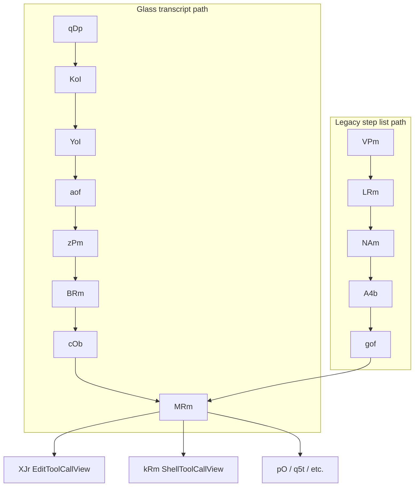
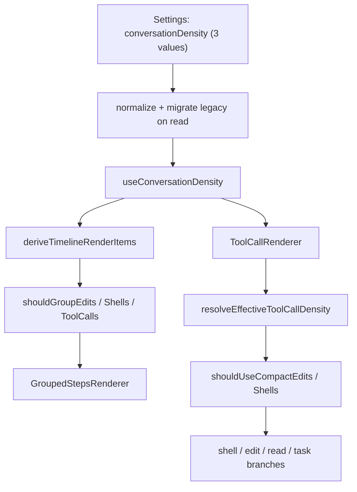

# Tool Call Density Parity — Cursor Entry Points and Multi Implementation Plan

## What this plan covers

This plan turns the reverse-engineered Cursor research into an actionable parity roadmap. The **entry point** is not a single function — it is a **layered pipeline** with two runtime paths in Cursor (Glass transcript vs legacy step list) that converge on the same density predicates and renderers.

**Product decision (locked):** Multi supports exactly **three** density values — the same stops as the settings slider. No legacy modes.

| Slider label | Stored value | Behavior |
|--------------|--------------|----------|
| Detailed (right) | `detailed` | Full edit/shell cards; no grouping |
| Balanced (middle) | `compact-ungrouped` | Compact edit/shell lines; no grouping |
| Compact (left) | `compact-all-grouped` | Compact edit/shell lines; grouped runs |

**Removed from Multi:** `compact-shells`, `compact-grouped`, `verbose`, `minimal`. Cursor still has these internally (`XBn` aliases, 5-stop `G8i`); we mirror only the **current 3-stop user-facing behavior**, not Cursor's legacy enum.

---

## Cursor entry point chain (reference architecture)

### Layer 0 — Constants and storage


| Symbol        | Value                                       | Role                                       |
| ------------- | ------------------------------------------- | ------------------------------------------ |
| `HFr`         | `cursor.composer.conversationDensity`       | Primary user setting key                   |
| `vSm`         | `cursor.composer.editorConversationDensity` | Editor-specific override                   |
| `VFr` / `b3n` | `compact-all-grouped`                       | Default when unset                         |
| `M9t`         | `detailed`                                  | Effective density when feature flag is off |
| Feature flag  | `conversation_density_setting`              | Gates slider UI and runtime reads          |


Cursor still normalizes legacy stored values via `XBn` (`verbose`, `minimal`, `compact-shells`, `compact-grouped`). **Multi does not** — persisted settings are migrated once to the nearest of the three values above, then only those three are valid at runtime.

**Binary location:** `[/Applications/Cursor.app/Contents/Resources/app/out/vs/workbench/workbench.desktop.main.js](/Applications/Cursor.app/Contents/Resources/app/out/vs/workbench/workbench.desktop.main.js)`

---

### Layer 1 — Settings UI mount

```
jTA(n, e)                              // hidden DOM React root for settings tab
  └─ ITk("appearance", rootWorkspace)
       └─ ETA({ rootWorkspace })       // Appearance panel
            ├─ sv("conversation_density_setting")   // feature flag gate
            ├─ VHn(HFr, VFr)          // [value, setter]
            ├─ XBn(U) → H             // normalize stored value
            └─ ATA({ onSelect, selectedOptionId: H })  // slider (G8i has 5 internal stops; user-facing is 3)
```

**Ownership:**

- `ETA` — mounts "Tool Call Density" row; label + description; analytics
- `ATA` — slider UI: Compact (left), Balanced (middle), Detailed (right) — **this 3-stop UX is what Multi implements**
- `VHn` — reads/writes `configurationService` for `HFr`

**Start here in Cursor binary:** search `ETA` / `ATA` / `conversation_density_setting`.

---

### Layer 2 — Config read (runtime)

Three readers, same key `HFr`:


| Function              | Mechanism                                           | Used where                     |
| --------------------- | --------------------------------------------------- | ------------------------------ |
| `VHn(n, e)`           | workspace config get/set                            | Settings (`ETA`)               |
| `s8(n, e, t, "user")` | `configurationService` + `onDidChangeConfiguration` | `GMS()` reactive hook          |
| `Cjt(n)`              | read-only reactive `getValue`                       | Glass transcript mount (`qDp`) |


**Runtime resolvers:**

```
$MS()  → wb("conversation_density_setting")

GMS()  → s8(HFr, …, VFr) + s8(vSm, …, ySm)
         → XBn(isGlass ? agentDensity : editorDensity)

f4o()  → $MS() ? GMS() : M9t("detailed")

WMS()  → isGlass ? GMS() : Iex(collapseAutoRunCommands)
         // non-glass terminal-compact path — out of scope for Multi (no compact-shells mode)
```

**Glass transcript bootstrap (`qDp`):**

```js
H = sv("conversation_density_setting")
z = Cjt(HFr)
V = H ? XBn(z ?? VFr) : M9t
// passed as conversationDensity:V → KoI
```

**Start here for runtime:** `f4o`, `GMS`, `Cjt`, `qDp`.

---

### Layer 3 — React context (density distribution)

```
F5r({ conversationDensity, copyToClipboard, onFileClick, …, children })
  ├─ XBn(conversationDensity) → normalized value
  └─ Kkf.Provider value={…conversationDensity:v, …}

SCe() → Nc(Kkf)   // hook: { conversationDensity, … }
```

**Mount sites:**

- Glass: `YoI` → `$(F5r, { conversationDensity: i, … })`
- Step list: `VPm` → optional `$(F5r, { conversationDensity: b, … })`

**Ownership:** Every downstream renderer calls `SCe()` — density is **context-only**, not passed as props to `MRm`.

**Start here for consumers:** `F5r`, `SCe`, `Kkf.Provider`.

---

### Layer 4 — Transcript / timeline build

**Export alias:** `buildAgentTranscriptRows` → `aof`

**Glass path (primary):**

```
qDp
  └─ KoI({ conversationDensity: V, … })
       └─ YoI
            ├─ M = getHeaderEntries(headers)
            ├─ aof(M, { conversationDensity: i, workGrouping })
            ├─ IFk / RFk                    // tail status rows
            ├─ DoI (virtualizer)
            └─ F5r → scroll + soI → zPm per row
```

`**aof` density decisions:**

```
pqb(density) → activity grouping mode:
  compact-all-grouped → "all" (cross-lane)
  else → "lane"

cof(lane, density) → standalone vs grouped per lane:
  fileChange → !lqb(density)   // !Wot
  shell      → !cqb(density)   // !Hot
```

**Start here for row projection:** `aof`, `pqb`, `cof`, `zPm` (`AgentTranscriptRowView`).

---

### Layer 5 — Step grouping

**Export alias:** `groupSteps` → `NAm`

```
NAm(steps, options)
  ├─ conversationDensity from options (default b3n)
  ├─ isToolGroupable: tFn(toolCase, toolCall, density)
  ├─ zIb(step, hasPending, rules) → merge eligibility
  └─ output: single | group | browser-group | waiting-group
```

**Called from:** `LRm` → `ln(() => NAm(n, o), [n, o])` using `SCe().conversationDensity`

**Density predicates (decision layer):**


| Predicate           | Meaning                                                               |
| ------------------- | --------------------------------------------------------------------- |
| `R6r(d)`            | `d !== "detailed"` → compact shells (`kRm` gets `compact: true`)      |
| `I6r(d)` / `vQp(d)` | compact edits (`compact-ungrouped` and `compact-all-grouped`)           |
| `Wot(d)` / `Hot(d)` | group edits/shells only for `compact-all-grouped`                     |
| `yAm(d)` / `_Am(d)` | mix edits + shells in same group only for `compact-all-grouped`       |
| `pqb(d)`            | activity lane `"all"` (Compact) vs `"lane"` (Detailed/Balanced)       |


**Pending approval override:** `MRm` forces `"detailed"` for edit/delete when `approval.status === "pending"`; shells force card path when pending.

**Start here for grouping:** `NAm`, `LRm`, `tFn`, `A4b` (group header + preview).

---

### Layer 6 — Per-step render (convergence point)

Two pipelines converge on `MRm`:




| Symbol                      | Role                                                                                        |
| --------------------------- | ------------------------------------------------------------------------------------------- |
| `gof` (`UiStepRenderer`)    | Single-step type switch (assistant, thinking, tool-call)                                    |
| `MRm`                       | Tool-case router; reads `SCe().conversationDensity`                                         |
| `XJr` (`EditToolCallView`)  | Edit/delete: full card (Detailed) vs minimal line (Balanced/Compact)                        |
| `kRm` (`ShellToolCallView`) | Shell: full card + 5-line preview (Detailed) vs compact line (Balanced/Compact)             |
| `A4b`                       | Grouped-step collapsible header + `ui-step-group-preview` (max 144px, `autoScrollToBottom`) |


**Start here for per-tool UI:** `MRm` (switch on `tool.case`), then `XJr` / `kRm`.

---

### Cursor density behavior matrix (council-confirmed)


| Behavior            | Detailed                                          | Balanced (`compact-ungrouped`)                               | Compact (`compact-all-grouped`)  |
| ------------------- | ------------------------------------------------- | ------------------------------------------------------------ | -------------------------------- |
| Edit/delete UI      | Full card + collapsed diff preview + expand       | Minimal line + chevron-right; no inline preview until expand | Same renderer as Balanced        |
| Shell UI            | Full card + 5-line output preview + expand scroll | Compact collapsible line + accordion on expand               | Same as Balanced                 |
| Read/grep/glob/etc. | Line renderer (`pO`)                              | Same                                                         | Same                             |
| Edit grouping       | Ungrouped                                         | Ungrouped                                                    | Grouped (`Wot`)                  |
| Shell grouping      | Ungrouped                                         | Ungrouped                                                    | Grouped (`Hot`)                  |
| Cross-type mixing   | No                                                | No                                                           | Yes (`yAm`/`_Am`)                |
| Activity lane       | `"lane"`                                          | `"lane"`                                                     | `"all"`                          |
| Exploration tools   | Group when ≥3 steps                               | Group when ≥3 steps                                          | Group when ≥2 + shell/edit rules |
| Pending approval    | Forces detailed card                              | Forces detailed card                                         | Forces detailed card             |


**Key insight:** Balanced vs Compact differ primarily in **grouping chrome**, not per-tool renderers. Only Detailed changes edit/shell component shape vs compact modes.

---

## Multi entry point chain (implementation target)

### Layer 0 — Constants and storage


| Cursor       | Multi equivalent                                                                                                                                        |
| ------------ | ------------------------------------------------------------------------------------------------------------------------------------------------------- |
| `HFr`        | `[packages/contracts/src/settings.ts](packages/contracts/src/settings.ts)` — `conversationDensity` (three values only)                                  |
| `XBn`        | **Removed** — no legacy alias layer; one-time migration in `normalizeConversationDensity` or settings decode                                            |
| Valid values | `USER_CONVERSATION_DENSITY_VALUES`: `detailed`, `compact-ungrouped`, `compact-all-grouped`                                                              |
| Feature flag | **Not implemented** — Multi always exposes slider and always applies stored density                                                                     |


---

### Layer 1 — Settings UI

```
settings.appearance route
  └─ AppearanceSettingsPanel
       └─ ToolCallDensitySlider
            ├─ toUserConversationDensity (read)
            └─ updateSettings({ conversationDensity }) (write)
```

**Files:**

- `[packages/app/src/routes/settings.appearance.tsx](packages/app/src/routes/settings.appearance.tsx)`
- `[packages/app/src/components/settings/appearance/appearance-settings-panel.tsx](packages/app/src/components/settings/appearance/appearance-settings-panel.tsx)`
- `[packages/app/src/components/settings/tool-call-density-control.tsx](packages/app/src/components/settings/tool-call-density-control.tsx)`

**Gap:** `ToolCallDensityPreview` exists in `tool-call-density-control.tsx` but is **not mounted** in the appearance panel (Cursor shows live preview in settings).

---

### Layer 2 — Config read

```
useSettings(selector)
  └─ useConversationDensity()
       └─ normalizeConversationDensity(settings.conversationDensity)
```

**Files:**

- `[packages/app/src/hooks/use-settings.ts](packages/app/src/hooks/use-settings.ts)` — `persistClientSettings` → IPC `setClientSettings`
- `[packages/app/src/hooks/use-conversation-density.ts](packages/app/src/hooks/use-conversation-density.ts)`
- `[packages/desktop/src/ipc/methods/client-settings.ts](packages/desktop/src/ipc/methods/client-settings.ts)`

**Gap vs Cursor:** No feature-flag fallback to `detailed`; no separate editor/glass keys; no `WMS` terminal-compact path.

---

### Layer 3 — Context distribution

**Cursor:** `F5r` / `SCe()` — single provider, all renderers consume context.

**Multi:** Hook + prop pattern — density read in multiple places:


| Consumer                                                                                   | Mechanism                                               |
| ------------------------------------------------------------------------------------------ | ------------------------------------------------------- |
| `[messages-timeline.tsx](packages/app/src/components/chat/timeline/messages-timeline.tsx)` | `useConversationDensity()` → grouping                   |
| `[tool-message.tsx](packages/app/src/components/chat/message/tool-message.tsx)`            | `useConversationDensity()` → prop to `ToolCallRenderer` |
| Settings preview                                                                           | Explicit `conversationDensity` prop                     |


**Gap:** No `AgentConversationProvider` equivalent; two independent subscriptions instead of one context tree.

---

### Layer 4 — Transcript build

```
chat-view.tsx
  └─ useThreadTimeline()
       └─ projectThreadTimeline()     // density-agnostic
            └─ MessagesTimeline
                 └─ deriveMessagesTimelineRows()
                      └─ deriveTimelineRenderItems({ conversationDensity })
```

**Files:**

- `[packages/app/src/components/chat/view/chat-view.tsx](packages/app/src/components/chat/view/chat-view.tsx)`
- `[packages/app/src/components/chat/view/use-thread-timeline.ts](packages/app/src/components/chat/view/use-thread-timeline.ts)`
- `[packages/app/src/components/chat/view/thread-timeline-projector.ts](packages/app/src/components/chat/view/thread-timeline-projector.ts)` — **no density** (by design)
- `[packages/app/src/components/chat/timeline/timeline-rows.ts](packages/app/src/components/chat/timeline/timeline-rows.ts)`
- `[packages/app/src/components/chat/timeline/timeline-render-items.ts](packages/app/src/components/chat/timeline/timeline-render-items.ts)` — **density-aware grouping**

**Cursor equivalent:** `aof` + `pqb` + `cof` → Multi's `deriveTimelineRenderItems` + `shouldGroupEdits`/`shouldGroupShells`/`shouldGroupToolCalls`.

---

### Layer 5 — Grouping render

```
MessagesTimeline → TimelineRowBody
  ├─ kind: "work" → GroupedStepsRenderer (WorkGroupHeaderButton, WorkGroupPreview)
  └─ single step → StepRenderer
```

**File:** `[packages/app/src/components/chat/timeline/step-renderer.tsx](packages/app/src/components/chat/timeline/step-renderer.tsx)`

**Cursor equivalent:** `LRm` + `A4b` → `GroupedStepsRenderer` + `WorkGroupPreview`.

---

### Layer 6 — Per-tool render

```
StepRenderer → WorkStepRenderer / RuntimeToolStepRenderer
  └─ ToolCallMessage / RuntimeToolCallMessage
       └─ ToolCallRenderer
            ├─ resolveEffectiveToolCallDensity (pending → detailed)
            ├─ shouldUseCompactShells / shouldUseCompactEdits
            └─ switch(tool.case) → shell / edit / task / read / …
```

**Files:**

- `[packages/app/src/components/chat/message/tool-message.tsx](packages/app/src/components/chat/message/tool-message.tsx)`
- `[packages/app/src/components/chat/message/tool-renderer.tsx](packages/app/src/components/chat/message/tool-renderer.tsx)`
- `[packages/app/src/styles/tool-call.css](packages/app/src/styles/tool-call.css)`
- `[packages/app/src/styles/conversation.css](packages/app/src/styles/conversation.css)`

**Cursor equivalent:** `MRm` → `XJr` / `kRm` → `ToolCallRenderer` shell/edit branches.

**Gaps:**

- `renderStep` prop exists on `ToolCallRenderer` but `**tool-message.tsx` never passes it** (blocks nested subagent transcript parity)
- Tray fallback `[SubagentActivityLine](packages/app/src/components/chat/composer/subagents/subagent-tray.tsx)` bypasses `ToolCallRenderer` entirely

---

## Side-by-side entry point map


| Layer            | Cursor symbol                  | Multi file / symbol                                              | Parity status                          |
| ---------------- | ------------------------------ | ---------------------------------------------------------------- | -------------------------------------- |
| Storage key      | `HFr`                          | `ClientSettings.conversationDensity`                             | OK                                     |
| Normalize        | `XBn`                          | `normalizeConversationDensity` (migrate-only, then identity)     | **Change** — drop legacy aliases       |
| Settings UI      | `ETA` + `ATA`                  | `AppearanceSettingsPanel` + `ToolCallDensitySlider`              | Partial (no preview)                   |
| Feature flag     | `conversation_density_setting` | —                                                                | Missing                                |
| Context          | `F5r` / `SCe`                  | `useConversationDensity` hook                                    | Architectural diff                     |
| Transcript rows  | `aof`                          | `projectThreadTimeline` (agnostic) + `deriveTimelineRenderItems` | OK split                               |
| Activity lane    | `pqb`                          | `shouldGroupToolCalls` + grouping in `timeline-render-items.ts`  | Verify `pqb` "all" vs "lane"           |
| Step grouping    | `NAm`                          | `deriveTimelineRenderItems`                                      | Partial (cross-type mixing, min sizes) |
| Group UI         | `A4b` / `LRm`                  | `GroupedStepsRenderer`                                           | Partial (preview scroll, stats header) |
| Tool router      | `MRm`                          | `ToolCallRenderer`                                               | Partial                                |
| Edit UI          | `XJr`                          | `editToolCall` branch in `tool-renderer.tsx`                     | Partial (minimal vs card)              |
| Shell UI         | `kRm`                          | `shellToolCall` branch in `tool-renderer.tsx`                    | Partial (5-line preview detailed-only) |
| Pending override | `MRm` pending→detailed         | `resolveEffectiveToolCallDensity`                                | OK                                     |


---

## Implementation phases

### Phase 0 — Collapse to three-value model (do first)

**Goal:** One enum, one slider, one predicate surface. No `compact-shells`, `compact-grouped`, `verbose`, or `minimal` anywhere in runtime code.

**Contracts** — [`packages/contracts/src/settings.ts`](packages/contracts/src/settings.ts):

- Set `ConversationDensity` = `UserConversationDensity` (the three literals only)
- Remove `compact-shells` and `compact-grouped` from `ConversationDensity` schema
- `DEFAULT_CONVERSATION_DENSITY` stays `compact-all-grouped`

**Shared predicates** — [`packages/shared/src/conversation-density.ts`](packages/shared/src/conversation-density.ts):

- `normalizeConversationDensity`: accept only the three values at runtime; on read, map any persisted legacy value once:
  - `verbose`, `detailed` → `detailed`
  - `compact-shells`, `compact-ungrouped` → `compact-ungrouped`
  - `minimal`, `compact-grouped`, `compact-all-grouped` → `compact-all-grouped`
- Remove `compact-grouped` from `GROUPED_DENSITIES` / `COMPACT_EDIT_DENSITIES` sets (only `compact-all-grouped` groups; both compact modes use compact edits/shells)
- Simplify `toUserConversationDensity` to identity (or delete if redundant)
- Predicates become explicit three-way switches:
  - `shouldGroupEdits` / `shouldGroupShells` / `shouldGroupToolCalls` → true only for `compact-all-grouped`
  - `shouldUseCompactEdits` / `shouldUseCompactShells` → true for `compact-ungrouped` and `compact-all-grouped`

**Persistence migration** — [`packages/app/src/hooks/use-settings.ts`](packages/app/src/hooks/use-settings.ts) or client-settings decode:

- When loading settings, if `conversationDensity` is a legacy value, normalize and **write back** the canonical three-value form so disk state converges

**Tests** — [`packages/shared/test/conversation-density.test.ts`](packages/shared/test/conversation-density.test.ts):

- Replace legacy-alias assertions with migration tests (legacy in → canonical out)
- Assert predicates only for the three values

**Verification:** `pnpm run typecheck`; fix any call sites still referencing removed literals.

---

### Phase 1 — Document and verify entry points (no behavior change)

Add an **Entry Point Map** section to `[packages/app/ARCHITECTURE.md](packages/app/ARCHITECTURE.md)` mirroring this plan's two chains. Annotate each Multi file with its Cursor symbol equivalent so future agents land in the right layer first.

**Verification:** `pnpm run typecheck` from repo root.

---

### Phase 2 — Predicate and grouping parity

**Target:** `[packages/shared/src/conversation-density.ts](packages/shared/src/conversation-density.ts)` + `[timeline-render-items.ts](packages/app/src/components/chat/timeline/timeline-render-items.ts)`

Align with Cursor predicates:

- Add `shouldMixEditAndShellGroups(density)` for `compact-all-grouped` only (`yAm`/`_Am`)
- Add `activityGroupingMode(density)` → `"all"` | `"lane"` (`pqb`)
- Confirm `timelineMinGroupSize`: Compact uses `minGroupSize: 2` for shell/edit groups; exploration tools keep min 3 at Detailed/Balanced
- Ensure pending-approval steps **break groups** (Cursor `zIb` guard)

**Tests:** Extend `[timeline-render-items.test.ts](packages/app/src/components/chat/timeline/timeline-render-items.test.ts)` with matrix cases for all three user-facing densities.

---

### Phase 3 — Per-tool renderer parity (`MRm` / `ToolCallRenderer`)

**Target:** `[tool-renderer.tsx](packages/app/src/components/chat/message/tool-renderer.tsx)` + CSS


| Tool        | Detailed                                                                        | Balanced / Compact                                                         |
| ----------- | ------------------------------------------------------------------------------- | -------------------------------------------------------------------------- |
| Edit/delete | Full card, collapsed `InlineToolDiff`, chevron down/up expand                   | `ui-edit-tool-call--minimal` line, chevron-right, expand reveals full card |
| Shell       | `ToolCallShellRoot` card + 5-line output preview window + full scroll on expand | `ToolCallLine` compact + accordion body on expand                          |
| Pending     | Always detailed card path                                                       | Same override                                                              |


**CSS:** Match Cursor selectors in `[tool-call.css](packages/app/src/styles/tool-call.css)` — preview max-height 144px, `autoScrollToBottom` gated on `loading`.

---

### Phase 4 — Group chrome parity (`A4b` / `GroupedStepsRenderer`)

**Target:** `[step-renderer.tsx](packages/app/src/components/chat/timeline/step-renderer.tsx)`

- Group header: action + file stats (additions/deletions) in Compact
- Collapsed preview strip: `WorkGroupPreview` with max-height + auto-scroll during active run
- Running group tail behavior: match Cursor `ui-step-group-preview` scroll-follow

---

### Phase 5 — Settings UX parity (`ETA` / `ATA`)

**Target:** `[appearance-settings-panel.tsx](packages/app/src/components/settings/appearance/appearance-settings-panel.tsx)`

- Mount `ToolCallDensityPreview` below slider (live edit + shell samples)
- Optional: add feature-flag gate if product wants Cursor's "flag off → detailed" behavior

---

### Phase 6 — Tray and nested subagent path (`O4b` / `taskToolCall`)

**Target:** `[tool-message.tsx](packages/app/src/components/chat/message/tool-message.tsx)`, `[subagent-tray.tsx](packages/app/src/components/chat/composer/subagents/subagent-tray.tsx)`

- Wire `renderStep` from `StepRenderer` into `ToolCallRenderer` for `taskToolCall`
- Remove `SubagentActivityLine` fallback for tool rows; route through `StepRenderer` → `ToolCallRenderer` with same density
- Cross-reference existing tray work in `[.cursor/plans/subagent-ui-parity-remediation.md](.cursor/plans/subagent-ui-parity-remediation.md)`

---

## Density decision flow (implementation mental model)




---

## Open decisions (resolve before Phase 2)

1. **Feature flag:** Should Multi gate the density setting behind `conversation_density_setting` (flag off → always `detailed`), or always honor stored value?
2. **Context provider:** Introduce `AgentConversationProvider` equivalent to dedupe subscriptions, or keep hook+prop pattern?

**Resolved:** Legacy density modes removed. Multi uses only `detailed`, `compact-ungrouped`, `compact-all-grouped`.

---

## Verification checklist

- [ ] `ConversationDensity` type has exactly three values; no legacy literals in schema
- [ ] Persisted legacy values migrate to canonical three on load
- [ ] Settings slider writes/read round-trip via `setClientSettings` IPC
- [ ] `deriveTimelineRenderItems` tests cover Detailed / Balanced / Compact grouping matrix
- [ ] `ToolCallRenderer` tests or snapshot for edit/shell at each density + pending override
- [ ] Manual: long shell run auto-scrolls preview in Detailed card and grouped Compact header
- [ ] Tray tool rows use same `ToolCallRenderer` path as main chat
- [ ] `pnpm run typecheck` passes

---

## Where to start (first file per task)


| Task                    | Open first                                                                                                                     |
| ----------------------- | ------------------------------------------------------------------------------------------------------------------------------ |
| Understand Cursor chain | `workbench.desktop.main.js` — search `ETA`, `f4o`, `F5r`, `aof`, `NAm`, `MRm`                                                  |
| Multi settings entry    | `[appearance-settings-panel.tsx](packages/app/src/components/settings/appearance/appearance-settings-panel.tsx)`               |
| Multi grouping entry    | `[timeline-render-items.ts](packages/app/src/components/chat/timeline/timeline-render-items.ts)` — `deriveTimelineRenderItems` |
| Multi render entry      | `[tool-renderer.tsx](packages/app/src/components/chat/message/tool-renderer.tsx)` — `ToolCallRenderer`                         |
| Three-value collapse    | `[settings.ts](packages/contracts/src/settings.ts)` + `[conversation-density.ts](packages/shared/src/conversation-density.ts)` |
| Multi predicates        | `[conversation-density.ts](packages/shared/src/conversation-density.ts)`                                                       |
| Tray parity             | `[subagent-tray.tsx](packages/app/src/components/chat/composer/subagents/subagent-tray.tsx)`                                   |


