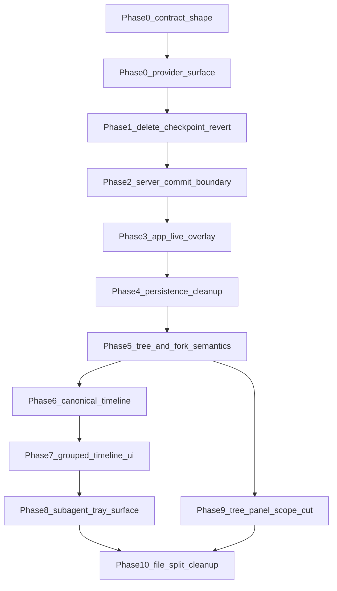

# Total nuclear recovery plan

## Scope

This plan is the implementation guide that [docs/implementation-notes/total-nuclear-broken.md](docs/implementation-notes/total-nuclear-broken.md) is missing. It covers the full cut, not a partial next phase.

In scope:

- Delete checkpoint and revert as shipped concepts, not hide them behind flags.
- Replace durable assistant deltas with turn-scoped live streaming plus one committed assistant message.
- Make `leafId` and explicit `parentEntryId` the only branch and fork model.
- Make server timeline rows canonical, then let the app branch-filter and group them for display.
- Keep subagent detail as a standalone tray surface while sharing the same step rendering logic as the timeline.
- Use pi-mono for parent-pointer tree helpers and product-grade tree panel behavior only when that behavior ships complete.
- Keep provider connections to Codex app-server, Claude SDK, and Cursor only.

Canonicality constraints:

- This is unreleased code. Do not preserve backward compatibility with internal branch states.
- Delete old event names, reducers, adapters, tests, and fallback paths in the same wave that migrates their callers.
- Prefer a smaller canonical product over a broad product with dual paths.
- Cursor is evidence, not a template to copy. Multi should use the same separation of concerns and then ship the sharper product.
- Codex app-server is the provider/runtime reference. Claude is a frontier model surface and stays first-class through a solid SDK adapter. Cursor is the UX and architecture reference.
- Remove OpenCode and standalone Cursor SDK provider connections. Maintaining extra SDKs is not frontier work unless their product surface earns its place.
- Every transitional state must be planned, short-lived, and removed before the phase exits.

Out of scope for the core deletion wave:

- A new checkpoint-like diff product.
- Full `ThreadTreePanel` product promotion with filters, folding, labels, and connector art.
- Keeping old and new internal APIs alive for compatibility.
- Leaving a fallback path because an internal test still expects it.
- Provider-agnostic SDK maintenance outside Codex app-server and Cursor.

## Evidence base

Composer 2.5 gathered the evidence from four read-only workstreams.

- The local note names eight next-cut steps and shows competing models across [packages/contracts/src/orchestration.ts](packages/contracts/src/orchestration.ts), [packages/server/src/orchestration/ProjectionPipeline.ts](packages/server/src/orchestration/ProjectionPipeline.ts), [packages/server/src/orchestration/ProviderRuntimeIngestion.ts](packages/server/src/orchestration/ProviderRuntimeIngestion.ts), [packages/app/src/stores/thread-sync.ts](packages/app/src/stores/thread-sync.ts), and [packages/app/src/components/chat/view/chat-view.tsx](packages/app/src/components/chat/view/chat-view.tsx).
- The Cursor bundle at `/Applications/Cursor.app/Contents/Resources/app/out/vs/workbench/workbench.desktop.main.js` shows atomic step rendering with `thinking`, `assistant-message`, and `tool-call`. It groups on the client with `GroupedSteps`, renders task tools through `TaskToolCallView`, and recursively nests `SubagentTurnView`. Branch state is separate from the step renderer.
- [cursor-composer-reference.md](cursor-composer-reference.md) records the corrected subagent model: Cursor and Multi use inline status rows plus a detailed transcript overlay above the composer. The tray is not duplicate state if it owns the detailed transcript surface and shares rendering primitives.
- The pi-mono mirror from `codebase-cli` shows the source tree model. It uses append-only entries with `parentId`, an active `leafId`, path-to-root branch reads, and tree flattening for active-branch-first UI.
- [README.md](README.md) says the product is frontier-first, opinionated, and frontend-owned. The supported built-ins are Codex app-server, Claude SDK, and Cursor. The implementation should remove OpenCode and standalone Cursor SDK while keeping Claude's SDK wiring strong.
- [packages/effect-codex-app-server](packages/effect-codex-app-server) is an upstream Codex app-server protocol package. [packages/server/src/provider/CodexAdapter.ts](packages/server/src/provider/CodexAdapter.ts) normalizes it into Multi contracts. The app should not render Codex app-server schemas directly.
- The `pingdotgg/t3code` mirror must be reviewed with `codebase-cli` before rebuilding Claude adapter wiring. Use it as a concrete SDK integration reference for session lifecycle, streaming normalization, permission/tool callbacks, abort handling, and error boundaries.
- GPT-5.5 medium sidecar review of the `pingdotgg/t3code` mirror found a remaining local provider wiring risk: [packages/server/src/provider/ProviderAdapterRegistry.ts](packages/server/src/provider/ProviderAdapterRegistry.ts) maps custom provider instances back to singleton adapters while provider subscriptions are per instance. Before final provider cleanup, align this with t3code-style per-instance adapter construction or remove custom instance support from that path.
- The verification map found strong unit coverage for contracts, server projection, app sync, and timeline rows. It found gaps for queue guards, optimistic canonical overlay, subagent tray browser parity, and `ThreadTreePanel`.

Opus reviewed the UI plan. The user correction supersedes its tray-deletion recommendation, but the other data-shape corrections still stand.

- Keep render grouping and tree flattening as separate data shapes.
- Replace the existing `kind: work` collapse rather than wrapping it.
- Keep the tray as the standalone detailed subagent surface. Delete only private tray adapters that fork rendering logic.

GPT 5.5 reviewed the rough plan. It changed the plan in three ways.

- Split server streaming invariants from app live overlay work.
- Add explicit reconnect and idempotency rules.
- Treat the pi-mono tree panel work as a scope cut unless product explicitly owns it.

## Target data shapes

Name these first. They are the spine of the implementation.

- `ThreadEntryGraph`. Durable parent-pointer entries with `id`, `parentEntryId`, role or kind, timestamp, and a thread-level `leafId`. Helpers in [packages/contracts/src/thread-tree.ts](packages/contracts/src/thread-tree.ts) own path, branch, and navigate semantics.
- `CommittedTimelineRow`. Server-owned durable rows derived from projected committed events. Rows do not contain partial assistant deltas.
- `LiveAssistantTurn`. App-visible transient streaming state keyed by `turnId`. It can be lost on reconnect without corrupting durable history.
- `PendingTimelineRow`. App-owned optimistic send state. It enters the same render IR as a synthetic pending row after branch filtering. It reconciles to the committed row by a stable client send key.
- `TimelineRenderItem`. App-only render IR. It is a union of `single`, `group`, and `waitingGroup`. Do not add `browserGroup` unless Multi has browser tool rows that need it.
- `ThreadTreeViewNode`. App or contract-level flattened tree view data derived from `ThreadEntryGraph`. It carries active-path order, indent, fold state, and decorative connector metadata. It never enters the timeline step renderer.
- `ProviderSurface`. The supported provider connection set is `codex`, `claudeAgent`, and `cursor`. `codex` uses Codex app-server as upstream input. `claudeAgent` uses the Claude Agent SDK behind `ClaudeAdapter`. `cursor` uses the Cursor integration. `opencode` and standalone `cursorSdk` are deleted provider surfaces.
- `SubagentTraySelection`. App-owned state for the standalone subagent tray. It stores which subagent transcript is open and points at canonical timeline or transcript rows. It does not define its own renderer.

## Architecture choice

Chosen approach:

- Delete old history mechanisms first.
- Define durable event and tree invariants in contracts.
- Prune provider connections before the orchestration rewrite so only Codex, Claude, and Cursor drive the canonical event model.
- Make the server own committed projection only.
- Make the app own branch filtering, transient stream overlays, optimistic rows, grouping, collapse state, and visual rendering.
- Remove fallback derivation as soon as canonical rows are always available. Do not keep fallback code for internal compatibility.
- Keep the standalone subagent tray, but make it a second surface over the same renderer rather than a private adapter.

Rejected alternatives:

- Patching current `chatTimelineRows` clearing and legacy derivation in place. This preserves the current split-brain model.
- Moving Cursor-style grouping into the server contract. The bundle shows grouping is a presentation pass, and putting it in contracts would bake UI policy into durable data.
- Half-productizing the pi-mono tree selector in the same wave. If it enters the product, it must ship with keyboard navigation, focus behavior, tests, and a clear role. Otherwise it stays out.
- Deleting the subagent tray. The corrected Cursor evidence and the product intent both point to a standalone detailed transcript surface.
- Keeping every provider adapter because a generic SDK layer already exists. Claude is retained because it is a frontier surface; OpenCode and standalone Cursor SDK are still deleted.

## Dependency graph

## Phase 0. Contract shape and deletion map

Goal:

- Freeze the target shapes before deleting code.

Changes:

- Write the deletion map for checkpoint, revert, durable deltas, dead entry columns, legacy timeline derivation, extra provider connections, and private subagent tray adapters.
- Define the exact durable event names and row shapes in [packages/contracts/src/orchestration.ts](packages/contracts/src/orchestration.ts).
- Add or update branch helper tests in [packages/contracts/src/thread-tree.test.ts](packages/contracts/src/thread-tree.test.ts).
- Add contract tests that assert checkpoint and revert shapes are gone once deletion lands.
- Mark every old shape as delete, migrate, or already gone. Do not create a preserve bucket.

Data structures:

- `ThreadEntryGraph`, `CommittedTimelineRow`, `LiveAssistantTurn`, `PendingTimelineRow`.

Verification:

- `pnpm --filter @multi/contracts test -- src/thread-tree.test.ts`
- `pnpm --filter @multi/contracts test`
- `pnpm run typecheck`

Exit criteria:

- The next phases can point to one source of truth for tree paths, durable rows, live streams, and pending sends. No compatibility adapter is planned.

## Phase 0A. Provider surface pruning and Claude SDK hardening

Goal:

- Keep only Codex app-server, Claude SDK, and Cursor before the orchestration model is rebuilt, and harden Claude SDK wiring against the `t3code` reference.

Changes:

- Update [README.md](README.md) and any provider-facing copy so the built-in provider list is Codex, Claude, and Cursor only.
- Keep Claude settings in [packages/contracts/src/settings.ts](packages/contracts/src/settings.ts). Remove OpenCode and standalone Cursor SDK settings. Keep Codex settings and Cursor settings.
- Keep Claude raw provider sources that are emitted by the retained Claude SDK adapter. Remove OpenCode and standalone Cursor SDK raw provider sources from [packages/contracts/src/provider-runtime.ts](packages/contracts/src/provider-runtime.ts). Keep `codex.app-server.*` and Cursor sources that are part of the kept Cursor integration.
- Keep Claude provider services, adapter services, runtime layers, registry entries, cache entries, tests, and settings UI rows. Remove OpenCode and standalone Cursor SDK provider services, adapter services, runtime layers, registry entries, cache entries, tests, and settings UI rows.
- Remove app settings panels, model menus, command-menu affordances, provider refresh paths, and tests that only exist for OpenCode or standalone Cursor SDK.
- Update [packages/server/src/server-runtime.ts](packages/server/src/server-runtime.ts), [packages/server/src/provider/builtInProviderCatalog.ts](packages/server/src/provider/builtInProviderCatalog.ts), and [packages/server/src/provider/ProviderRegistry.ts](packages/server/src/provider/ProviderRegistry.ts) so runtime wiring registers Codex, Claude, and Cursor only.
- Keep [packages/effect-codex-app-server](packages/effect-codex-app-server) as the upstream Codex protocol package. Do not expose its schemas to the app.
- Use `codebase-cli` to inspect `github:pingdotgg/t3code` before modifying Claude SDK wiring. Mirror its useful boundaries where they fit Multi: top-level SDK imports, session lifecycle ownership, stream event normalization, permission/tool callbacks, abort propagation, and typed error normalization.
- Keep Cursor as UX and integration reference. Delete standalone Cursor SDK as a separate provider connection unless it is the implementation behind the kept Cursor provider.

Data structures:

- `ProviderSurface` with only `codex`, `claudeAgent`, and `cursor`.

Verification:

- Update and run provider registry tests in [packages/server/test/lib/server.test.ts](packages/server/test/lib/server.test.ts).
- Update and run local API provider tests in [packages/app/src/local-api.test.ts](packages/app/src/local-api.test.ts).
- Update and run settings tests that decode provider settings.
- Add or update Claude adapter tests that prove SDK stream events, permission callbacks, aborts, and errors normalize into Multi runtime events without leaking SDK-only shapes to the app.
- Run `pnpm --filter @multi/contracts test`.
- Run `pnpm run typecheck`.

Exit criteria:

- The app and server expose only Codex, Claude, and Cursor as provider connections. Claude SDK wiring is covered by adapter tests and does not leak SDK-only shapes to the app. No OpenCode or standalone Cursor SDK settings, registry entries, runtime layers, or tests remain.

## Phase 1. Delete checkpoint and revert

Goal:

- Remove checkpoint and revert as first-class product and data concepts.

Changes:

- Delete checkpoint contracts and RPC shapes from [packages/contracts/src/orchestration.ts](packages/contracts/src/orchestration.ts) and [packages/contracts/src/ipc.ts](packages/contracts/src/ipc.ts).
- Remove runtime wiring in [packages/server/src/server-runtime.ts](packages/server/src/server-runtime.ts), [packages/server/src/ws.ts](packages/server/src/ws.ts), and `packages/server/src/checkpointing`.
- Remove checkpoint capture and revert projection from [packages/server/src/orchestration/ProjectionPipeline.ts](packages/server/src/orchestration/ProjectionPipeline.ts) and [packages/server/src/orchestration/projector.ts](packages/server/src/orchestration/projector.ts).
- Remove app reducers, diff summaries, and `thread.reverted` handling from [packages/app/src/stores/thread-sync.ts](packages/app/src/stores/thread-sync.ts) and [packages/app/src/stores/thread-store.ts](packages/app/src/stores/thread-store.ts).
- Delete tests that only protect checkpoint implementation details. Rewrite tests that should now assert absence.

Data structures:

- No replacement checkpoint type. If diffs return later, they must be a new product built over committed timeline rows.

Verification:

- `pnpm --filter usemulti test -- test/orchestration/ProjectionPipeline.test.ts`
- `pnpm --filter usemulti test -- test/orchestration/projector.test.ts`
- `pnpm --filter usemulti test -- test/orchestration/CheckpointReactor.test.ts` should be deleted or no longer referenced.
- `pnpm --filter @multi/app test -- src/stores/thread-store.test.ts src/stores/thread-sync.test.ts`
- `pnpm run typecheck`

Exit criteria:

- There are no checkpoint or revert schema exports, services, runtime layers, reducers, adapters, fallback paths, or tests left.

## Phase 2. Server assistant commit boundary

Goal:

- Make durable history store one final assistant message per assistant turn.

Changes:

- Replace durable `thread.message.assistant.delta` projection with transient streaming events in [packages/server/src/orchestration/decider.ts](packages/server/src/orchestration/decider.ts), [packages/server/src/orchestration/ProviderRuntimeIngestion.ts](packages/server/src/orchestration/ProviderRuntimeIngestion.ts), [packages/server/src/orchestration/ProjectionPipeline.ts](packages/server/src/orchestration/ProjectionPipeline.ts), and [packages/server/src/orchestration/projector.ts](packages/server/src/orchestration/projector.ts).
- Define idempotency for final assistant commit events. Duplicate commits for the same turn must converge to one durable row.
- Define cancellation behavior. Cancelled turns may show transient text, but they do not write a committed assistant message unless the provider completed.
- Define reconnect behavior. If live tokens are lost before commit, the app shows no durable partial and waits for the final committed row.

Data structures:

- `LiveAssistantTurn` keyed by `turnId`.
- `CommittedAssistantMessage` or equivalent final event keyed by stable turn and message identifiers.

Verification:

- Add server tests for many deltas followed by one commit.
- Add reconnect and duplicate-commit tests in the server projection or ingestion suite.
- Run `pnpm --filter usemulti test -- test/orchestration/ProviderRuntimeIngestion.test.ts test/orchestration/ProjectionPipeline.test.ts test/orchestration/projector.test.ts`.
- Run `pnpm run typecheck`.

Exit criteria:

- Durable projection never appends assistant text incrementally.

## Phase 3. App live stream and optimistic overlay

Goal:

- Let the app show transient streaming and optimistic sends without corrupting canonical rows.

Changes:

- Stop treating streaming `thread.message-sent` as durable append behavior in [packages/app/src/stores/thread-sync.ts](packages/app/src/stores/thread-sync.ts).
- Keep transient stream state keyed by `turnId` until the committed row arrives, the turn cancels, or the stream is interrupted.
- Represent optimistic sends as `PendingTimelineRow` values that enter the render IR after branch filtering. Layout, grouping, and reconciliation use one path.
- Preserve focus and scroll position when a pending row reconciles to a committed row.

Data structures:

- `LiveAssistantTurn`, `PendingTimelineRow`, and a stable client send key that reconciles pending user sends to committed rows.

Verification:

- Add app sync tests for transient streaming and final commit reconciliation in [packages/app/src/stores/thread-sync.test.ts](packages/app/src/stores/thread-sync.test.ts).
- Add browser coverage in [packages/app/src/components/chat/view/chat-view.browser.tsx](packages/app/src/components/chat/view/chat-view.browser.tsx) for send, pending bubble, and reconciliation.
- Run `pnpm --filter @multi/app test -- src/stores/thread-sync.test.ts src/stores/thread-store.test.ts`.
- Run targeted browser test after adding it.

Exit criteria:

- Live text, pending sends, and committed rows have explicit lifetimes and do not fight each other.

## Phase 4. Persistence cleanup

Goal:

- Delete dead tree entry columns and remove every reader that keeps them alive.

Changes:

- Audit [packages/server/src/persistence/ProjectionThreadEntries.service.ts](packages/server/src/persistence/ProjectionThreadEntries.service.ts), migration `027_ProjectionThreadEntries`, migration `029_ProjectionThreadsLeafId`, and projection writes.
- Delete `targetEntryId`, `label`, and `summary`.
- If a reader still consumes one of those fields, migrate that reader to `ThreadEntryGraph` or delete the reader. Do not defer the schema cleanup to preserve it.

Data structures:

- `ThreadEntryGraph` with only fields needed for durable branch traversal.

Verification:

- Persistence and projection tests that read thread entries.
- `pnpm --filter usemulti test -- test/orchestration/ProjectionPipeline.test.ts`
- `pnpm run typecheck`

Exit criteria:

- The physical schema matches the target graph shape, and no fallback reader keeps old columns alive.

## Phase 5. Tree navigation, fork semantics, and queue guard

Goal:

- Separate navigation from mutation.

Changes:

- Fix `resolveLeafIdAfterThreadNavigate` in [packages/contracts/src/thread-tree.ts](packages/contracts/src/thread-tree.ts) so navigation moves to the requested leaf. Keep the parent-of-user rule only for edit or fork send behavior.
- Update [packages/server/src/orchestration/decider.ts](packages/server/src/orchestration/decider.ts) to use the contract helper and preserve idle checks.
- Keep user edit fork behavior in [packages/app/src/components/chat/view/chat-view.tsx](packages/app/src/components/chat/view/chat-view.tsx) as explicit `thread.turn.start` with `parentEntryId`.
- Add an app-owned guard that blocks tree mutation when a send is in flight or queued composer items exist. Cover [packages/app/src/components/chat/composer/queue](packages/app/src/components/chat/composer/queue), [packages/app/src/components/chat/view/use-thread-composer-queue.ts](packages/app/src/components/chat/view/use-thread-composer-queue.ts), and [packages/app/src/chat-send-queue-dispatch.ts](packages/app/src/chat-send-queue-dispatch.ts) as needed.
- Delete any older helper that lets queue dispatch, tree navigation, and fork sends compute branch state differently.

Data structures:

- `ThreadEntryGraph` and a small `ThreadTreeMutationAvailability` or equivalent app view model.

Verification:

- `pnpm --filter @multi/contracts test -- src/thread-tree.test.ts`
- Add app tests for queue guard behavior.
- Extend [packages/app/src/components/chat/view/thread-branch-view.test.ts](packages/app/src/components/chat/view/thread-branch-view.test.ts) if branch filtering semantics change.
- Run `pnpm --filter @multi/app test -- src/components/chat/view/thread-branch-view.test.ts`.

Exit criteria:

- Read navigation cannot fork. Mutation paths must name their parent explicitly.

## Phase 6. Canonical timeline ownership

Goal:

- Make server timeline rows the only durable timeline source.

Changes:

- Keep [packages/server/src/orchestration/chat-timeline-derivation.ts](packages/server/src/orchestration/chat-timeline-derivation.ts) and [packages/server/src/orchestration/ThreadProjection.ts](packages/server/src/orchestration/ThreadProjection.ts) as the canonical row source.
- Stop clearing `chatTimelineRows` on every live event in [packages/app/src/stores/thread-sync.ts](packages/app/src/stores/thread-sync.ts).
- Remove legacy fallback derivation from [packages/app/src/components/chat/view/chat-view.tsx](packages/app/src/components/chat/view/chat-view.tsx) in the same wave that makes canonical rows always present.
- Refactor [packages/app/src/components/chat/view/thread-branch-view.ts](packages/app/src/components/chat/view/thread-branch-view.ts) so branch filtering happens before render grouping.
- Replace the existing `tool-summary` and `global-status` to `kind: work` collapse. Do not run two grouping systems.

Data structures:

- `CommittedTimelineRow` as input.
- `TimelineRenderItem` as app-only output.

Verification:

- `pnpm --filter usemulti test -- test/orchestration/chat-timeline-derivation.test.ts`
- `pnpm --filter @multi/app test -- src/components/chat/view/thread-branch-view.test.ts`
- Browser coverage in [packages/app/src/components/chat/timeline/messages-timeline.browser.tsx](packages/app/src/components/chat/timeline/messages-timeline.browser.tsx).
- `pnpm run typecheck`

Exit criteria:

- There is one durable timeline owner, and app rendering starts from branch-filtered canonical rows plus explicit pending rows. There is no legacy derivation fallback.

## Phase 7. Grouped timeline UI

Goal:

- Ship a frontier-quality grouped timeline using Cursor’s proven separation of concerns without copying bundle internals blindly.

Changes:

- Add app timeline modules for `TimelineRenderItem`, `GroupedSteps`, and `StepRenderer` near [packages/app/src/components/chat/timeline](packages/app/src/components/chat/timeline).
- Support `single`, `group`, and `waitingGroup`. Hold `browserGroup` until Multi has browser step data.
- Use data attributes aligned with Cursor’s bundle evidence where useful, including `data-message-kind`, `data-tool-status`, and `data-tool-call-id`.
- Use real button semantics for collapsibles, `aria-expanded`, `aria-controls`, `aria-busy` for waiting groups, and reduced motion support.
- Keep grouping state app-owned so collapse state survives row updates and virtualization.

Data structures:

- `TimelineRenderItem` and `TimelineStep`.

Verification:

- Add unit tests for grouping rules.
- Extend [packages/app/src/components/chat/timeline/messages-timeline.browser.tsx](packages/app/src/components/chat/timeline/messages-timeline.browser.tsx) for group collapse, waiting group, and status transitions.
- Run `pnpm --filter @multi/app test -- src/components/chat/timeline/timeline-rows.test.ts` if the legacy row helper remains during transition.
- Run targeted browser tests.

Exit criteria:

- Work grouping is one app presentation pass, not a server row kind plus a second app collapse. The UI is keyboard reachable, stable under streaming, and readable with assistive tech.

## Phase 8. Subagent tray surface

Goal:

- Keep subagents as a standalone detailed tray surface while sharing canonical rendering logic with the timeline.

Changes:

- Use Cursor's two-surface model as the reference. Inline task rows show compact subagent status and open the standalone tray. The tray owns the detailed transcript.
- Rename [packages/app/src/stores/subagent-preview-store.ts](packages/app/src/stores/subagent-preview-store.ts) to tray language. The target state is `SubagentTraySelection`, not preview selection.
- Rename [packages/app/src/components/chat/composer/subagents/subagent-preview-tray.tsx](packages/app/src/components/chat/composer/subagents/subagent-preview-tray.tsx) to tray language. Do not delete the standalone surface.
- Delete private transcript adapters inside the tray. The tray and timeline must render from the same `TimelineStep`, `GroupedSteps`, `StepRenderer`, and tool-row primitives.
- Inline subagent rows in [packages/app/src/components/chat/message/tool-message.tsx](packages/app/src/components/chat/message/tool-message.tsx) should be entry points into the tray, not a full duplicate transcript.
- Nested task cards and tray rows expose status by text and icon, not color alone. Decorative connector metadata stays `aria-hidden`.
- Switching threads clears tray selection. Collapsing the composer hides the tray without losing the selected subagent when the same thread remains active.

Data structures:

- `TimelineStep` with a task variant that carries optional `subagentConversation` turns and loaded steps.
- `SubagentTraySelection` keyed by thread and subagent identity.

Verification:

- Rename and update [packages/app/src/components/chat/composer/subagent-preview-tray.test.ts](packages/app/src/components/chat/composer/subagent-preview-tray.test.ts) and [packages/app/src/stores/subagent-preview-store.test.ts](packages/app/src/stores/subagent-preview-store.test.ts) to assert tray ownership and shared rendering inputs.
- Add browser coverage for inline status row to tray open, composer collapse and expand restoring the same subagent, thread switch clearing, and shared grouped step rendering.
- Run the renamed tray/store tests plus the new browser test.

Exit criteria:

- Subagents have one standalone detailed tray surface and compact inline entry points. Both surfaces share the canonical renderer, and no private tray adapter remains.

## Phase 9. Shared tree helper only

Goal:

- Land the canonical tree helper needed by the timeline and fork work. Do not half-ship a tree panel.

Changes:

- Create or refine one shared helper in [packages/contracts/src/thread-tree.ts](packages/contracts/src/thread-tree.ts) for path, active branch, active-branch-first ordering, and branch-aware flattening.
- Port only the pi-mono algorithms needed by that helper: parent walk, active-path detection, active-branch-first sibling ordering, and flattened node metadata.
- Do not add folding, filters, labels, connector art, or product navigation in this wave. Those belong to a complete tree panel phase.
- Delete or quarantine devtools-only [packages/app/src/components/chat/view/thread-tree-panel.tsx](packages/app/src/components/chat/view/thread-tree-panel.tsx) wiring if it no longer reflects the canonical helper.
- If product insists the tree panel ships now, replace this phase with a full product phase. That phase must include configurable keybindings, roving tabindex, expand and collapse behavior, go-to-active-branch, browser coverage, and production mounting. Do not merge a partial panel.

Data structures:

- `ThreadTreeViewNode`, separate from `TimelineRenderItem`. It is helper output, not a product component contract.

Verification:

- Add direct tests for active path, active-branch-first ordering, flatten metadata, orphan handling, cycles, and missing parents.
- Run `pnpm --filter @multi/contracts test -- src/thread-tree.test.ts`.

Exit criteria:

- The wave has exactly one canonical tree helper. No partial tree selector is mounted in product code.

## Phase 10. File split and cleanup

Goal:

- Close the wave by proving every legacy path is gone and by splitting the remaining oversized owners along the new canonical boundaries.

Changes:

- Run a legacy-symbol inventory and delete every remaining reference to checkpoint, revert, durable assistant deltas, `activeEntryId`, dead entry columns, legacy timeline derivation, `kind: work` grouping, OpenCode, standalone Cursor SDK, and private subagent transcript adapters.
- Delete empty directories and service layers made obsolete by the wave, including checkpointing, removed provider adapters, removed provider services, old tests, stale fixtures, stale settings rows, and stale devtools wiring.
- Split [packages/contracts/src/orchestration.ts](packages/contracts/src/orchestration.ts) into explicit contract files for thread events, timeline rows, provider runtime refs, pending user input, plans, and shared orchestration ids. Keep [packages/contracts/src/orchestration.ts](packages/contracts/src/orchestration.ts) only as a barrel if existing import churn makes that necessary.
- Split [packages/server/src/orchestration/ProjectionPipeline.ts](packages/server/src/orchestration/ProjectionPipeline.ts) into pure projection modules for committed messages, thread entries, timeline rows, and turn lifecycle. No module may know about deleted checkpoint or revert concepts.
- Split [packages/server/src/orchestration/ProviderRuntimeIngestion.ts](packages/server/src/orchestration/ProviderRuntimeIngestion.ts) into Codex, Claude, and Cursor runtime normalization, transient stream handling, and committed event dispatch. Do not keep a provider-agnostic SDK compatibility layer beyond the three supported surfaces.
- Split [packages/app/src/stores/thread-sync.ts](packages/app/src/stores/thread-sync.ts) into canonical row sync, live turn sync, pending row reconciliation, and thread metadata sync. No branch filtering or grouping belongs in sync.
- Split [packages/app/src/components/chat/view/chat-view.tsx](packages/app/src/components/chat/view/chat-view.tsx) by ownership: timeline view model, composer send flow, tree actions, subagent tray wiring, and route shell. Remove provider parsing, legacy timeline derivation, and branch walking from the component.
- Delete one-caller wrappers before extracting new modules. If a wrapper survives, it must own a real boundary named in this phase.
- Delete or rewrite tests that preserve old behavior. Do not keep fixture compatibility shims for deleted events.

Data structures:

- No new data shape. This phase enforces the shapes already landed: `ThreadEntryGraph`, `CommittedTimelineRow`, `LiveAssistantTurn`, `PendingTimelineRow`, `TimelineRenderItem`, `SubagentTraySelection`, and `ProviderSurface`.

Verification:

- Add an absence check for deleted identifiers. At minimum cover checkpoint, revert, durable assistant delta event names, removed provider driver ids, old entry columns, legacy timeline derivation helpers, and private subagent adapter names.
- Re-run the targeted tests touched by the moved code.
- Run `pnpm --filter @multi/contracts test`.
- Run server orchestration tests touched by the projection and ingestion splits.
- Run app sync, timeline, chat view, and subagent tray tests touched by the app splits.
- Run `pnpm run typecheck`.
- Run `git diff --cached --check` before commit. The current note already flagged sidebar whitespace failures.

Exit criteria:

- No deleted concept has a remaining implementation, fixture, setting, provider registry entry, runtime layer, reducer, or test.
- The five former owner files are either split or explicitly under the target size and responsibility limits because deletion made them simple.
- Every surviving module has one owner and one reason to exist.
- The code is easier to trace because old paths are gone, not because they moved into more files.

## Implementation guidance

Use these skills during implementation:

- `how` before each unfamiliar subsystem. Use critique mode when existing architecture is the constraint.
- `architect` before crossing function or module boundaries. Sketch types first, then implement.
- `typescript-best-practices` for TypeScript changes.
- `control-ui` for browser or Electron runtime verification if available. If unavailable, use the repo browser harness and flag the missing control skill.
- `/deslop` before each commit.
- `unslop` for docs and PR text.
- `babysit` after opening the PR.

Apply these principles with concrete decisions:

- Foundational Thinking. It forces target data shapes before edits and sequences contracts before server and app rewrites.
- Subtract Before You Add. It puts checkpoint, revert, legacy derivation, over-broad provider SDKs, private tray adapters, and dead columns on the chopping block before polish.
- Redesign From First Principles. It replaces legacy work collapsing instead of layering Cursor grouping on top.
- Boundary Discipline. It keeps durable commit rules in contracts and server projection, while grouping and live overlay stay in the app.
- Type System Discipline. It models live, pending, committed, grouped, and tree states as distinct unions instead of optional-field bags.
- Migrate Callers Then Delete Legacy APIs. It removes checkpoint, revert, and legacy derivation callers in the same waves as their replacements.
- Outcome-Oriented Execution. It treats intermediate breakage as acceptable inside a phase, then requires the phase to exit with only canonical code.
- Make Operations Idempotent. It requires duplicate commit and reconnect tests for assistant turns.
- Separate Before Serializing Shared State. It serializes high-conflict contract, projection, and sync edits, while independent tests and UI browser coverage can happen after the data model stabilizes.
- Minimize Reader Load. It creates one branch walker and one grouping pass, not duplicate walks or nested collapse systems.
- Experience First. It treats optimistic send, focus, scroll, and the standalone subagent tray as product requirements, not visual cleanup.
- Prove It Works. Every phase has static and runtime checks tied to the matching artifact.

## Review checkpoints

Stop and re-plan if any of these happen:

- A new adapter appears only to keep checkpoint or revert compatibility alive.
- Any code path survives only because this unreleased branch used to call it.
- Durable assistant deltas remain after Phase 2.
- `chatTimelineRows` still clear on normal live events after Phase 6.
- Two grouping systems are active in the app.
- The subagent tray renders through a private adapter instead of shared canonical step rendering.
- OpenCode or standalone Cursor SDK provider connections survive as first-class built-ins, or Claude SDK wiring regresses to an untested compatibility path.
- Tree panel product work starts delaying checkpoint deletion or timeline ownership.
- A phase exits with both old and new internal APIs present.

## Final verification plan

Run these by phase, not as one broad suite at the start.

- Always run `pnpm run typecheck` for code changes.
- Contracts changes run `pnpm --filter @multi/contracts test`.
- Server orchestration changes run the touched `usemulti` orchestration tests.
- App sync and view changes run targeted `@multi/app` tests.
- Timeline and UI behavior changes add or extend browser tests, then run the specific browser file.
- Before commit, run `git diff --cached --check` and `/deslop`.

## Hand-off

The core implementation should be one serialized owner through Phases 0 to 6. Phase 0A should land before the orchestration rewrite so the new contracts only serve Codex, Claude, and Cursor. Phases 7 and 8 are part of done because the product experience is the point, not a backend cleanup. Tree panel work should split into a follow-up unless it ships as a complete product surface in this wave.
