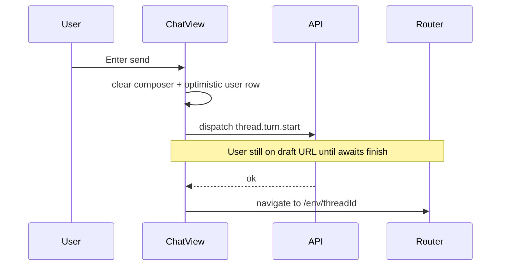

# Debug and UX cleanup (high delete / add ratio)

## Constraints (from repo rules)

- Follow [AGENTS.md](AGENTS.md): run `bun run typecheck` after code edits; avoid **introducing trivial one-off one-liner wrappers** — prefer collapsing logic into existing functions or small named blocks with normal structure.
- No inline / dynamic imports. Match existing `@multi/ui` patterns.
- Prefer **delete-first**: remove duplicated theme paths (CSS variables vs Tailwind), dead props, redundant layout wrappers.

---

## Principles: padding, spacing, and style math (**cross-cutting**, applies to everything this sweep touches)

- **Single source of truth**: any vertical/horizontal inset that participates in layout math (composer reserve, timeline scroll gutters, overlap gradients, `[data-composer-messages]` column padding, **`--composer-max-width`** alignment between messages and composer shell, menu/viewport gutters) flows from **`tokens.css`** semantic variables (existing `--multi-*` / new `--composer-*` as needed) — **not** ad hoc `px`/rem literals duplicated across **`shell.css`**, **`chat-view.tsx`**, **`messages-timeline.tsx`**, **`command.tsx`**, and UI packages.
- **Change once, update consumers**: patching one surface (e.g. §8 scroll bottom inset) must include a **`rg`/grep pass** for the old magic number across the repo and **delete** divergent copies (including dead custom properties such as orphaned `--meta-agent-thread-stack-*` if still unused — see §8).
- **No parallel arithmetic**: overlays (`conversation-overlay`, command backdrop/viewport nesting) **must not invent independent `calc`** that contradict composer height tokens — gradient masks reference the **same inset family** so visual fade and scroll clearance stay aligned.
- **TS/React**: avoid **`style={{ paddingBottom: 24 }}`-class islands** unless the value is **`var(...)` read from documented tokens** (prefer CSS + data attributes); inline `heroActionStyle` object patterns (§1) violate this discipline and stay on the deletion list.
- **`@multi/ui` vs app**: dialogs/menus/commands share **matching viewport geometry tokens** where they implement the same pattern (§6 parity with **`dialog.tsx`**) so z-index/stacking/spacing behave as one system.

---

## 1) Hero composer action cards ([`packages/app/src/components/chat-view.tsx`](packages/app/src/components/chat-view.tsx))

**Findings**

- Cards use **`style={heroActionStyle(tone)}`** only to inject `--hero-action-accent` mapped from `--primary`, `--multi-action`, `--success` (`lines ~185–197`, [`HeroComposerActionCard`](packages/app/src/components/chat-view.tsx) ~207–227).
- The same accent is referenced as **`text-(color:--hero-action-accent)`** on the icon chip while body text relies on **`text-multi-*`** — this split is brittle across themes (elevation/contrast mismatches).

**Direction**

- **Delete** `HeroActionTone` / `HERO_ACTION_ACCENT` / `heroActionStyle` and the **`style`** prop entirely if tonal accents can map to existing multi tokens already used elsewhere ([`tokens.css`](packages/app/src/styles/tokens.css)): e.g. icon chip uses **`text-multi-action`** / semantic success / primary equivalents **without custom properties**.
- Consolidate **`HeroComposerActionCard`** surface to fewer classes: rely on **`bg-multi-bg-*`**, **`border-multi-stroke-*`**, **`text-multi-fg-*`** consistently (title/detail/icon) — one visual system, minimal variants.
- If a distinct tint per tile is still desired, encode it as **`cva` variants on the chip only** (3 lines of variant defs) rather than imperative style objects ([AGENTS Tailwind guidance](AGENTS.md)).

---

## 2) Sidebar footer “hover affordance” ([`packages/app/src/components/shell/sidebar/footer.tsx`](packages/app/src/components/shell/sidebar/footer.tsx) + [`packages/app/src/styles/shell.css`](packages/app/src/styles/shell.css))

**Findings**

- There is **no explicit `agent-window-account-row:hover`** rule in `shell.css`; hover is perceived as coming from **`UpdatePill`** (`hover:bg-primary/10`) above the row ([`packages/app/src/components/shell/shared/update-pill.tsx`](packages/app/src/components/shell/shared/update-pill.tsx)), or from users mentally grouping the avatar strip with chrome that looks interactive.

**Direction**

- **UX intent**: branding row is **informational**, only the **gear `<Link>`** is actionable.
  - Reduce misleading affordances: tighten vertical rhythm so avatar row reads as footer metadata (no shared rounded hit target with pills).
  - Add explicit **`gap`** / separation between `UpdatePill` and account row **without new components** — likely class-only tweaks in `footer.tsx`.
- If Electron inspection still shows unintended hover tint on the avatar row from global selectors, **`pointer-events-none`** on the label cluster (not the gear) is the minimal behavior fix — deletes the possibility of stray pointer hit testing.

---

## 3) Traits / compact composer menus ([`packages/app/src/components/chat/traits-picker.tsx`](packages/app/src/components/chat/traits-picker.tsx), [`packages/app/src/components/chat/compact-composer-controls-menu.tsx`](packages/app/src/components/chat/compact-composer-controls-menu.tsx), [`packages/ui/src/menu.tsx`](packages/ui/src/menu.tsx))

**Findings**

- Both flows already use **`MenuPopup variant="workbench"`** and **`MenuRadioItem variant="workbench"`**.
- **`workbenchMenuRadioItemClassName`** is a **`grid grid-cols-[1rem_1fr]`** with the indicator pinned in column 1 and label column 2 — “text beside checkmark” exists in markup; flattened debug trees (“FastOnOff”) often mean **semantic spacing/visual separation** reads wrong on screen.

**Direction**

- **Delete / narrow theming divergence**: grep for **`MenuRadioItem`** / **`MenuItem`** usages under `variant="default"` alongside workbench shells in composer surfaces — normalize to **`workbench`** where the elevated shell is intentional (fewer duplicated style paths).
- **Fix perceived layout**, not markup noise:
  - Ensure **`gap` / column min widths** preserve readable label + steady check column (inspect off states: indicator uses `opacity-0` — column should still occupy space consistently in [`menu.tsx`](packages/ui/src/menu.tsx) lines ~198–208).
  - **`MenuGroupLabel variant="workbench"`** typography already uses tertiary meta sizing — confirm **divider + label rhythm** between **Fast**, **Thinking** (pickers), **`Access`**/`Mode` sections in [`compact-composer-controls-menu.tsx`](packages/app/src/components/chat/compact-composer-controls-menu.tsx) reads as discrete blocks (thin spacing adjustments only).

---

## 4) Composer lag on first send from a draft route ([`packages/app/src/components/chat-view.tsx`](packages/app/src/components/chat-view.tsx) + [`packages/app/src/app/routes/chat-draft-route.tsx`](packages/app/src/app/routes/chat-draft-route.tsx))

**Findings**

- **`onSend` clears composer first** (~2552–2554) then awaits **`dispatchCommand({ type: "thread.turn.start", ... bootstrap })`**; **only afterward** **`navigate` to canonical thread route** (~2653–2658).
- UX gap : user sees cleared input **while still routed as `/draft/...`** for the duration of orchestration latency.

**Direction (behavior-first, minimal churn)**

1. **`navigate` immediately after optimistic updates + composer clear when `isLocalDraftThread`** (same URL params targeted today: `/$environmentId/$threadId`).
2. **`dispatchCommand` proceeds in parallel** (keep existing try/catch behavior).
3. **Failure**: existing catch path restores prompt/images and rolls back optimistic user message — extend with **safe route correction** (`navigate` back to `/draft/$draftId` **only when** promotion never succeeded — avoid fighting successful promotion).
4. Reconcile duplication with **`chat-draft-route`** promotion effect (`canonicalThreadRef` navigation): verify we do not **double-navigate** or oscillate drafts; consider setting **`markDraftThreadPromoting` synchronously** at send start **only if** that removes competing navigation paths (**delete duplication** wherever two effects fight).

**Safety check**

- Inspect [`ChatThreadRouteView`](packages/app/src/app/routes/chat-thread-route.tsx) **missing-thread / bootstrap** guards so landing **before server ack** does not incorrectly bounce home.

---

## 5) Timeline spacing under user bubbles → assistant ([`packages/app/src/components/chat/assistant-message.tsx`](packages/app/src/components/chat/assistant-message.tsx) + [`packages/app/src/components/chat/messages-timeline.tsx`](packages/app/src/components/chat/messages-timeline.tsx))

**Findings**

- Row chrome uses **`flex-col gap-1`** on [`TimelineRowContent`](packages/app/src/components/chat/messages-timeline.tsx) (~296–308) mostly for intra-row stacks; LegendList row gap (`CHAT_TIMELINE_ROW_GAP = 12`) already spaces rows.
- [`AssistantMessage`](packages/app/src/components/chat/assistant-message.tsx) wraps bubble in **`div.min-w-0.pt-1.5`** (~89) — reportedly still feels **`pt-0`**.

**Direction**

- **Apply Principles** (spacing/padding coherence) — derive any new timeline bubble inset from **`tokens.css`** vocabulary (reuse conversation row gap tokens if present); avoid introducing a stray `px` only in JSX.
- Prefer **single adjustment point** (delete speculative multi-wrapper churn): modestly bump **`AssistantMessage` top inset** (`pt-*`) **or** add **`pb`** on[`HumanMessage` bubble surface]([`packages/app/src/components/chat/message-surface.tsx`](packages/app/src/components/chat/message-surface.tsx)) only for **`role="user"`** if padding belongs to user chrome.
- Keep change **one-sided** — avoid widening all timeline gaps (`CHAT_TIMELINE_ROW_GAP`) unless screenshots show global looseness regression.

---

## 6) Command palette centering / stacking / footer alignment ([`packages/ui/src/command.tsx`](packages/ui/src/command.tsx), [`packages/app/src/components/command-palette.tsx`](packages/app/src/components/command-palette.tsx))

**Findings**

- [`CommandDialogViewport`](packages/ui/src/command.tsx) uses **`fixed inset-0 z-[91] flex flex-col items-center justify-center`** while canonical modals [`DialogViewport`](packages/ui/src/dialog.tsx) uses **`grid grid-rows-[1fr_auto_3fr] justify-items-center`** with popup **`row-start-2`** for consistent vertical framing.
- [`CommandDialogPopup`](packages/ui/src/command.tsx) inherits **nested-dialog scale/translate** formulas (`var(--nested-dialogs)`) aligned with **`dialog.tsx`**, but viewport geometry differs — easy source of subtle “floating high/low”.
- Footer uses **`CommandFooter`** + ghost **`Button`** for filesystem action — typography/height mismatches [`KbdGroup`]([`packages/ui/src/kbd.tsx`](packages/ui/src/kbd.tsx)).

**Direction**

- **Viewport parity + Principles**: refactor `CommandDialogViewport`/`CommandDialogPopup` to mirror **`dialog.tsx`'s proven grid framing** (`row-start-2`), **unless** regression tests show breakage — this is largely **moving Tailwind atoms**, not expanding behavior.
- **Stacking clarity**: bump portal z-index together with backdrop so palette always defeats local chrome only if reproducible layering bug exists AFTER viewport fix (avoid gratuitous raises).
- **Footer alignment**: tighten **one row flex** baseline — replace ghost button with **`text-multi-*` muted control** styled like other inline hints (+ optional `tabular-nums` on shortcuts) unless `Button` is required for accessibility; goal is **`items-center` without `h-auto` drift**.

---

## 7) Composer model selector versus effective provider (“wrong provider”) ([`packages/app/src/components/chat/chat-composer.tsx`](packages/app/src/components/chat/chat-composer.tsx), [`packages/app/src/composer-draft-store.ts`](packages/app/src/composer-draft-store.ts), [`packages/app/src/components/chat/provider-model-picker.tsx`](packages/app/src/components/chat/provider-model-picker.tsx))

**Findings**

- **`ProviderModelPicker`** receives **`selectedModelForPickerWithCustomFallback`** (normalizes slug against `modelOptionsByInstance.get(selectedInstanceId)` plus `normalizeModelSlug`, see chat-composer ~760–764), while **traits menus**, **`getComposerProviderState`**, and **`getSendContext`** all consume **`selectedModel`** from **`useEffectiveComposerModelState`** without that picker-only fallback (~1056–1074 vs ~2210–2236).
  - Same screen can therefore **show Provider A / model label in the picker** while **computing descriptors / persistence for Provider B model slug** until state converges — classic “looks like different provider”.
- **`selectedInstanceId` resolution** (chat-composer ~636–679) falls through with **`explicitSelectedInstanceId` cast to instance id without requiring an enabled `providerInstanceEntries` match** (~661–662). **`selectedProvider`/driver-kind** meanwhile comes from **`resolveProviderDriverKindForInstanceSelection`** on that same opaque id (~603–609). Divergence when the persisted id is **disabled**, **missing**, or **non-routable**: driver kind resolves one way while the picker still binds to stale instance keys or wrong option lists.

**Direction (prefer delete/consolidate over patching UI only)**

1. **Single effective model slug**: derive **one canonical `composerDisplayModelSlug` (name TBD)** used by **`ProviderModelPicker`**, **`renderProviderTraitsPicker`**, **`getComposerProviderState`**, and send context construction — ideally by **elevating normalization into `deriveEffectiveComposerModelState`** (returns instance-valid slug) and **removing parallel `selectedModelForPickerWithCustomFallback`** logic from chat-composer (net delete once centralized).
2. **Harden `selectedInstanceId` fallback**: replace raw **`ProviderInstanceId.make(explicitSelectedInstanceId)`** with the **same resolver used for picker rows** — only ids that **`providerInstanceEntries` proves enabled + respects `lockedProvider` / `lockedContinuationGroupKey`**. Deleted/stale drafts should degrade to **`byKind`/first-enabled** deterministically (**delete dead branch that mints bogus ids**).
3. **Compact vs hero**: **`CompactComposerControlsMenu`** and **`TraitsPicker`** already share **`selectedProvider`** + **`selectedModel`** arguments; fixing (1) covers both (**no duplicated fix path** unless a second bug is isolated in [`provider-model-picker.tsx`](packages/app/src/components/chat/provider-model-picker.tsx) `activeEntry` resolution ~86–106).
4. **Regression harness**: extend an existing **`*.browser.tsx`** or unit test closest to **`useEffectiveComposerModelState` / picker** (`provider-model-picker.browser.tsx`, `composer-provider-registry.test.tsx`) when touching resolution — **only run that file** per AGENTS.

---

## 8) Chat bottom padding clipped by docked composer (messages scroll vs overlay) ([`packages/app/src/components/chat/messages-timeline.tsx`](packages/app/src/components/chat/messages-timeline.tsx), [`packages/app/src/components/chat-view.tsx`](packages/app/src/components/chat-view.tsx), [`packages/app/src/styles/shell.css`](packages/app/src/styles/shell.css), [`packages/app/src/styles/tokens.css`](packages/app/src/styles/tokens.css))

**Findings (distinct from section 5 — that is intra-row spacing; this is viewport vs composer stack)**

- When **scrolled to the end**, [`ChatView`](packages/app/src/components/chat-view.tsx) applies **`agent-panel-followup-input--conversation-overlay`** to the composer column (~3342–3346). **`shell.css`** pins that strip with **`position: absolute; bottom: 0; z-index: 30`** (~1079–1087), so it **draws over** the **`flex-1` messages pane** sibling instead of reflowing layout.
- The message scroller (**`LegendList`**) only reserves **`paddingBottom: 24`** via **`CHAT_TIMELINE_SCROLLER_STYLE`** in [`messages-timeline.tsx`](packages/app/src/components/chat/messages-timeline.tsx) (~54–57). A docked **`ChatComposer`** (toolbar + **`min`/max editor height**, follow-up **`padding-bottom`**) is easily **multiple times** that height — bottom transcript lines render **behind** the composer + gradient shim (`--multi-composer-overlay-height` defaults to **`24px`**, unrelated to composer body height).

**Direction (token-first; delete duplication)**

1. **`tokens.css`**: Introduce **`--composer-messages-scroll-bottom-inset`** as a **`calc(...)` from existing knobs** (`--multi-composer-editor-min-height`, toolbar padding, **`--prompt-input-section-gap`**, shell follow-up **`padding-bottom`**, `pt` from [`chat-view` follow-up wrappers]([`packages/app/src/components/chat-view.tsx`](packages/app/src/components/chat-view.tsx) ~3336–3340)) so one formula tracks layout changes. Optionally add **`safe-area`** term for iOS notch if shell already exposes it.
2. **`messages-timeline.tsx`**: Set **`LegendList`** `paddingBottom` (and/or a non-empty **`ListFooterComponent`** min-height wired to that var if library requires block sizing) — **single consumer** instead of brittle magic **`24`**.
3. **`shell.css` / overlay**: Revisit **`::before`** / **`::after`** gradient extents only after scroll inset proves sufficient — avoid layering “fixes” that mask the underlying clearance bug.
4. **Dead-variable cleanup**: The shell sets **`--meta-agent-thread-stack-*`** on **`agent-panel-meta-agent-chat-shell`** in [`messages-timeline.tsx`](packages/app/src/components/chat/messages-timeline.tsx) (~253–256) with **no other references** repo-wide — **confirm and delete** that block (*high delete/add*) **or** rewire exactly one inset through it (**pick one canonical variable**, not five).

**Escalation only if constants fail**

- If **expanded composer** height regularly exceeds **`min-height` semantics**, optionally set **`--composer-messages-scroll-bottom-inset`** from a **`ResizeObserver`** on **`[data-chat-composer-form]`** (no one-liners; grouped effect with normal handler). Prefer trying **formula + generous buffer** first to stay delete-heavy.

---

## Validation

- **`bun run typecheck`** (repo-required after substantive edits).
- If any touched **`*.browser.tsx`** / modified tests:** `bunx vitest --run <file>` ** only for edited tests (AGENTS permits when test files changed).
- Smoke (manual): first send draft → composer clears + immediate URL transition; TraitsMenu + compact menu tokens in light/dark; command palette over chat + Electron titlebar inset; **model picker trigger (icon/subtitle/model) agrees with Traits / slash-command surface / first send**; **with thread scrolled to bottom, last user/assistant line fully above docked composer (also with compact footer / expanded textarea)**.
- **Spacing coherence**: composer column padding in [`chat-view.tsx`](packages/app/src/components/chat-view.tsx), timeline/List padding in [`messages-timeline.tsx`](packages/app/src/components/chat/messages-timeline.tsx), **`[data-composer-messages]`** rules in **`shell.css`**, and **`--composer-messages-scroll-bottom-inset`** (§8) use **consistent token names**; no leftover duplicate literals after the **`spacing-coherence-pass`** grep.
