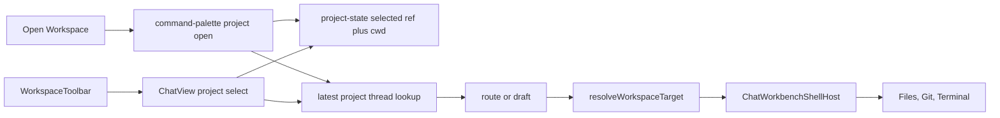

# Workspace Selection Fix

## Diagnosis

The earlier plan was too weak. It only persisted a cwd and did not fix the project/thread selection logic.

The actual shape is this:

- Projects live in the primary environment and have a `ProjectId`, `environmentId`, and `cwd`.
- Pi session threads can live under `desktop-runtime` while still carrying the primary project id.
- `resolveWorkspaceTarget` already knows this and maps desktop-runtime project threads back to the project cwd and RPC environment.
- `command-palette.tsx` does not. It filters threads to `thread.environmentId === project.environmentId` before asking for the latest project thread. That drops Pi runtime threads.
- `project-state.ts` persists only `multi:project-cwd`. A cwd alone is not a project selection when the app also needs `environmentId` and `projectId`.
- `use-agent-sidebar-model.ts` looks up a thread project by `(thread.environmentId, thread.projectId)`. That drops Pi runtime threads whose `environmentId` is `desktop-runtime` while their project lives in the primary environment.

That explains the reported failures.

- `Open Workspace` does not select an existing Pi-backed workspace because the existing-project path cannot see desktop-runtime threads for that project.
- `WorkspaceToolbar` does not keep the selected project with threads because `handleWorkspaceProjectSelect` always starts or reuses a draft instead of opening the project thread when one exists.
- Files, Git, and Terminal receive wrong or missing project data when the route never reaches the thread or draft that `resolveWorkspaceTarget` can map to the project cwd and RPC environment.
- Stored cwd fallback can also resolve the wrong project when paths collide, drift, or the route is a desktop-runtime thread. The selected project needs an identity, not just a path.
- Sidebar grouping can hide Pi-backed project threads before selection ever reaches the toolbar or panels.

## Implementation Plan

- Keep the logic flat. Do not create a new folder or project-selection service.
- Subtract first:
  - Remove temporary `agent log` fetch blocks from [packages/app/src/components/chat/view/workspace-toolbar.tsx](packages/app/src/components/chat/view/workspace-toolbar.tsx), [packages/app/src/components/chat/view/chat-view.tsx](packages/app/src/components/chat/view/chat-view.tsx), [packages/app/src/components/shell-host.tsx](packages/app/src/components/shell-host.tsx), and [packages/app/src/lib/git-status-state.ts](packages/app/src/lib/git-status-state.ts) where they touch this workspace flow.
  - Remove the unused `active` prop from [packages/app/src/components/shell/git/panel.tsx](packages/app/src/components/shell/git/panel.tsx). `GitWorkbenchPanel` already gates loading through `useEnvironmentGitPanel(..., { enabled: active })`.
  - Remove the optional shell fallback from `useEnvironmentGitPanel` in [packages/app/src/hooks/use-environment-git.ts](packages/app/src/hooks/use-environment-git.ts). The workbench passes canonical `cwd` and `environmentId` from `ChatWorkbenchShellHost`; the hook should not independently rediscover shell cwd.
  - Keep useful effect wiring. Delete props only when they no longer drive behavior.
- Update [packages/app/src/lib/project-state.ts](packages/app/src/lib/project-state.ts):
  - Treat selected project identity as canonical.
  - Keep a one-way read fallback for the existing `multi:project-cwd` value.
  - Add a selected project value that stores `environmentId`, `projectId`, and `cwd` together.
  - Expose read, write, and subscribe functions from the same file.
  - Resolve selected project by ref first, then fall back to cwd matching for old state.
  - Remove cwd-only write usage from callers as they migrate.
- Update [packages/app/src/hooks/use-handle-new-thread.ts](packages/app/src/hooks/use-handle-new-thread.ts):
  - Derive `defaultProjectRef` from the selected project identity when present.
  - Keep the existing cwd and server-cwd fallback order for old state and empty state.
- Update [packages/app/src/components/command-palette.tsx](packages/app/src/components/command-palette.tsx):
  - In `openProjectFromSearch`, stop filtering candidate threads to the project environment before `getLatestThreadForProject`.
  - In the existing-project branch of `handleAddProject`, use the same fixed lookup. This is the path behind [packages/app/src/components/shell/sidebar/header.tsx](packages/app/src/components/shell/sidebar/header.tsx) `Open Workspace`.
  - Write the selected project identity before navigation or draft fallback.
- Update [packages/app/src/components/shell/agents/sidebar/use-agent-sidebar-model.ts](packages/app/src/components/shell/agents/sidebar/use-agent-sidebar-model.ts):
  - Match desktop-runtime project threads to projects by `projectId`, using the same rule as `resolveWorkspaceTarget`.
  - Keep those threads grouped under the real project so the sidebar, project sections, and selection state do not drop Pi sessions.
  - Replace cwd-only persistence with canonical selected project writes when selecting or creating within a project.
  - Do not add a second selection path for the old sidebar header button.
- Update [packages/app/src/components/chat/view/chat-view.tsx](packages/app/src/components/chat/view/chat-view.tsx):
  - Add the sidebar thread summaries needed by `handleWorkspaceProjectSelect`.
  - Resolve the selected project from `workspaceProjects`.
  - Persist the selected project identity.
  - Open the latest project thread if one exists.
  - Fall back to `handleWorkspaceNewThread(projectRef, { envMode: settings.defaultThreadEnvMode })` only when no thread exists.
- Leave [packages/app/src/components/shell/git/panel.tsx](packages/app/src/components/shell/git/panel.tsx), [packages/app/src/components/shell/files/panel.tsx](packages/app/src/components/shell/files/panel.tsx), and [packages/app/src/components/shell/terminal/panel.tsx](packages/app/src/components/shell/terminal/panel.tsx) unchanged unless runtime verification proves they still receive the wrong `cwd` or `environmentId`.
- Leave [packages/app/src/components/settings/agent-preferences.test.tsx](packages/app/src/components/settings/agent-preferences.test.tsx) unchanged. It covers settings copy, not project selection logic.

## Verification

- Add or extend focused tests around `getLatestThreadForProject` or a small exported predicate if needed. The test must prove a desktop-runtime thread with the selected project id is eligible for project selection.
- Add focused tests for selected project state resolution. New selected ref wins. Old cwd-only state still works.
- Run the focused test from `packages/app`.
- Run `pnpm run typecheck` from the repo root.
- Use `ReadLints` on changed TS/TSX files after implementation.
- In agent mode, reproduce the UI path before and after with the app surface. The same Open Workspace and toolbar selection path must drive the panels to the selected project.

