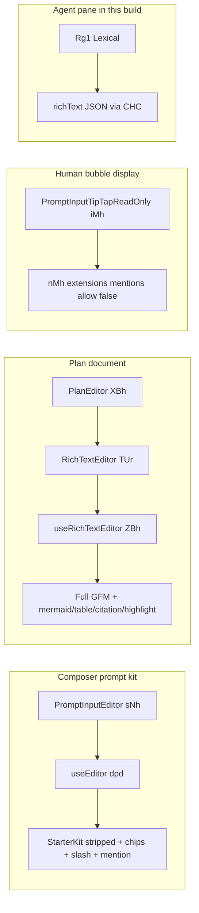
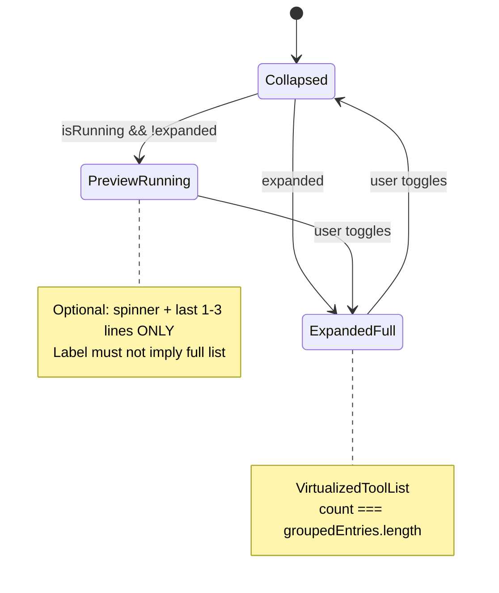

# Composer / chat document fix — Cursor binary review

Planning notes from dissecting Cursor’s shipped workbench (`/Applications/Cursor.app/Contents/Resources/app/out/vs/workbench/workbench.desktop.main.js` + `workbench.desktop.main.css`) and comparing to Multi’s chat/composer implementation.

Ten parallel binary searches were run against the minified bundle; five thermo-nuclear code-quality reviews were run on the in-flight branch. This doc consolidates findings, a top-down target for a **Cursor-full-replicate chat view**, and a fix plan for broken thread UX (work groups, subagent preview, flicker).

**Related:** `implementation-notes.md` (Cursor SDK / streaming decisions), `AGENTS.md` (composer menu anchor rules).

### Contents

| Part | Sections |
|------|----------|
| **I — Binary & contracts** | §1–7 Where CSS/JS lives; TipTap; message taxonomy; plan mode |
| **II — Chat view target** | §13–20 Target architecture; bugs; subagent; stream; CSS; reviews |
| **III — Implementation** | §8–10, §21 Gaps; props; phases |
| **IV — Multi CSS & components** | §22 From zero: `*.css`, tokens, files |
| **V — Ops** | §11, §20 Re-grep commands; verification |

---

## 1. Where everything lives in the binary

| Asset | Path | Notes |
|--------|------|--------|
| **JS** | `.../workbench.desktop.main.js` (~61MB) | Composer, TipTap kit, agent step renderer, tool routers |
| **CSS** | `.../workbench.desktop.main.css` (~2MB, **one line**) | All `composer-*`, `plan-*`, tool cards, glass overrides |
| **Source hints** | `out-build/vs/workbench/contrib/composer/...`, `markdownPlanEditor/...` | Embedded as strings in the bundle, not shipped as TS |

There is **no** separate plan/chat CSS file under Resources. Grep for `composer-human-message` or `composer-create-plan` only hits `workbench.desktop.main.css`.

**Implication:** parity work means reverse-engineering selectors and tokens from that CSS file, not hunting other stylesheets.

---

## 2. TipTap: two editors, not one

Cursor runs **two TipTap stacks**, and in the build inspected the **live agent composer input** also has a **Lexical** path (`Rg1` / `aislash-editor-input`) that syncs `richText` as Lexical JSON. The shared **TipTap prompt kit** (`PromptInputEditor`) is still the reference for chips, slash, and mention behavior.



### Composer prompt (`PromptInputEditor` / `sNh`)

**Extensions (order):** stripped `starterKit` → `promptInputUndoBoundary` → custom `link` → `promptInputSlashSuggestion` (`/`) → `promptSuggestion` → `promptInputKeymap` → `commandChip` (`commandNode`) → `mentionChip` (`mentionNode`, `@`) → `placeholder` (`is-editor-empty`).

**Capabilities:**

- `/` slash menu with sections from slash registry
- `@` mentions with live suggestion menu
- Command chips (`ui-prompt-input-command-chip`)
- Ghost prompt suggestion (Tab accept)
- Submit: Enter / Mod-Enter / Shift-Enter via `promptInputKeymap`
- Link bubble menu (slash uses React menus, not FloatingMenu)
- Read-only clone: `getPromptInputReadOnlyExtensions()` — mentions `allow: () => false`
- Serialize: `parsePromptInputTipTapDocContent` / `isPromptInputTipTapDocContent` (ProseMirror JSON `doc`)

**CSS / DOM:** `ui-prompt-input-editor__input`, `ui-prompt-input-*`, `ui-pill`, `data-prompt-input-tiptap-readonly`, `aislash-editor-input-readonly`, `composer-human-tiptap-readonly-editor`.

### Plan body (`PlanEditor` / `RichTextEditor`)

**Extensions:** `starterKit` (link off) + markdown indent + `richTextSearch`; **plugins:** mermaid, table (non-resizable), optional citation link, link decorator, code-block highlight (Shiki).

**Capabilities:**

- Full markdown editing (`contentType: "markdown"`)
- Tables, mermaid, citations, in-doc find (`planEditor.find*`)
- Modes: `planEditorModeService` — **RICH** (TipTap) vs **RAW** (non-TipTap editor)
- Placeholder: `"Plan body..."`
- DOM: `.plan-editor .tiptap, .plan-editor .ProseMirror`

**Plan mode (product)** is **not** this schema — it is `unifiedMode === "plan"` on composer data plus `ComposerPlanService` / plan file tabs.

### Minified export map (for grepping upgrades)

| Export name | Minified | Role |
|-------------|----------|------|
| `useEditor` | `dpd` | TipTap React hook |
| `PureEditorContent` | `djh` | Content mount |
| `PromptInputEditor` | `sNh` | Composer prompt surface |
| `PromptInputTipTapReadOnly` | `iMh` | Read-only TipTap view |
| `PlanEditor` | `XBh` | Plan tab body + todos |
| `RichTextEditor` | `TUr` | Markdown TipTap editor |
| `useRichTextEditor` | `ZBh` | Hook wiring `dpd` + markdown |

---

## 3. CSS map (minified bundle)

All styles below live in `workbench.desktop.main.css` (split on `}` for extraction; ~945 blocks touch chat/plan keywords in one pass).

### Design tokens (`.composer-bar` / `.composer-messages-container`)

- `--conversation-text-font-size`, `--conversation-tool-font-size`, `--conversation-surface-border-radius`
- `--conversation-text-inset`, `--conversation-block-inset` (+ classic/glass variants)
- `--conversation-tool-card-padding-x`, `--conversation-tool-card-padding-tight-x`
- `--composer-max-width` (840px default), `--composer-human-message-content-padding`
- `--composer-mode-plan-background|border|icon|text` (+ chat, debug, spec, multitask, background)
- `--plan-execution-message-background`, hover background/border
- Glass: `--glass-chat-bubble-background`, `body[data-cursor-glass-mode=true]` overrides

### User messages

| Selector family | Role |
|-----------------|------|
| `.composer-human-message` | Right-aligned bubble, input background, min-width 150px |
| `.composer-human-message-container` / `-content` | Padding vars, column layout |
| `.composer-sticky-human-message` | Sticky user row |
| `.human-dimmed` | 0.5 opacity until hover |
| `.standalone-glass`, `.cloud-readonly`, `.unclickable`, `.restore-hovering` | Bubble variants |
| `.aislash-editor-input-readonly`, `.composer-human-tiptap-readonly-editor` | Read-only TipTap in bubble |

**Not used for live chat:** generic `.chat-message` / `cursor-chat` (only appearance-preview mocks).

### Tool messages

| Selector family | Role |
|-----------------|------|
| `.composer-tool-call-container`, `-simple-layout`, headers | Card chrome |
| `.composer-tool-former-message` | Legacy tool-former spacing with AI rows |
| `.ui-shell-tool-call*`, `.ui-tool-call-line` | Agent one-line + expandable shell |
| `.mcp-tool-*`, `.web-fetch-tool-reason-*` | MCP / fetch affordances |

### Plan UI

| Layer | Classes |
|-------|---------|
| Inline execution chip | `.plan-execution-message-container`, `-content`, `-title` |
| Create-plan tool card | `.composer-create-plan-container` … `composer-create-plan-view-plan-button` |
| Embedded plan block | `.composer-plan-container`, `-markdown-container`, `-todos`, `.composer-sticky-plan-block` |
| Full editor tab | `.plan-editor`, `.plan-tab-*`, `.plan-breadcrumb-*`, `.plan-todos-section__*` |

---

## 4. Message type system and dynamic rendering

Cursor does **not** use `MessageRenderer` / `getMessageComponent`. It uses **parallel discriminators**.

### A. Virtualized timeline row `kind` (composer scroll)

| `kind` | UI |
|--------|-----|
| `human` | User bubble (`BRs`) |
| `ai-bubble` | Assistant bubble |
| `ai-activity-group` | Collapsed tools/thinking |
| `ai-background-task-completion-group` | Background completion cluster |
| `simulated-thinking` | Synthetic loading row |
| `agent-loop-phase` | Phase strip (thinking, tool_streaming, summarizing, …) |
| `turn-collapse-header`, `canvas-mention-card`, status rows, spacers | Chrome |

### B. Agent activity steps (`UiStepRenderer` / `dRh`)

`switch (step.type)`:

| `step.type` | Renderer |
|-------------|----------|
| `assistant-message` | `AssistantMessage`; `data-message-kind="assistant"` |
| `tool-call` | `ToolCallRenderer`; `data-message-role="ai"` `data-message-kind="tool"` |
| `thinking` | Thinking collapsible |

Grouped display types before render: `single`, `group`, `browser-group`, `waiting-group`.

### C. Tool dispatch (`ToolCallRenderer` / `aRh`)

`switch (toolCall.tool.case)` — **17 explicit branches** (await, edit, delete, shell, task, todos, read, grep, glob, ls, semSearch, webSearch, webFetch, readLints, getMcpTools, mcp, reflect); **default** → generic `ToolCallLine` (`action`, `details`, `loading`, `onClick`).

**Props worth modeling in contracts:**

```text
toolCall, callId, loading, startedAtMs, hasError, approval,
editToolCallDisplay { beforeContent, afterContent, precomputedDiff },
subagentConversation, renderStep,
onFileClick, onUrlClick, onNestedToolExpand,
defaultExpanded, showBackgroundNudge, backgroundNudgeDelayMs, onSendToBackground
```

Result branching: nested `result.case` — `success`, `failure`, `timeout`, `rejected`, `spawnError`, `permissionDenied`.

Label maps: `getToolActionLabels` covers 40+ tool kinds; `bdd` / `getToolCallLineDisplayState` build compact line text.

### D. Composer “tool former” (Solid, second stack)

`capabilityType === TOOL_FORMER` → `switch (sn.*)` on `ClientSideToolV2` (`EDIT_FILE`, `RUN_TERMINAL_COMMAND_V2`, `CREATE_PLAN`, `ASK_QUESTION`, …).

Sets:

- **`GROUPABLE_TOOL_TYPES`** — can merge in UI
- **`TOOLS_WITH_NO_UI_BLOCK`** — no bubble (`CREATE_DIAGRAM`, `FETCH_PULL_REQUEST`, …)

### E. Wire / bubble enums

- Bubbles: `_l.HUMAN` / `_l.AI` (`type` 1/2)
- `agent.v1.UserMessage`: `text`, `rich_text`, `selected_context`, `is_simulated_msg`, blob ids
- Plan wire: `StartingMessageType` includes `PLAN_START`, `PLAN_EXECUTE`; create-plan tool protos

### F. VS Code chat parts (separate pipeline)

`ChatListItemRenderer.renderChatContentPart` dispatches on `content.kind`: `markdownContent`, `toolInvocation`, `treeData`, `confirmation`, `progressMessage`, etc. Relevant if integrating with `contrib/chat`, not the main Composer React tree.

---

## 5. User messages — states and props

**Component:** `BRs` (DOM uses `composer-human-message*`, not `UserBubble` / `user-message`).

| State | Mechanism |
|-------|-----------|
| **Static read** | `PRs` → `PromptInputTipTapReadOnly` if `richText` parses as TipTap doc; else plain fallback |
| **Collapsed** | `k3i` max-height + fade until expanded |
| **Edit** | `editingBubbleId === bubbleId` → in-composer input or Glass `ui-prompt-input` |
| **Attachments** | `context.selectedImages`, `selectedVideos`, `terminalSelections` + image grid |
| **Placeholders** | “Using N images/videos”, “Using terminal selections”, “Empty message…”, “Message is too long…” |
| **Variants** | `standalone-glass`, `cloud-readonly`, `unclickable`, `restore-hovering` |
| **Simulated** | `isSimulatedMsg` + `simulatedMsgReason` (plan execution, background completion, subagent, …) |
| **Plan execution row** | `Ix1` instead of `BRs` when `isPlanExecution` |

**Row data attributes:** `data-message-role="human"`, `data-message-kind="human"`, `data-message-id`, sticky/dim classes.

---

## 6. Tool vs user vs special messages

| Concern | User | Tool | Special |
|---------|------|------|---------|
| Timeline `kind` | `human` | Inside `ai-activity-group` | `simulated-thinking`, background groups, plan execution |
| Step type | — | `tool-call` | `thinking`, `assistant-message` |
| Primary CSS | `composer-human-message*` | `ui-shell-tool-call*`, `composer-tool-call-*` | `ui-thinking-*`, `plan-execution-*`, `composer-create-plan-*` |
| Errors | Rare on bubble | `status === "error"`, `composer-error-message` | Tool approval `rejected` / `cancelled` |

**No** `SystemMessage` bubble in the composer timeline. Summaries are stream events plus **group headers** (`summary.files`, `summary.commands`, …), not a dedicated bubble type.

**Thinking:** persisted `thinking_message`, stream `thinkingDelta`, synthetic `simulated-thinking` row, collapsible `ui-thinking-collapsible`.

**Subagent:** mainly `taskToolCall` + nested `subagentConversation`; async UI `composer-async-subagent-*`.

---

## 7. Plan mode — product capabilities

| Capability | Mechanism |
|------------|-----------|
| Switch mode | `setComposerUnifiedMode(handle, "plan")`, `unifiedMode`, `qlt.PLAN` |
| Auto-suggest | `shouldSuggestPlanMode(text)` keyword heuristics → `planModeSuggestionUsed` |
| Model gate | `supportsPlanMode` on model config |
| Plan file | `ComposerPlanService`, `PlanStorageService`, `MarkdownPlanEditor` tab |
| Streaming | `updatePlanModelDirty`, `savePlanModel`, `discardPlanModel` |
| Create-plan tool | `composer-create-plan-*` UI, accept/reject/build/export |
| Analytics | `composer.plan_mode.entry_point`, `.plan_created`, `.plan_viewed`, … |
| Flags | `new_plan_editor`, `mode_nudge_plan`, `plan_mode_build_in_cloud`, `auto_proceed_after_planning` |

Composer **input** in plan mode still uses the prompt stack; **body** edits in `PlanEditor` TipTap.

---

## 8. Multi — current alignment

### Already close to Cursor

| Cursor | Multi |
|--------|--------|
| `PromptInputEditor` TipTap stack | `packages/app/src/components/chat/composer/prompt-editor.tsx` — StarterKit, Mention, Link, chips (`mentionNode`, `commandNode`, `skillNode`, `inlineTokenNode`) |
| Caret-tracked menu anchor | `usePromptEditorCaretAnchor` (coordsAtPos + ResizeObserver); documented in AGENTS.md |
| `ToolCallRenderer` | `tool-renderer.tsx` — same prop shape, `switch (toolCall.tool.case)`, line + specialized views |
| Conversation tokens | `conversation.css` — `--conversation-*`, composer vars, ProseMirror placeholder |
| Virtualized timeline | `messages-timeline.tsx` + `@tanstack/react-virtual`, sticky user rows |
| Tool line data attrs | `data-tool-call-line`, `-action`, `-details`, `-chevron` |
| Plan follow-up | `activeProposedPlan`, `proposed-plan` row, `plan-tray__markdown`, `/plan` slash |

### Gaps (priority order)

1. **Dual rich-text formats** — Cursor: Lexical JSON in live agent composer + TipTap doc for readonly human bubbles. Multi: TipTap for composer; user bubbles are plain/markdown without readonly TipTap chip parity.

2. **Plan document editor** — Cursor: full `RichTextEditor` (tables, mermaid, citations, find-in-plan). Multi: proposed plan tray + server `ExitPlanMode`; no in-app `PlanEditor`-class TipTap surface in chat.

3. **Timeline row taxonomy** — Cursor: `ai-activity-group`, `simulated-thinking`, `agent-loop-phase`, background completion groups. Multi: `work` + `working` + `proposed-plan`; simpler orchestration surface.

4. **Human message variants** — Cursor: collapse fade, attachment-only placeholders, cloud-readonly, simulated reasons, checkpoint restore/stop CTA. Multi: partial (`HumanMessageCollapsible`, git actions, terminal context).

5. **Tool second stack** — Cursor Solid `TOOL_FORMER` + groupable sets. Multi: single `ToolCallRenderer` path (fine if ingest is agent.v1-only; document which kinds get rich vs line UI).

6. **CSS / data contract** — Cursor: `composer-human-message`, `data-message-kind`. Multi: `data-message-bubble-surface`, `data-message-role` user/assistant — explicit mapping needed for pixel parity.

7. **Composer input engine drift** — Re-verify Lexical vs TipTap on agent input after each Cursor upgrade; Multi aligns with **prompt kit**, not necessarily latest agent pane.

---

## 9. Props checklist (for contracts / UI)

### User bubble

- `message.text`, `message.richText`, `message.context.{selectedImages, selectedVideos, terminalSelections}`
- `editingBubbleId`, `unclickable`, `isExpanded`, `location` (pane / bar / editor)
- `isSimulatedMsg`, `simulatedMsgReason`
- `isPlanMode`, `isPlanExecution`

### Tool bubble

- Full `ToolCallRenderer` prop list (§4C)
- `capabilityType`, `toolFormerData.{tool, status, params, result}`
- `isToolGroupable`, `isBrowserMcpTool`
- Approval: `userDecision`, `pendingDecisions`

### Timeline row

- `kind` (§4A)
- `flatIndex`, `pairIndex`, `bubbleId`, `isLastInTurn`
- Sticky: `enableStickyHumanMessages`, `virtualizedStickyHumanBubbleId`

### Plan

- `planId`, `planFileUri`, `planTitle`, `planBuildStatus`, `planModeSuggestionUsed`
- Editor: `variant: "document"`, `plugins[]`, `placeholder`

---

## 10. Suggested implementation phases (superseded by §21 for chat-view fix)

Original plan/TipTap-focused phases. **Chat view / work group / subagent work uses §21.**

| Phase | Scope |
|-------|--------|
| **P0** | Keep this doc updated; map Multi `data-*` attrs to Cursor equivalents |
| **P1** | Readonly human TipTap when messages store ProseMirror JSON + chips |
| **P2** | Tool parity audit: `ToolCase` vs Cursor label map; line fallbacks + hover cards for search tools |
| **P3** | Timeline kinds: `simulated-thinking` / `agent-loop-phase` if orchestration exposes phases |
| **P4** | Plan editor page: markdown TipTap (tables/mermaid) beyond composer tray |
| **P5** | CSS tokens: `--conversation-tool-card-padding-*`, glass bubble vars where shell supports glass |

---

## 11. Re-running binary dissection

```bash
# TipTap / plan exports
rg -o '.{0,60}(PromptInputEditor|PlanEditor|RichTextEditor).{0,60}' \
  "/Applications/Cursor.app/Contents/Resources/app/out/vs/workbench/workbench.desktop.main.js"

# CSS class roots
rg -o '\.[a-z][a-z0-9_-]*' \
  "/Applications/Cursor.app/Contents/Resources/app/out/vs/workbench/workbench.desktop.main.css" \
  | rg '^(composer-human|composer-tool|composer-plan|plan-)' | sort -u
```

Because CSS is one line, prefer Python split-on-`}` or `rg -o` over `rg | head` on full lines (multi-megabyte single-line hits).

---

## 12. Bottom line

- **Plan Mode TipTap** in Cursor = `PlanEditor` → `RichTextEditor` markdown stack, not the composer prompt schema.
- **Chat input** = stripped TipTap prompt kit (chips, slash, mention) plus readonly kit for human bubbles; agent pane in the inspected build also uses Lexical for live input.
- **Dynamic messages** = `timeline row kind` → component, then `step.type` / `tool.case` with large prop surfaces.
- **Styles** = `workbench.desktop.main.css` under `composer-*` and `plan-*`.
- **Multi** is structurally aligned on `prompt-editor.tsx` and `tool-renderer.tsx`; largest missing pieces are readonly human TipTap, full plan document editor, and richer timeline row kinds—not the core composer TipTap stack.

---

## Part II — Cursor-full-replicate chat view (design engineering)

### 13. Executive summary

**Goal:** One chat column that behaves like Cursor’s composer timeline: stable virtualized rows, correct tool semantics, work groups that expand to **every** step, and subagents as **task cards** with an embedded virtualized transcript—not three half-connected surfaces.

**Core mismatch:** Multi models agent work as:

1. Generic **`work` timeline rows** (`WorkGroupSection`) with a running **preview** that only shows the last six entries.
2. Optional **`SubagentStatusRow`** chips under `taskToolCall` that open a **composer preview tray**.
3. A **polling snapshot** in the tray (`getProviderThreadSnapshot` every 2.5s while active).

Cursor models agent work as:

1. **Typed tool rows** per `tool.case` on a shared `ui-tool-call-line` primitive.
2. **Group headers** (“Explored …”, “Ran · N commands”) that summarize collapsed state—not a substitute for per-tool rows when expanded.
3. **`ui-task-tool-call`** — bordered card, status icon, title/subtitle, chevron, scrollable body (`max-height: 300px`) with **nested `interaction_update`** steps streamed from `task_tool_call_delta`.

The screenshot failure mode (“Working · 16 steps”, five faded `Ran`/`Running` lines, subagent not clickable, flickering status) is the **work-group running preview** path plus **disconnected subagent focus**, not a single missing CSS tweak.

---

### 14. Target layout (one scroll owner)

```
┌─────────────────────────────────────────────────────────────┐
│  MessagesTimeline (@tanstack/react-virtual) — ONLY scroller   │
│  ├─ HumanMessageRow      (inset, 14px card, §5)             │
│  ├─ AssistantMessageRow  (markdown; streaming §15)          │
│  ├─ ThinkingRow          (shimmer; collapsible)               │
│  ├─ ToolCallLine | ToolCallCard  (per tool.case, §4)        │
│  ├─ WorkGroupHeader      (aggregate label only)             │
│  │     └─ expanded: VirtualizedToolList(ALL groupedEntries) │
│  └─ TaskToolCard         (subagent; §16)                    │
├─────────────────────────────────────────────────────────────┤
│  Composer column (prompt-editor TipTap, queue, plan tray)   │
│  └─ SubagentFollowupTray — OPTIONAL; same row components    │
└─────────────────────────────────────────────────────────────┘
```

**Invariant:** The main timeline virtualizer owns vertical scroll. Any “preview” is either expand-in-place in the timeline or a focus rail that **reuses the same row components**—never a second full transcript with its own poll loop and `overflow-y-auto` over hundreds of snapshot items.

---

### 15. Wire protocol → Multi rows (`agent.v1.InteractionUpdate`)

Protobuf oneof on `agent.v1.InteractionUpdate` (21 arms; primary dispatch in minified `rWt` / `agentResponseAdapter.js`):

| Field | JS `case` | Cursor UI effect | Multi mapping |
|-------|-----------|------------------|---------------|
| `text_delta` | `textDelta` | Append AI bubble; drop empty | `thread.message-sent` `streaming: true` |
| `thinking_delta` / `thinking_completed` | `thinkingDelta` … | THINKING capability bubble | reasoning stream / `ThinkingStatus` |
| `partial_tool_call` | `partialToolCall` | Early tool row; shell → started | `item.started` (once per `call_id`) |
| `tool_call_started` | `toolCallStarted` | Create tool bubble, `running` | `item.started` |
| `tool_call_delta` | `toolCallDelta` | Update in place by `delta.case` | **`item.updated`** — must parse delta, not only full `tool_call` |
| `tool_call_completed` | `toolCallCompleted` | Finalize; shell `success`/`error` | `item.completed` + merge started snapshot |
| `shell_output_delta` | `shellOutputDelta` | **no-op** in main composer adapter | `content.delta` `command_output` (OK for Multi) |
| `summary` / `summary_started` / `summary_completed` | … | SUMMARIZATION bubbles | `tool.summary` — **not** `task.completed` |
| `turn_ended` | `turnEnded` | Clear `generatingBubbleIds`; complete | turn complete; **not** empty text delta |
| `active_branch_change` | `activeBranchChange` | SCM branch sync | `dynamic_tool_call` metadata (not shell) |
| `token_delta`, `heartbeat` | … | no-op | ignore |

**Assistant finalize (semantic parity, different carrier):**

| | Cursor | Multi |
|---|--------|--------|
| End signal | `turnEnded` | `streaming: false`, `text: ""` |
| Coalesce | Drop empty `textDelta` | **Do not** merge finalize into deltas (`isStreamingFinalization`) |
| Empty UI | `hide-if-empty` | Avoid showing “(empty response)” when accumulated text exists |

**Tool label map (`_qv` — mirror in `TOOL_ACTION_LABELS`):**

| `tool.case` | loading | completed |
|-------------|---------|-----------|
| `shellToolCall` | Running command | Ran command |
| `editToolCall` | Editing | Edited |
| `taskToolCall` | Working on task | Completed task |
| `deleteToolCall` | Deleting | Deleted |

Multi today uses `Running` / `Ran` for shell in `tool-renderer.tsx` — mismatch with both Cursor and activity summaries (`Ran command`).

**`tool_call_delta` inner oneof (must not flatten):**

- `shell_tool_call_delta` → stdout/stderr buffers (~50ms flush in Cursor shell handler)
- `edit_tool_call_delta` → `stream_content_delta`
- `task_tool_call_delta` → nested `interaction_update` (recursive `InteractionUpdate` into subagent adapter)

`CursorSdkAdapter` today routes `partial-tool-call`, `tool-call-delta`, and `tool-call-started` through the same `cursorSdkToolMessageFromUpdate` path. That matches “started then updated” lifecycle but **does not** read `toolCallDelta.delta`, which causes weak titles and activity storms (698 `tool.updated` on a production thread per `implementation-notes.md`).

**Adapter invariants (target):**

1. One runtime item id = `call_id` for the tool lifetime.
2. First running signal → `item.started`; thereafter → `item.updated` or `content.delta` (output only).
3. Route `tool_call_delta` by `delta.case`; accumulate per `callId`.
4. On `item.completed`, merge **started stash + completed + shell buffers** (Pi `mergeCursorToolCalls` pattern).
5. Git/PR tools → `dynamic_tool_call` with curated `title`/`detail`/`data` — never `command_execution`.

---

### 16. Work groups — fix “Working · N steps” / show ALL work

**Cursor:** Collapsed group header = `Exploring` / `Explored` / `Ran` + `N commands`. Expanded group = **every** nested tool row; per-row shell still says **Ran command** + command snippet. Aggregate and per-row labels can coexist when collapsed; expanded shows all rows.

**Multi today (`WorkGroupSection` in `messages-timeline.tsx`):**

| Constant / behavior | Value | Problem |
|---------------------|-------|---------|
| `WORK_GROUP_PREVIEW_MAX_ENTRIES` | **6** | Running collapsed view shows at most six steps |
| `WORK_GROUP_PREVIEW_PX` | 144 | Fixed preview height |
| `previewEntries` | `entries.slice(-N)` | Drops older steps while header says “16 steps” |
| Expanded + running | Still uses `WorkGroupPreview` | User expects full list when chevron expanded |
| `isCommandWorkEntry` (timeline) | `command_execution` \| `command` only | **Narrower** than `timeline-rows.ts` helper — group classification can disagree |
| Header when running | `summary.action` only (“Working”) | Secondary line “Working · N steps” only when collapsed via summary |

**Target behavior:**



| State | Render |
|-------|--------|
| Collapsed, not running | Header + `WorkGroupSummaryLine` (e.g. `Worked for 2m` · stats) |
| Collapsed, running | Header `Working` + `· N steps`; optional **compact** tail (≤3 lines) OR spinner only—**not** six truncated rows pretending to be the full run |
| **Expanded** (running or done) | **`groupedEntries.map`** inside inner virtualizer — **all N rows** |
| Command-only expanded | No duplicate `WorkGroupSummaryLine` (already fixed); rows use **Ran command** |

**Virtualizer note:** Outer timeline already virtualizes rows. Expanded work group with 50+ shell commands should use a **nested** virtual list (or flatten into timeline as individual `work` rows—product choice). Cursor keeps nested rows inside the group; nested virtualizer is the lower-risk match.

**Opacity / style (screenshot):** Faded top line may be preview scroll clipping + tertiary text, or a row marked `loading` with shimmer on wrong element. Cursor uses `--dismissed` at 0.6 opacity only for skipped tools. Audit: no `opacity-40` on non-dismissed tool lines inside `[data-work-group-preview]`.

---

### 17. Subagent / task tool — fix click, preview, flicker, “unhooked”

**Cursor `ui-task-tool-call` (`usv` / `TaskToolCallView`):**

- Bordered card (`border`, `cursor-bg-tertiary`, `conversation-surface-border-radius`)
- Header: status icon (spinner / check / error), title + subtitle (`Generating`, `Completed`, …)
- Chevron: hidden until header hover; `__chevron--open` rotates 90°
- Body: scroll `max-height: 300px`, nested turns (`ui-turn-view` / step renderer)
- **`defaultExpanded`:** task card starts **collapsed**; subagent stream only visible when expanded
- Nested stream: `task_tool_call_delta.interaction_update` → recursive `InteractionUpdate`

**Multi today (split across four places):**

| Location | Role | Failure mode |
|----------|------|--------------|
| `tool-message.tsx` → `SubagentStatusRow` | Button opens preview | `disabled={!hasDetails}` — no click if no `providerThreadId`/logs |
| `tool-renderer.tsx` → `TaskToolCall` | Inline expand + `subagentConversation` | `defaultExpanded={hasSubagents}` — **opposite** of Cursor |
| `subagent-preview-tray.tsx` | Composer tray body | `overflow-y-auto`; 2.5s poll; remount on key |
| `input.tsx` | `visible={composerExpanded}` | `SubagentPreviewActiveThreadSync` calls **`closePreview()`** when hidden |
| `chat-view.tsx` | `data-subagent-preview-open`, mask, click-capture | Tied to `preview !== null` |

**Why subagent feels “unhooked”:**

1. **Selection vs presentation** conflated: collapsing composer clears store (`closePreview`), so focus is lost.
2. **Transcript duplicated**: timeline shows work-group shell rows; tray fetches separate snapshot; they diverge.
3. **Polling**: `readSnapshot(false)` every 2500ms while `isActive` → header/status flicker.
4. **Clicks don’t apply** to work-group `Ran` rows — those are `ToolCallMessage`, not `SubagentStatusRow`. User must click the task/subagent chip row under the task tool, which may be off-screen or disabled.

**Target focus model:**

```ts
// Conceptual — single store
type SubagentFocus = {
  key: string;
  activeThreadId: ThreadId;
  taskCallId: string;
  providerThreadId?: string;
} | null;

// Derived (never stored)
const subagentPresented =
  subagentFocus !== null &&
  (composerVariant !== "compact" || isDockComposerExpanded);
```

| Event | Store | UI |
|-------|-------|-----|
| Click subagent row | Set `subagentFocus` | Expand `TaskToolCall`; highlight row |
| Composer pill collapse | **Keep** focus | Hide tray/mask; timeline highlight may persist |
| Composer expand | — | Show tray if `subagentPresented` |
| Thread change | Clear focus | Close tray |
| Active run | Append steps from events | **No** 2.5s full snapshot poll; optional background reconcile |

**Transcript body (tray or inline):**

- Use **`@tanstack/react-virtual`** over `steps[]` (same estimators as timeline).
- Reuse **`ToolCallLine` / `ToolCallMessage`** for each child step—do not invent `SubagentActivityLine` as a parallel renderer.
- Feed steps from: (a) nested SDK events persisted on `WorkLogSubagent`, (b) optional snapshot merge when opening.

**Align tray policy with plan/queue trays** (thermo review): document why subagent alone hides on collapse, or hide all three consistently.

---

### 18. CSS — two-file reality (tool parity)

Most `ui-*` tool styling is **not** in `workbench.desktop.main.css`.

| Source | Offset / location | Contains |
|--------|-------------------|----------|
| `workbench.desktop.main.css` | ~654080 | `composer-tool-former-message` margin collapse (`2px` → `0` when `:has(.ui-tool-call-line, .ui-shell-tool-call)`) |
| `workbench.desktop.main.css` | ~651703 | `--conversation-tool-card-padding-x`, `--card-border-color`, … |
| `workbench.desktop.main.js` | **byte 16310841** (~402KB embedded stylesheet) | `.ui-shell-tool-call--pending`, `.ui-edit-tool-call--minimal`, `.ui-task-tool-call`, shimmers |

**Multi mapping:**

| Cursor | Multi today |
|--------|-------------|
| `.ui-tool-call-line` | `data-tool-call-line-*` + `toolCallLineVariants` (`tool-call.css`) |
| `.ui-shell-tool-call` | `ShellToolCall` in `tool-renderer.tsx` (no output preview, no stop) |
| `.ui-task-tool-call` | `TaskToolCall` inline row (no bordered card) |
| `.ui-user-message-box__card` | `message-surface.tsx` `rounded-xl px-2.5 py-2` (not 6×8 / 14px) |
| Margin collapse | Partial via `conversation.css`; audit AI tool wrapper spacing |

**Shell parity checklist:**

- [ ] Row verbs: `Running command` / `Ran command`
- [ ] Collapsed **output preview** while `loading` (~5 lines, tail-anchored)
- [ ] Expanded output `max-h-[min(480px,60vh)]`
- [ ] `--with-stop` when run cancellable
- [ ] `--dismissed` for rejected/skipped

**Task parity checklist:**

- [ ] Copy: `Working on task` / `Completed task`
- [ ] Bordered card + status icon column
- [ ] Default **collapsed**; expand shows nested virtualized steps
- [ ] Chevron on hover (optional)

---

### 19. Observed thread bugs → code → fix

| User-visible symptom | Likely code locus | Fix phase |
|----------------------|-------------------|-----------|
| “16 steps” but ~5 truncated rows | `WorkGroupPreview` + `WORK_GROUP_PREVIEW_MAX_ENTRIES = 6` | **P0-A** |
| Subagent can’t click | `hasDetails` false; or clicking shell rows in work group | **P0-B** focus model + wiring |
| Preview scroll jank | `subagent-preview-tray.tsx` non-virtual scroll | **P0-C** |
| Status flickers | 2.5s snapshot poll; `isRunning` churn | **P0-D** event-driven + stable running predicate |
| Panel “unhooked” | `closePreview` on composer collapse | **P0-B** `subagentPresented` |
| Duplicate “Ran” (mitigated) | `WorkGroupSummaryLine` when expanded command group | Done; export shared `isCommandWorkEntry` |
| Assistant text truncated | `coalesceOrchestrationUiEvents` | Done; extract `orchestration-ui-coalescing.ts` |
| 698 tool updates / thread | `CursorSdkAdapter` delta path + ingestion | **P1** adapter |
| `tool.summary` → wrong activity | `ProviderRuntimeIngestion` | **P1** |
| Wrong shell verbs | `TOOL_ACTION_LABELS.shellToolCall` | **P2** |
| 1339-line adapter | `CursorSdkAdapter.ts` | **P1** split modules |
| Three tool taxonomies | `resolveToolCase` in React | **P2** derive in `session-logic` |

---

### 20. Thermo-nuclear review synthesis (branch under review)

Presumptive **do not merge** until structural items addressed (behavior can be correct):

| Area | Verdict | Top action |
|------|---------|------------|
| `CursorSdkAdapter.ts` (1339 lines) | Blocker | Split: shared credentials, interaction parser, tool mapping, run stream |
| `tool-renderer.tsx` (1224 lines) | Blocker | Derive `toolCase` in `session-logic`; split shell/task/line modules |
| `service.ts` (1002 lines) | Blocker | Move `coalesceOrchestrationUiEvents` out |
| `messages-timeline.tsx` (1072 lines) | Improve but still monolith | Extract `work-group-section.tsx`, virtualizer hook |
| Subagent preview | Do not approve | `subagentPresented`; stop `closePreview` on layout |
| `tool.summary` ingestion | Semantic bug | Dedicated activity kind, not `task.completed` |
| Provider wiring (6 files per driver) | Debt | Manifest table in contracts (later) |

**What is fine to keep:**

- `inert` on collapsed shell sidebars (`app.tsx`)
- Final empty assistant event not coalesced (`service.ts` guard)
- Expanded command-only groups without duplicate aggregate `Ran` line
- `CursorSdkSettings` minimal shape; ingestion stays provider-agnostic

---

## 21. Revised implementation phases

Phases supersede §10 where they conflict. **P0** fixes the screenshot thread; **P1–P2** adapter and labels; **P3–P5** structural parity from §10.

| Phase | Scope | Acceptance |
|-------|--------|------------|
| **P0-A** | Work group: expanded = **all** `groupedEntries` (nested virtualizer); running collapsed ≠ fake full list | Expand “Working · 16 steps” shows 16 rows |
| **P0-B** | `subagentFocus` store; `subagentPresented`; remove `closePreview` on composer collapse | Collapse composer → re-expand restores same subagent |
| **P0-C** | Virtualize subagent tray / task body scroll regions | Smooth scroll 100+ steps |
| **P0-D** | Remove 2.5s poll as primary UX; debounce running header | No visible status flicker during steady run |
| **P0-E** | Export `isCommandWorkEntry` from `timeline-rows.ts`; delete duplicate in timeline | Command groups consistent |
| **P0-F** | Extract `orchestration-ui-coalescing.ts` + tests | `service.ts` < 1000 lines |
| **P1** | `CursorSdkAdapter` split; `tool_call_delta` accumulator; `tool.summary` fix; adapter unit tests | Production thread activity count drops |
| **P2** | Shell/task labels + shell output preview; task card chrome; `DynamicToolDisplay` | Side-by-side with Cursor |
| **P3** | Timeline row kinds (`simulated-thinking`, phases) if orchestration exposes them | §4A parity |
| **P4** | Readonly human TipTap; plan document editor | §10 P1/P4 |
| **P5** | CSS tokens + margin collapse from embedded JS block | Pixel-close tool spacing |

---

## 22. From zero: Multi `*.css`, tokens, components, and rewrites

This section is the **implementation map for Multi’s repo**, not Cursor’s bundle. Use it when starting a greenfield chat-view pass or when deciding where a token belongs.

### 22.1 Stylesheet stack (load order)

`packages/app/src/index.css` imports Tailwind, then `styles/app.css`:

```text
packages/app/src/styles/app.css
  ├── settings.css      # settings UI only
  ├── conversation.css  # composer + timeline + subagent + bubbles (PRIMARY chat surface)
  ├── git-diff.css      # inline diff widgets
  ├── terminal.css      # terminal panel
  ├── tool-call.css     # shimmer only today (minimal)
  ├── markdown.css      # assistant markdown in timeline
  └── shell.css         # agent window, sidebars, workbench chrome
```

**Foundation (not in `app.css` but always present):**

| File | Role |
|------|------|
| `packages/app/src/styles/tokens.css` | Pierre palette, `--multi-fg-*`, `--multi-stroke-*`, `--cursor-*` aliases, glass bubble backgrounds on `[data-component="root"]` |
| `packages/app/src/index.css` | Tailwind `@theme`: `--text-conversation`, `--max-width-agent-chat`, color aliases |

**Rule:** New chat/timeline layout tokens go in **`conversation.css`** unless they are truly global (then `tokens.css`) or shell chrome (`shell.css`). Tool-row-specific rules go in **`tool-call.css`** (expand this file; do not only use Tailwind in `tool-renderer.tsx`).

**Contract tests (grep before moving vars):**

- `packages/app/src/components/chat/composer/composer-css-contract.test.ts` — reads `conversation.css`
- `packages/app/src/lib/appearance-tokens-contract.test.ts` — reads `conversation.css`
- `packages/app/src/components/shell/shell/app-shell-css-contract.test.ts` — reads `shell.css`

---

### 22.2 Cursor → Multi token rewrite table

Cursor names (from bundle) on the left; **what to set in Multi** on the right. Prefer extending existing vars before inventing new ones.

#### Conversation / timeline rhythm

| Cursor token / value | Multi today | Rewrite target |
|---------------------|-------------|----------------|
| `--conversation-text-font-size` (13px tool line) | `--conversation-text-font-size` → `--multi-text-title` (13px default) | Keep; set explicit **13px** for tool lines if user scale bumps title |
| `--conversation-font-size` on `.ui-tool-call-line` | `text-conversation` utility | OK — maps via `@theme --text-conversation` |
| `--conversation-text-inset` | **Missing** | **Add** `--conversation-text-inset: 0px` (glass) / use row padding in CSS |
| Human row `padding-top: 0.8rem` | ad hoc Tailwind on rows | **Add** `--chat-timeline-user-row-padding-block: 0.8rem` |
| Human row `padding-bottom: 0.4rem` | — | **Add** `--chat-timeline-user-row-padding-block-end: 0.4rem` |
| `--conversation-surface-border-radius` (`--cursor-radius-xl`) | `--multi-radius-card` / `rounded-xl` on bubble | **Add** `--conversation-surface-border-radius: var(--multi-radius-card)` or 8px for user card |
| `--card-border-color` | `--multi-stroke-tertiary` on bubble `::after` | **Add** `--conversation-tool-card-border: var(--multi-stroke-secondary)` |
| `--conversation-tool-card-padding-x: 10px` | `--conversation-tool-card-padding-x: 8px` | **Change to 10px** to match Cursor |
| `--conversation-tool-card-padding-tight-x` | **Missing** | **Add** `calc(var(--conversation-tool-card-padding-x) - 2px)` |

#### User message card (`.ui-user-message-box__card`)

| Cursor | Multi today | Rewrite |
|--------|-------------|---------|
| `padding: 6px 8px` | `px-2.5 py-2` (10×10) on `humanMessageBubbleVariants` | **Change** to `padding: 6px 8px` via CSS on `[data-message-bubble-surface][data-message-role="user"]` or update cva |
| `border-radius: 8px` | `rounded-xl` (~12px) | **8px** on user bubble |
| `background: var(--cursor-bg-input)` | `--multi-message-bubble-background` | Map `--multi-message-bubble-background` to input-tinted mix in `tokens.css` or dedicated `--multi-user-message-bubble-background` |
| `font-size: 14px; line-height: 1.5` | inherits `text-conversation` (13px) | **Add** `--multi-user-message-font-size: 14px` + line-height 1.5 for user card only |

#### Tool row chrome

| Cursor | Multi today | Rewrite |
|--------|-------------|---------|
| `.ui-tool-call-line` flex gap 4px | Tailwind in `toolCallLineVariants` | Mirror in **`tool-call.css`** `[data-tool-call-line]` |
| Action color secondary → primary on hover | `toolCallLineActionVariants` | **`[data-tool-call-line-action]`** rules |
| `.ui-tool-call-line-shimmer` / `tool-call-line-shine` | `.tool-call-shimmer` in `tool-call.css` | Keep; align duration 2s linear |
| `.ui-shell-tool-call` 14px / 20px line-height | `text-conversation` on shell block | **Add** `[data-shell-tool-call]` block in `tool-call.css` |
| `.ui-shell-tool-call--pending` border primary | partial `border-multi-stroke-primary` in TSX | **`[data-shell-tool-call][data-pending]`** |
| `.ui-shell-tool-call--dismissed` opacity 0.6 | **Missing** | **`[data-shell-tool-call][data-dismissed]`** |
| `.ui-task-tool-call` bordered card | plain `TaskToolCall` div | **Add** `[data-task-tool-call]` in `tool-call.css` |
| Tool-former margin 2px → 0 with `:has(.ui-tool-call-line)` | **Missing** | **Add** `[data-assistant-tool-row]` wrapper + rules in `conversation.css` |

#### Work group / preview (fix screenshot)

| Cursor | Multi today | Rewrite |
|--------|-------------|---------|
| (no direct equivalent) | `--chat-timeline-work-preview-max-height: 144px` | Keep for **collapsed running peek only**; do not use for expanded |
| | `WORK_GROUP_PREVIEW_MAX_ENTRIES = 6` in TS | **Remove cap** when expanded; optional `--chat-timeline-work-preview-peek-lines: 3` |
| | `[data-work-group-preview]` mask gradient | Keep for peek; **disable mask** when expanded lists all rows |

#### Subagent tray

| Cursor | Multi today | Rewrite |
|--------|-------------|---------|
| Task body max-height 300px | `--multi-composer-subagent-preview-max-height: min(70dvh, …)` | **Add** `--multi-task-tool-body-max-height: 300px` for inline task card; tray can stay taller |
| | `[data-subagent-preview-body] overflow-y-auto` | Pair with **virtualizer** in TS; CSS: `min-height: 0` only |

#### Semantic colors (already aliased in `tokens.css`)

| Cursor | Multi |
|--------|--------|
| `--cursor-text-primary` | `--cursor-text-primary` → `--multi-fg-primary` |
| `--cursor-bg-input` | use `--multi-message-bubble-background` / composer input bg |
| `--cursor-stroke-secondary` | `--cursor-stroke-secondary` → `--multi-stroke-secondary` |
| `--cursor-bg-tertiary` | `--multi-bg-quaternary` / elevated surfaces |

Use **`--cursor-*` aliases** in new CSS when matching Cursor docs; use **`--multi-*`** in React via Tailwind theme where already wired.

---

### 22.3 Data-attribute contract (selectors belong in CSS)

Multi already uses `data-*` hooks; **expand CSS against these**, not new class names like `ui-shell-tool-call` unless migrating wholesale.

#### Timeline (`messages-timeline.tsx`)

| Attribute | Set on | CSS today | CSS to add |
|-----------|--------|-----------|------------|
| `data-message-role` | `user` \| `assistant` | minimal | user row inset; assistant tool spacing |
| `data-assistant-work-group` | work group root | — | group header typography |
| `data-work-group-expanded` | `true`/`false` | — | hide preview mask when expanded |
| `data-work-group-running` | `true`/`false` | — | running shimmer on header |
| `data-work-group-header` | toggle button | — | chevron rotation (optional; TS has transition) |
| `data-work-group-summary` | collapsed summary | — | ellipsis |
| `data-work-group-preview` | running peek | **mask** in `conversation.css` L424–432 | only when `data-work-group-expanded="false"` |
| `data-work-group-stats` | +/− counts | — | tabular nums (TS) |
| `data-work-preview-scrollable` | preview scroll | — | fade mask on/off |

#### Tool renderer (`tool-renderer.tsx`)

| Attribute | Component | CSS file |
|-----------|-----------|----------|
| `data-tool-call-line` | all compact tools | **`tool-call.css`** (new rules) |
| `data-tool-call-line-action` | verb | **`tool-call.css`** |
| `data-tool-call-line-details` | command/path | **`tool-call.css`** |
| `data-tool-call-line-chevron` | expand | **`tool-call.css`** |
| `data-shell-tool-call` | **not emitted yet** | **`tool-call.css`** — add on `ShellToolCall` root |
| `data-shell-tool-call` + `data-pending` / `data-dismissed` | **not yet** | **`tool-call.css`** |
| `data-task-tool-call` | **not yet** | **`tool-call.css`** — add on `TaskToolCall` card |
| `group/shell-tool-call`, `group/edit-tool-call` | Tailwind group | optional migrate to `data-*` |

#### Subagent (`tool-message.tsx`, tray, chat-view)

| Attribute | File | CSS file |
|-----------|------|----------|
| `data-subagent-status-container` | `tool-message.tsx` | `conversation.css` L593+ |
| `data-subagent-row` | status button | hover/focus L598+ |
| `data-subagent-open` | selected row | |
| `data-subagent-followup-tray` | `subagent-preview-tray.tsx` | `conversation.css` L434–565 |
| `data-subagent-preview-body` | tray scroll | L578–591 |
| `data-subagent-conversation-shell` | `chat-view.tsx` | L517–536 mask |
| `data-subagent-preview-click-capture` | overlay | L538+ |

#### Composer (`input.tsx`, `prompt-editor.tsx`)

| Attribute | CSS file |
|-----------|----------|
| `data-multi-composer-shell`, `data-expanded` | `conversation.css` L75–138 |
| `data-multi-composer-surface`, `data-variant` | `conversation.css` L161–187 |
| `data-prompt-editor-root`, `data-prompt-editor-input` | `conversation.css` L98–119 |
| `data-queued-composer-panel` | `conversation.css` L271+ |
| `data-message-bubble-surface` | `conversation.css` L211–261 |

#### Shell (`shell/app.tsx`)

| Attribute | CSS file |
|-----------|----------|
| `data-shell-panel`, `data-state` | **`shell.css`** |
| `inert` on collapsed aside | TS prop; no extra CSS required |

---

### 22.4 Component → file map (build order from 0)

If rebuilding chat view parity **without** touching server first, still follow this **render tree order**:

```text
packages/app/src/components/chat/view/chat-view.tsx
  └── MessagesTimeline                    messages-timeline.tsx
        ├── timeline-rows.ts              row model (work / message / working / proposed-plan)
        ├── HumanTimelineRow              human-message.tsx
        │     └── message-surface.tsx     ChatMessageBubble / Editable *
        ├── AssistantTimelineRow          assistant-message.tsx
        │     └── chat-markdown.tsx       markdown.css
        ├── WorkGroupSection              messages-timeline.tsx  → EXTRACT work-group-section.tsx
        │     └── ToolCallMessage         tool-message.tsx
        │           └── ToolCallRenderer  tool-renderer.tsx  → SPLIT + data-shell/task attrs
        └── (virtualizer hooks)           → EXTRACT use-messages-timeline-virtualizer.ts

packages/app/src/components/chat/composer/input.tsx
  ├── prompt-editor.tsx                   TipTap (composer CSS vars)
  ├── subagent-preview-tray.tsx           conversation.css subagent block
  ├── queued-items-panel.tsx
  └── plan tray (classes .plan-tray__)     conversation.css .plan-tray*

packages/app/src/components/chat/message/
  ├── tool-message.tsx                    adapter WorkLogEntry → ToolCallModel + subagent rows
  ├── tool-renderer.tsx                   all tool.case UI
  ├── tool-inline-diff.tsx                git-diff.css
  └── human-message.tsx                   user content

packages/app/src/session-logic.ts         canonical WorkLogEntry (derive toolCase HERE)

packages/app/src/environments/runtime/service.ts
  └── coalesceOrchestrationUiEvents       → MOVE to orchestration-ui-coalescing.ts

packages/app/src/styles/
  ├── conversation.css                    timeline + composer + subagent + bubbles
  ├── tool-call.css                       EXPAND: lines, shell card, task card
  └── tokens.css                          palette + --cursor-* aliases only
```

**Session / data path (parallel track):**

```text
packages/server/src/provider/CursorSdkAdapter.ts   → split modules
packages/server/src/orchestration/ProviderRuntimeIngestion.ts
packages/contracts/src/provider-runtime.ts
```

---

### 22.5 What to implement in CSS vs TSX (from 0)

| Concern | Put in CSS | Put in TSX |
|---------|------------|------------|
| Font sizes, line-height, gaps | `conversation.css`, `tool-call.css` | only if dynamic per prop |
| Shimmer / keyframes | `tool-call.css` | `loading` prop toggles class |
| Shell output preview max-height | `tool-call.css` `[data-shell-tool-call] …` | `output` presence |
| Task card border/background | `tool-call.css` `[data-task-tool-call]` | `expanded` state |
| Work group peek height | `--chat-timeline-work-preview-max-height` | `expanded` flag |
| Virtualized lists | — | `@tanstack/react-virtual` |
| Click handlers / focus | — | components |
| `inert`, `aria-expanded` | — | `app.tsx`, buttons |

**Anti-pattern today:** large layout in `tool-renderer.tsx` cva only; Cursor’s ~402KB tool stylesheet is **not** duplicated in `tool-call.css` yet.

---

### 22.6 Suggested new / changed CSS blocks (concrete)

Add to **`packages/app/src/styles/tool-call.css`** (new content):

```css
/* Compact tool line — Cursor .ui-tool-call-line */
[data-tool-call-line] {
  display: flex;
  align-items: center;
  gap: 4px;
  min-width: 0;
  font-size: var(--conversation-text-font-size, 13px);
  line-height: 1.5;
  user-select: none;
}

[data-tool-call-line-action] {
  color: var(--multi-fg-secondary);
  flex-shrink: 0;
}
[data-tool-call-line]:is(:hover, :focus-within) [data-tool-call-line-action] {
  color: var(--multi-fg-primary);
}

/* Shell tool card — Cursor .ui-shell-tool-call */
[data-shell-tool-call] {
  font-size: 14px;
  line-height: 20px;
  letter-spacing: -0.15px;
}
[data-shell-tool-call][data-pending] [data-shell-tool-call-card] {
  border-color: var(--multi-stroke-primary);
}
[data-shell-tool-call][data-dismissed] {
  opacity: 0.6;
  color: var(--multi-fg-tertiary);
}
[data-shell-tool-call-output-preview] {
  max-height: var(--shell-tool-output-preview-height, 7.5rem);
  overflow: hidden;
  /* column-reverse tail anchor — layout mostly TS */
}

/* Task tool card — Cursor .ui-task-tool-call */
[data-task-tool-call] {
  border: 1px solid var(--conversation-tool-card-border, var(--multi-stroke-secondary));
  border-radius: var(--conversation-surface-border-radius, var(--multi-radius-card));
  background: var(--multi-bg-quaternary);
  overflow: hidden;
}
[data-task-tool-call-body] {
  max-height: var(--multi-task-tool-body-max-height, 300px);
  overflow: hidden; /* inner virtualizer scrolls */
}
```

Add to **`packages/app/src/styles/conversation.css`**:

```css
:root {
  --conversation-text-inset: 0px;
  --chat-timeline-user-row-padding-block-start: 0.8rem;
  --chat-timeline-user-row-padding-block-end: 0.4rem;
  --multi-user-message-font-size: 14px;
  --multi-user-message-line-height: 1.5;
  --conversation-tool-card-border: var(--multi-stroke-secondary);
  --conversation-surface-border-radius: var(--multi-radius-card);
  --multi-task-tool-body-max-height: 300px;
  --shell-tool-output-preview-height: 7.5rem;
}

/* Cursor tool-former margin collapse */
[data-assistant-tool-row] {
  margin-block: 2px;
}
[data-assistant-tool-row]:has(
  [data-tool-call-line],
  [data-shell-tool-call]
) {
  margin-block: 0;
}

[data-message-bubble-surface][data-message-role="user"] {
  font-size: var(--multi-user-message-font-size);
  line-height: var(--multi-user-message-line-height);
  padding: 6px 8px;
  border-radius: 8px;
}

/* Only peek preview when collapsed */
[data-assistant-work-group][data-work-group-expanded="false"]
  [data-work-group-preview] {
  max-height: var(--chat-timeline-work-preview-max-height);
}
[data-assistant-work-group][data-work-group-expanded="true"]
  [data-work-group-preview] {
  display: none;
}
```

Then **emit wrappers from TSX:**

- Wrap each `ToolCallMessage` in `<div data-assistant-tool-row>` (timeline).
- Add `data-shell-tool-call` on `ShellToolCall` root; `data-task-tool-call` on task card.
- Set `data-message-role="user"` on user bubble surface (already on timeline row; bubble may need pass-through).

---

### 22.7 Tailwind vs CSS split (project convention)

| Use Tailwind (`cva` / utilities) | Use `*.css` + `data-*` |
|--------------------------------|-------------------------|
| One-off spacing in a single component | Cross-cutting tool/user/composer rules |
| Interactive hover on a button | Shimmer keyframes, margin collapse |
| `max-w-agent-chat` layout width | Tokens and glass/blur contracts |
| Icon sizes | Preview masks, tray enter animation (already in `conversation.css`) |

`text-conversation` → always **`--conversation-text-font-size`** + **`--conversation-text-leading`** from `conversation.css` `:root`.

---

### 22.8 Verification checklist (CSS)

After token/CSS changes:

1. `pnpm run typecheck`
2. `composer-css-contract.test.ts` — update expected vars if renamed
3. `appearance-tokens-contract.test.ts` — same
4. `messages-timeline.browser.tsx` — expanded group shows **all** tool lines; preview only when collapsed
5. Visual: user bubble 14px / 8px radius; shell row says **Running command** / **Ran command** (labels in TS + `TOOL_ACTION_LABELS`)
6. Grep: no new `*_CLASSNAME` decorative buckets (AGENTS.md) — prefer `data-*` + CSS files above

---

### 22.9 Phase tie-in (§21)

| Phase | CSS work |
|-------|----------|
| **P0-A** | `conversation.css` expanded vs preview; remove 6-row cap in TS |
| **P0-C** | task/tray body max-height + virtualizer (TS); CSS `min-height: 0` |
| **P2** | Full `tool-call.css` expansion + user bubble tokens |
| **P5** | Margin collapse, embedded-Cursor parity audit |

---

## Local commands (Multi verification)

```bash
pnpm run typecheck

# Timeline / work group
cd packages/app && pnpm exec vitest run src/components/chat/timeline/messages-timeline.browser.tsx
cd packages/app && pnpm exec vitest run src/components/chat/timeline/messages-timeline.test.tsx

# Coalescing (after P0-F extract)
cd packages/app && pnpm exec vitest run src/environments/runtime/service.threadSubscriptions.test.ts

# Adapter (after P1)
cd packages/server && pnpm exec vitest run test/orchestration/ProviderRuntimeIngestion.test.ts
```

### Locate Cursor embedded tool CSS

```bash
python3 -c "
p=open('/Applications/Cursor.app/Contents/Resources/app/out/vs/workbench/workbench.desktop.main.js').read()
print('embedded stylesheet at', p.find('.ui-shell-tool-call{font-size:14px'))
"
```
