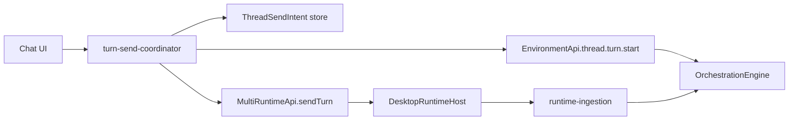

# @multi/app Architecture

The app is a Promise-client UI layer. It coordinates user turns, projects chat rows, and subscribes to runtime overlays. It does not import Pi, execute agents, or synthesize durable orchestration facts from runtime streams.

## Package Boundaries

| Package | Allowed | Forbidden |
|---------|---------|-----------|
| `packages/app` | `@multi/contracts`, `@multi/client-runtime`, `@multi/shared`, React/Zustand UI state | Pi imports, `@multi/runtime`, server internals, Effect services in stores, IPC channel strings, renderer orchestration ingestion from Pi events |
| `@multi/client-runtime` | Promise clients for `MultiRuntimeApi`, `EnvironmentApi`, `LocalApi` | Pi, server internals, UI state |
| `@multi/runtime` | Pi SDK, projections, `ThreadAgentRuntime`, sidecars | React, app stores, desktop IPC |
| `packages/desktop` | `@multi/runtime`, IPC, runtime ingestion, Effect services | Pi types in renderer/preload |
| `packages/server` | Durable orchestration facts and projections | Pi execution, runtime display rows, `chatTimelineRows` |

## Agent-Adjacent SDK Surfaces

| API | Transport | Owns |
|-----|-----------|------|
| `MultiRuntimeApi` | Electron IPC | Pi execution: `sendTurn`, `abort`, `hydrateThread`, credentials, host events |
| `EnvironmentApi` | WebSocket RPC | Durable orchestration facts, projects, git, terminal, thread snapshots |
| `LocalApi` | IPC | Shell/local UI operations only |

## Chat Invariants

- One `MessageId` per send, assigned in `coordinateTurnSend`.
- `thread-timeline-projector.ts` is the sole semantic row projector.
- `MessagesTimeline` renders rows only; no semantic synthesis.
- `agent-runtime-store` is overlay/subscription state only; desktop main ingests runtime persistence.
- All send paths call `coordinateTurnSend` (composer, git actions, queue/retry, draft, worktree, inline edit, plan follow-up).

## Turn Send Flow

## UI Projection

`thread-timeline-projector.ts` inputs:

- committed messages, entries, activities, proposed plans from `EnvironmentApi`
- runtime display overlay from `MultiRuntimeApi` host events
- `ThreadSendIntent[]` for in-flight sends
- active turn state for waiting-row eligibility

Output: ordered `TimelineEntry[]` with stable ids (`message:${MessageId}`).
