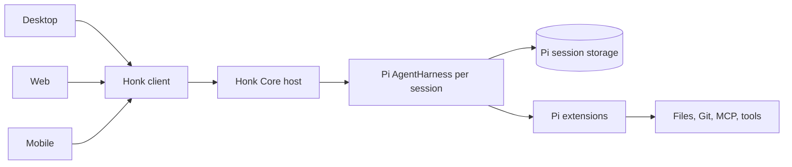

# Honk Core

> **Status:** Working draft. This document helps us build, test, and decide.
> Honk owns it.
>
> Pi's `AgentHarness` is the core. Honk hosts it, extends it, and makes it
> available to desktop, web, and mobile. We do not copy its session model into a
> second Honk model.

## Read this first

The design fits in five statements:

1. One host process opens Honk Core and holds its writer lease.
2. Every Honk session contains a real Pi `AgentHarness`.
3. A workspace is either unopened or trusted; trusted code runs without
   per-action permission checks.
4. Clients reload Pi session data and render the messages themselves.
5. The host keeps running across interface reloads and disconnects.

This is a human-led process. The implementation exists to test these decisions.
When an experiment proves one wrong, we change this document before adding more
wiring.



## Pi source target

Honk targets Pi's current `main` revision when this draft was written:
[`aa0ec808b970db31822e07835a46647cb51d9d66`](https://github.com/earendil-works/pi/commit/aa0ec808b970db31822e07835a46647cb51d9d66).
That commit is the contract for both `@earendil-works/pi-agent-core` and
`@earendil-works/pi-ai`.

The core consumes package output built from that revision. `pi-agent-core` and
`pi-ai` are one atomic dependency and must come from the same revision. A Pi
upgrade is a reviewed core change.

Honk Core does not depend on `@earendil-works/pi-coding-agent` or
`@earendil-works/pi-tui`. Honk owns its host and clients.

# Part I: the boundary

## 1. What Honk Core is

Honk Core is the long-lived host for Pi harnesses and Pi extensions. It owns
process lifetime, session acquisition, the single-writer lease, resilient
session reads, and access to host capabilities.

The core does not replace `AgentHarness`. Pi already owns:

- session persistence and context construction;
- prompt, steering, follow-up, abort, compaction, and tree navigation;
- operation locking and safe points between model turns;
- models, thinking levels, tools, resources, and stream options;
- hooks, events, and extension-facing mutation semantics.

Honk should pass these through. A second session schema or rewritten event
catalog would create two definitions of the same run.

## 2. What belongs in the first build

The first build includes:

1. Session creation, acquisition, execution, and restoration through Pi.
2. Trusted Pi extensions with direct `AgentHarness` access.
3. Resilient session reloads plus live events for desktop, web, and mobile.
4. Pi models and credential resolution without a core allowlist.
5. Battery-included Files, Git, MCP, and Honk tools built on Pi's extension
   points.

Worktrees can wait until these pieces work together. Pairing is not part of the
core specification. A pairing feature may later use the same extension,
interface, credential, and transport hooks as anything else.

The Claude Agent SDK subscription runtime is deferred. Its public query API
owns an agent loop and a separate Claude transcript, so registering it as a Pi
model provider would break the session boundary. The requirements for
reconsidering that integration live in
[Honk built-ins](./honk-built-ins.md#3-claude-agent-sdk-runtime).

## 3. What does not belong here

- Account management, subscription state, usage plans, or billing policy.
- A curated list of models chosen by the core.
- Pairing behavior or a remote-access product design.
- A second transcript, message, tool-call, or session-tree model.
- A durable copy of Pi's live event stream.
- Per-tool allow, ask, deny, or permission modes.

The frontend may ship a small, polished default model list. Settings may add
any model supported by the configured Pi providers. The core accepts the model
selected through Pi's model types and does not judge whether it belongs in the
default interface.

# Part II: the shape

## 4. What `AgentHarness` is

Pi has a persisted `Session` and a live `AgentHarness`.

The Pi session stores entries, branches, model changes, thinking-level changes,
and active-tool changes. `AgentHarness` is the in-memory object that operates on
that session. The host calls `prompt()`, `steer()`, `followUp()`, `abort()`, and
the other Pi operations on it.

The host keeps the Pi session and its harness together while that session is
open. This is private runtime state. Desktop, web, and mobile only see
`sdk.session`; they never receive or serialize an `AgentHarness`.

Live notifications remain Pi `AgentHarnessEvent` values. Honk adds the session
ID needed to route an event, but does not rename fields or create another event
union.

### Pi types and boundary schemas

Desktop, web, and mobile use Pi's exported TypeScript types directly. Honk does
not declare matching message, entry, model, tool, harness-event, or hook types.

At the target revision, Pi does not yet export complete runtime schemas for
session entries, harness events, or its public error classes. The first
in-process client can pass those values without serialization. A remote
transport must wait until the required schemas are exported by Pi. We add them
upstream and consume them from Pi; we do not create Honk-owned copies that can
drift.

The public API does not expose a generic transport envelope. A client calls a
typed SDK method and receives a concrete result:

```ts
await sdk.session.prompt({ sessionId, text: "Explain this repository" });

const state = await sdk.session.reload({ sessionId });
render(state.entries);
```

Request IDs, response correlation, and wire framing belong to the transport
implementation. Once a Pi value crosses that transport, it must use its Pi
schema. A missing upstream schema is a blocker for that remote command, not
permission to invent a Honk equivalent.

Client and host negotiate compatible Honk and Pi protocol versions before
exchanging payloads. A mismatch fails the connection instead of attempting a
best-effort conversion.

## 5. Workspace trust is the only permission gate

Honk asks one question before opening a workspace: **Do you trust this
workspace?**

An untrusted workspace is not a restricted session. It is unopened. Honk must
not load its extensions, MCP configuration, skills, prompts, instructions, or
tools. It may resolve the canonical path and return the small amount of
metadata needed to show the trust prompt.

Once trusted, the workspace is allow-all. Pi, tools, MCP servers, and
extensions may use every host capability exposed to them. There is no second
permission system and no approval callback around individual tool calls.

The proposed client flow is deliberately explicit:

```ts
const opened = await sdk.workspace.open({ directory });

if (opened.type === "trust_required") {
  const accepted = await showWorkspaceTrustPrompt(opened.directory);
  if (!accepted) return;

  await sdk.workspace.trust({ directory: opened.directory });
}

const workspace = await sdk.workspace.open({ directory });
```

`workspace.open()` must check stored trust before it reads workspace-controlled
configuration or creates a harness. `workspace.trust()` is the only approval
API in version zero.

## 6. Construction

Honk Core is battery included. Starting it creates Pi session storage, the Pi
model collection, Honk's Pi `CredentialStore`, file and shell execution, Git,
MCP, Honk tools, and the client transport.

Application code should look like this:

```ts
import { createHonkCore } from "@honk/core";

const core = await createHonkCore({
  dataDirectory: honkDataDirectory,
});

const sdk = core.client(); // one in-process client connected to this core
const workspace = await sdk.workspace.open({ directory });
if (workspace.type !== "ready") return;

const session = await sdk.session.create({
  workspaceId: workspace.id,
  model: { providerId: "anthropic", modelId: "claude-sonnet-4-6" },
});

await sdk.mcp.connect({ workspaceId: workspace.id, server: "github" });
await sdk.session.prompt({
  sessionId: session.id,
  text: "Explain the current auth flow",
});
```

`sdk.session`, `sdk.models`, `sdk.files`, `sdk.git`, and `sdk.mcp` always exist.
The caller does not import factories or assemble an extension list to make Honk
work.

This example has one core and one client. `core.client()` creates a client
connected to the existing core through an in-process transport. It does not
start another core or acquire another writer lease.

Inside `createHonkCore()`, Honk uses APIs present at the pinned Pi source
revision. This is the production shape, with names shortened only where Honk
still needs to implement the surrounding store and extension loading:

```ts
import { AgentHarness, JsonlSessionRepo } from "@earendil-works/pi-agent-core";
import { NodeExecutionEnv } from "@earendil-works/pi-agent-core/node";
import { builtinModels } from "@earendil-works/pi-ai/providers/all";

const storage = new NodeExecutionEnv({ cwd: dataDirectory });
const repo = new JsonlSessionRepo({ fs: storage, sessionsRoot: "sessions" });

const models = builtinModels({ credentials });
const model = models.getModel(providerId, modelId);
if (!model) throw new Error(`Unknown Pi model: ${providerId}/${modelId}`);

const session = await repo.create({ cwd: workspaceDirectory });
const workspaceEnv = new NodeExecutionEnv({ cwd: workspaceDirectory });

const harness = new AgentHarness({
  session,
  models,
  model,
  tools: builtInAndExtensionTools,
  toolContext: () => ({ env: workspaceEnv }),
  resources,
  systemPrompt,
});
```

The core owns the repository for its entire lifetime and restores sessions
lazily: the first command naming a stored session reopens it, gated by the
same trust store that gated its creation. Alongside the `sessions/` tree the
data directory holds `workspaces.json` — trust decisions with their stable
ids — `auth.json` — the Pi `CredentialStore`, one credential per provider —
and the writer lease, a heartbeat file whose freshness is the liveness
signal: a clean shutdown removes it, a crash lets it expire. Tests may use
Pi's in-memory repository; production stays on JSONL until the SQLite store
described by Pi is ready for this path.

`builtinModels({ credentials })` registers Pi's provider collection without a
Honk allowlist. Honk may add providers with `models.setProvider()`. The harness
receives the exact model returned by `models.getModel()`. Credentials belong to
the Pi `Models` collection; they are not a harness callback.

The SDK maps its object-shaped commands to Pi's actual methods. For example,
`sdk.session.prompt({ sessionId, text })` calls `harness.prompt(text)`, and an
authoritative reload reads `session.getEntries()` without calling the harness.

At the target revision, `new AgentHarness(...)`, `harness.subscribe(...)`,
`harness.requestShutdown()`, `harness.waitForShutdown()`, and `Session` reads
are implemented. `AgentHarness.create()`, atomic snapshots, lanes, replay, and
`watch()` appear in `harness-v2.md` but are not implemented APIs. Honk follows
that direction without writing code against methods that do not exist.

### The client SDK

Desktop, web, and mobile use the same method shape over different transports:

```ts
const sdk = await createHonkClient({ transport });

const session = await sdk.session.create({
  workspaceId,
  model: { providerId: "anthropic", modelId: "claude-sonnet-4-6" },
});

await sdk.session.prompt({
  sessionId: session.id,
  text: "Explain the current auth flow",
});
const state = await sdk.session.reload({ sessionId: session.id });

render(state.entries); // Pi SessionTreeEntry[]
```

There is one core host for a data directory and one client for each interface:

```text
one Honk Core host
├── desktop client over IPC
├── web client over the network transport
└── mobile client over the network transport
```

`core.client()` is the in-process form used by host code and tests. A renderer,
web app, or mobile app creates its own `HonkClient` with its transport. All
clients call the same SDK methods and reach the same core.

The core owns sessions, harnesses, storage, extensions, and the writer lease. A
client owns its connection, subscriptions, and disposable reload buffer.
Closing a client detaches that interface. It does not close the core or stop an
active run.

The host does not expose `AgentHarness` over the wire as a serialized object.
It exposes commands that call the real harness and returns Pi values. An
in-process extension receives the actual harness instance.

Provider-specific integrations do not belong in the core contract. The
Claude Agent SDK experiment and its deferral criteria are documented in
[Honk built-ins](./honk-built-ins.md#3-claude-agent-sdk-runtime).

### A client is ready or it does not exist

Construction has no half-ready state:

```ts
const core = await createHonkCore({ dataDirectory });
const local = core.client();

const remote = await createHonkClient({ transport });
```

`createHonkCore()` resolves after it owns the lease and its host-scoped stores,
models, credentials, and built-ins are usable. It rejects if any required part
cannot start. `core.client()` is synchronous because the core is already ready;
it creates another in-process client, not another core.

`createHonkClient()` is asynchronous because a remote client must connect and
negotiate the Honk and Pi protocol versions. It returns a usable client or
rejects. There is no public `init()`, `ready` promise, `isReady` flag, or
nullable namespace.

Workspace-scoped services still open lazily after workspace trust. Their SDK
namespaces exist from construction; opening a workspace makes that workspace's
instances usable.

### One call has one outcome

A synchronous SDK function returns its value or throws. An asynchronous SDK
function fulfills with its value or rejects. Callers never inspect a bag such
as `{ data?, error? }` to discover whether a call worked.

The owner of an operation owns its errors. Pi session and harness operations
keep Pi's exported `SessionError` and `AgentHarnessError` classes, codes, and
messages. Honk does not catch them and translate them into lookalike errors.
The Honk SDK re-exports those Pi classes so applications can narrow errors from
one import without importing `AgentHarness`.

Honk defines `HonkError` only for failures Honk owns. Its codes, canonical
messages, and details schemas live in one catalog:

```ts
// Pseudocode. The catalog derives the error union and its wire schema.
const honkErrors = defineErrors({
  "core.lease_conflict": {
    message: "Another Honk Core already owns this data directory.",
    details: leaseConflictDetails,
  },
  "transport.outcome_unknown": {
    message: "Honk could not confirm whether the operation completed.",
    details: outcomeUnknownDetails,
  },
  "protocol.version_mismatch": {
    message: "The client and host protocol versions do not match.",
    details: protocolVersionDetails,
  },
});

type HonkErrorData = InferErrors<typeof honkErrors>;

declare class HonkError extends Error {
  readonly data: HonkErrorData;
}
```

The catalog is closed at compile time. A throw site selects a catalog entry and
provides details that pass that entry's schema. It cannot invent a code, change
the message, omit required details, or attach details belonging to another
error.

Remote transports send Honk's `code`, `operation`, and typed details. The
client validates them and reconstructs the canonical message from its
negotiated SDK catalog. Local and remote callers therefore receive the same
`HonkError`.

The target revision exports the Pi error classes and code unions but not their
wire schemas. A remote session command waits for those schemas to land upstream
in Pi. Honk will then reconstruct the same Pi error class on the client. It
will not flatten a Pi error into `HonkError` or serialize an arbitrary `cause`.

Code branches on `error.data.code`, never on `message`. Switching on the code
also narrows the details type:

```ts
try {
  await sdk.session.reload({ sessionId });
} catch (error: unknown) {
  if (error instanceof SessionError && error.code === "not_found") {
    forgetSession(sessionId);
    return;
  }

  if (error instanceof HonkError && error.data.code === "transport.outcome_unknown") {
    reconnectAndReload();
    return;
  }

  throw error;
}
```

Honk's canonical messages are known, reviewed, and tested. Pi messages come
from the exact pinned Pi revision. Contract tests record any Pi message on
which Honk relies, and a Pi upgrade must review those assertions. Clients do
not parse either kind of message. They branch on the typed code and may map it
to product copy and localization.

Expected product states are not failures. `workspace.open()` may return
`{ type: "trust_required", ... }`; model status may return
`{ type: "login_required", ... }`; a list may be empty. By contrast, `get()`
returns the requested value or rejects with the owning domain's typed
not-found code. We add a nullable `find()` only when absence is the normal
answer to that exact operation.

Every method defines when success is true. `mcp.connect()` resolves only after
the server is connected. `session.reload()` resolves with an authoritative
read. `session.prompt()` follows Pi's prompt settlement point instead of
returning an invented Honk acknowledgement.

The client may retry declared reads after a transport interruption. It never
automatically retries a mutation. If the transport loses a mutation response
and cannot know whether the host committed it, the call rejects with
`transport.outcome_unknown`; the client reloads authoritative state before
deciding what to do next.

### Namespaces group calls; they do not hide execution

Honk does not begin with a general fluent API. Each operation takes one object
argument so the SDK can add optional fields without positional overloads:

```ts
const session = await sdk.session.create({ workspaceId, model });

await sdk.session.prompt({
  sessionId: session.id,
  text: "Find the reload bug",
});

await sdk.mcp.connect({ workspaceId, server: "github" });
```

The returned `session` is data, not a client-bound object with hidden methods.
It can live in application state, cross a worker boundary, and be rendered by
desktop, web, or mobile. The one client for that interface remains explicit.

A builder is justified only when several synchronous calls accumulate one
atomic request. If Honk later needs one, intermediate methods validate and
return the builder, exactly one terminal method performs I/O, and the builder
is single-use. No version-zero operation needs that abstraction yet.

### Derive the SDK with Effect v4

Honk uses Effect v4 RPC definitions as its command catalog. The RPC group
derives the raw client, handler requirements, encoded protocol, and typed error
channel. We do not run a separate SDK generator or commit generated client
files.

Core uses the repository's exact Effect v4 catalog pin. Because RPC lives under
`effect/unstable/rpc`, an Effect upgrade must pass the SDK contract tests before
the pin changes.

```ts
import { Schema } from "effect";
import { Rpc, RpcGroup } from "effect/unstable/rpc";

const SessionReload = Rpc.make("session.reload", {
  payload: { sessionId: SessionId },
  // These Pi-owned schemas are upstream prerequisites for remote reload.
  success: SessionReloadOutput,
  error: Schema.Union([PiSessionErrorSchema, HonkErrorSchema]),
});

class HonkRpcs extends RpcGroup.make(SessionReload) {}

const handlers = HonkRpcs.toLayer({
  "session.reload": ({ sessionId }) => sessionService.reload(sessionId),
});
```

Effect stays inside the host and transport packages. Pi remains the agent core.
The host wraps Pi promises and callbacks at the service boundary. The public
client exposes `Promise` methods and typed error classes:

```ts
const sdk = {
  session: {
    reload: (input: SessionReloadInput) => runtime.runPromise(rpcClient["session.reload"](input)),
  },
};
```

The namespace facade repeats no payload, result, or error definitions. Its
method types derive from the RPC client. A contract test checks that every RPC
appears in exactly one public namespace. In-process clients use the same RPC
group without serialization; remote clients use an Effect RPC protocol
adapter for their transport.

Honk owns schemas for Honk command inputs, Honk result wrappers, and
`HonkError`. Pi owns the nested Pi values. `SessionReloadOutput`, for example,
adds Honk's transient run status around Pi session entries, but the entry
schema must come from Pi.

Pi 0.83.0 exports no runtime schema for `SessionTreeEntry` from
`pi-agent-core`, and Pi's own remote clients never receive raw entries. Pi's
answer to remote rendering is `@earendil-works/pi-protocol`: runtime TypeBox
schemas for `SessionSnapshot` (authoritative read with phase, revision, and
transcript), `TranscriptItem`, and `TranscriptProgress` deltas, produced by
Pi-owned projections in `pi-server` (`toProtocolUserMessage`,
`toProtocolAssistantMessage`, `toProtocolToolResultMessage`). Snapshots remain
authoritative and deltas are advisory, which is the same read model as section 9. Neither package is published to npm at 0.83.0; `pi-agent-core` and `pi-ai`
are.

When Honk serves a genuinely remote or version-skewed client, it adopts those
Pi protocol schemas and projections. Honk does not write its own projection
and does not ship raw entries across a trust boundary. Until the packages are
published, `packages/pi-protocol` vendors Pi's schema source verbatim at a
pinned upstream ref with a regeneration script; byte-identical vendoring has
no translation drift, and the package dissolves into a dependency swap when
Pi publishes. A converted or hand-written Honk schema remains forbidden.

A transport parses each untrusted value once at its boundary. Trusted code
receives the parsed type; it does not cast or validate the same value again.
Host and client must not hand-write matching interfaces.

## 7. Battery included, extended through Pi

Files, Git, MCP, models, credentials, sessions, and Honk tools are core
features. Their public home is the SDK. Internally they attach tools, resources,
and hooks to the Pi harness.

Pi extensions are still part of version zero. They can add tools, listen to Pi
events, and contribute an SDK namespace. Every loaded extension is trusted.
There is no extension trust level, sandbox mode, or per-extension permission
policy.

The core owns one small piece of bookkeeping for tool contributions. Whenever
MCP or another Pi extension changes its tools, the core recomputes the complete
tool list and calls:

```ts
await harness.setTools(allTools, activeToolNames);
```

Passing `activeToolNames` matters. Pi retains the previous active names when it
is omitted. A removed MCP tool could otherwise fail validation, and a new tool
would remain inactive.

### A turn captures a checkpoint; tools gate attribution

Every settled turn captures a whole-workspace checkpoint: a hidden parentless
commit under `refs/honk/checkpoints/<sessionId>/<entryId>`, written through a
scratch index so the user's index, `HEAD`, branches, and log never move. The
git object store is the only storage, and the ref name is the entire
bookkeeping — no second transcript, no Honk database. OpenCode's message
snapshots, t3 code's checkpoints, and Cursor's checkpoints all converge on
this mechanism.

The diff between consecutive checkpoints is the truth about _content_: it sees
what a shell redirect wrote, what a build step generated, and what an MCP
server changed — everything an argument-reading fold structurally cannot.
What a snapshot cannot say is _whose_ write it was, so the turn's own tool
calls gate the diff:

- A tool that cannot write (`read`) never affects attribution.
- A tool that writes exactly the paths its arguments name (`write`, `edit`)
  declares them, and a turn that used only declaring tools claims only the
  paths it named. This is what keeps a sibling session's edits — two sessions
  can share one directory — and the user's own hand edits out of a turn's
  receipt.
- A tool whose writes are not derivable from its arguments (`bash`, an MCP or
  extension tool) is opaque, and an opaque turn claims the whole diff. The
  gate errs open: over-claiming a path is a visible, correctable mistake,
  while dropping one is an invisible lie.

Three consequences we accept:

- The receipt is advisory for the transcript, never authoritative for the
  working tree. `sdk.git` owns what is actually on disk.
- A workspace without a git repository has no checkpoints, so `changes`
  honestly reports nothing rather than guessing from arguments.
- Attribution is by time window. A hand edit made during an opaque turn lands
  in that turn's receipt; worktree isolation, when it arrives, is the real
  fix, and every shipped checkpoint product accepts the same limit today.

An extension owns schemas for values it introduces. If it exposes a Pi value,
it imports Pi's schema once that schema exists. Until then, that value cannot
cross a remote SDK boundary. The extension does not translate Pi events or
messages into Honk equivalents.

Pi's current lifecycle document warns that a listener can deadlock if it calls
settlement APIs such as `waitForIdle()` during an active run. Pi extensions
must follow Pi's documented lifecycle rules. We should test those rules instead
of hiding them behind another abstraction.

MCP, Files, and Git use Pi's extension points internally, but Honk always ships
them.

The `sdk.*` shape lives in [Honk built-ins](./honk-built-ins.md). Keep that
document and this core boundary in sync while the code takes shape.

## 8. The loop

Pi owns the detailed loop. Honk only hosts it:

```text
host opens core and acquires the writer lease
client asks to open a workspace
    -> core checks the one workspace-trust gate
    -> if untrusted, stop before loading workspace-controlled code
    -> if trusted, continue with allow-all host capabilities

core restores Pi sessions
core installs the battery-included features and Pi extensions on each harness

interface sends a command
    -> core finds the harness
    -> core calls the matching public AgentHarness method
    -> AgentHarness runs and persists the operation

for each AgentHarness event
    -> core publishes it to every attached interface

interface reloads or reconnects
    -> client asks core to reload the Pi session
    -> core reads the session without changing the run
    -> client replaces its local messages and renders them
    -> live event delivery continues
```

Modes, prompts, tools, and resources configure the harness. They do not fork
the loop.

Run control preserves the user's words: `abort` returns the queued messages
Pi cleared (`AbortResult`), so a composer can restore them to the editor —
stopping never destroys typed text. The session is a tree; once tree
navigation is exposed, authoritative reads follow the **active branch**
(Pi's `getBranch()`), never the whole tree, and every linear walk — turn
grammar, workspace trail, model record, per-turn change pairing — walks that
path. Checkpoints are entry-id-keyed and branch-agnostic. The composer
contract lives in spec/conversation.md section 7.

## 9. Reload and live events

The Pi session is the durable truth. Events are temporary notifications that
let an attached interface update without reloading after every change.

```text
interface attaches
    -> start listening for live AgentHarness events
    -> reload the authoritative Pi session
    -> render its messages
    -> apply events that arrived during the read
    -> continue with live events

interface misses an event or reconnects
    -> reload the Pi session again
    -> replace disposable client state
    -> continue with live events
```

`session.reload()` must be an idempotent read. It must work while a harness is
idle or running, and it must not depend on which clients are attached. It
returns committed Pi session data plus enough harness status for the client to
show whether work is active.

```ts
const state = await sdk.session.reload({ sessionId });

render(state.entries); // Pi session entries, rendered by this client
```

Calling `reload()` does not acquire the session, restart the harness, or change
its lifetime. It is safe for three clients to call it independently.

Reload returns committed session data only. It does not persist or reconstruct
partial token updates. If the harness is still running, the client renders the
committed transcript and Honk's existing `Planning next moves` status. The
complete assistant message appears when Pi commits it.

The client library handles the read-to-live handoff with a small in-memory
buffer. It starts listening, notes a local event sequence, performs the read,
then applies newer events. The buffer exists only for that handoff. It is not
storage and can be discarded after the client catches up.

One Pi session owns the entries. Honk does not reconcile another transcript.

## 10. Lease and lifetime

The host that opens the core owns the writer lease. Interfaces do not compete
for it.

```text
desktop or CLI host starts
    -> open core
    -> acquire one lease for the data directory
    -> accept desktop, web, and mobile interfaces

renderer reloads or network disconnects
    -> core and harnesses keep running
    -> interface reconnects and reloads the Pi session

host closes all managed interfaces and shuts down
    -> stop accepting commands
    -> settle or abort active operations by explicit shutdown policy
    -> close harnesses and extensions
    -> release the writer lease
```

A browser refresh or lost phone connection never releases the lease. Only the
host lifecycle can close the core.

At the target revision, Pi exposes `harness.requestShutdown()` followed by
`await harness.waitForShutdown()`. `requestShutdown()` aborts active work and
clears pending queues. If Honk chooses a finish-first host policy, it must await
`harness.waitForIdle()` before requesting shutdown. After every harness has
settled, the host disposes the shared `SessionStore` and releases its lease.

## 11. Models and credentials

The core does not maintain a Honk model allowlist. It passes Pi `Model` values
to the harness and exposes the provider model registry to settings.

The frontend owns presentation policy:

- ship a small default list that feels deliberate;
- show those defaults without setup work;
- let settings add models available through Pi providers;
- store the exact selected Pi model on the session.

The core manages credential access only so Pi can call a provider. For
credential-bearing providers, Honk implements Pi's `CredentialStore` and Pi's
`Models` runtime owns login, request-time resolution, and serialized OAuth
refresh. A provider extension may instead use ambient authentication that its
external runtime owns. It contributes status and setup hooks to `sdk.models`
without copying those credentials into Honk.

The core does not calculate billing, label account plans, choose a cheaper
route, or silently move a session between credentials. Provider APIs remain the
source of usage and billing behavior.

The Pi `anthropic` provider is the explicit Messages API route. A future
subscription runtime must use Anthropic's official authentication path and
must never fall back to API credentials. It does not join Pi's model
collection until it can preserve Pi's loop and sole durable session.

## 12. Files, Git, and MCP

These are battery-included SDK namespaces. Pi's extension points connect them
to each harness.

- Files supply Pi's `ExecutionEnv` and built-in read, write, and edit tools.
- Git exposes typed read and mutation methods to Pi extensions and interfaces.
- MCP manages server definitions, process lifetime, OAuth interactions when a
  server requires them, and its tool registry.
- Honk tools use the same harness tool registry as built-in and MCP tools.

Each feature owns its domain types. It should reuse Pi types wherever Pi already
defines the value. It should not force unrelated Git or file values into the
agent session schema.

Agent-driven Git actions are session commands, not Git namespace methods.
`session.gitAction` appends a `honk.git_action` custom entry naming the action
and prompts the harness with core-owned canonical instructions in the same
handler — append first, so a refused prompt leaves a marker with no turn,
which is the failure state and needs no cleanup. Judgment work (commit
messages, branch names, choosing paths) goes through the agent; the Git
namespace grows typed mutations only for mechanical, fully parameterized
operations. The marker's data stays minimal — the action id and an optional
explicit path scope — never a change list that duplicates `session.changes`.
Plain `custom` entries stay out of model context, so the instruction text
rides the prompt's own user message: model context and stored transcript
stay identical by construction.

# Part III: proof

## 13. Invariants

The first implementation must prove:

1. One core host holds one writer lease for a data directory.
2. Every session operation runs through its real `AgentHarness`.
3. Reloading a session never executes work or changes the session.
4. A missed event is repaired by the next authoritative session reload.
5. Reloading any interface does not stop a run or create another harness.
6. Untrusted workspaces execute no workspace-controlled code.
7. Trusted workspaces have no per-action permission path.
8. Construction never returns a client or core that still needs initialization.
9. Local and remote clients expose the same values and preserve the owning Pi
   or Honk error class, code, and message.
10. The client never retries a mutation whose outcome may already be committed.

Every Pi payload that crosses a trust or version boundary must pass a Pi-owned
runtime schema. No mirrored Honk schema is allowed. A boundary inside one
installed artifact is different: the desktop main process and its renderer
ship from one lockfile, so no version skew can exist between them. That
boundary carries Pi values typed by Pi's exported TypeScript types without a
runtime check, and a pin bump that changes a shape breaks the build at every
usage site. A command for genuinely remote clients stays unimplemented while
its value lacks a published Pi schema; the expected source is
`@earendil-works/pi-protocol` with the `pi-server` projections, which exist at
Pi 0.83.0 but are not yet on npm.

Extensions add their own invariants. MCP must not duplicate tools after a
reload. Git must resolve paths inside the session workspace. File tools must use
the host `ExecutionEnv`.

## 14. TypeScript floor

The repository already enables `strict`, `noUncheckedIndexedAccess`,
`exactOptionalPropertyTypes`, and `noImplicitOverride`. The new core and client
packages add these options from their first file:

```json
{
  "compilerOptions": {
    "noFallthroughCasesInSwitch": true,
    "noImplicitReturns": true,
    "noUnusedLocals": true,
    "noUnusedParameters": true
  }
}
```

Those packages also permit no `any`, no non-null assertions, and no type
assertions outside a validation or branded-value constructor. Boundary data
begins as `unknown` and becomes trusted through its owning schema.

Do not enable `noPropertyAccessFromIndexSignature` repo-wide. A compiler probe
shows that it mostly makes validated record access noisy without finding a
new boundary. Runtime schemas, `unknown`, and `noUncheckedIndexedAccess` cover
the useful risk more directly.

## 15. First experiments

Build these in order:

1. One harness, one fake model, one prompt, and one session reload.
2. Disconnect and reconnect three clients while the prompt is running.
3. Deliver a live event during reload and prove the handoff does not lose it.
4. Drive one workspace-bound session end to end from the desktop renderer
   through the RPC host: trust, create, prompt, queue, steer, abort, live
   events, and a reloaded transcript on screen.
   Core exists to be consumed; this experiment proves the consumption path
   before extensions widen the surface.
5. Install an extension in a trusted workspace that adds a tool and an `sdk.*`
   namespace.
6. Restore after a host restart, then add files, Git, and one MCP server.

Use Pi's faux provider for deterministic loop tests. Each experiment should end
as an invariant test. Delete temporary code that does not belong in the final
path.

## 16. Hard edge still to settle

### Host shutdown

The host owns the lease, but we still need one rule for active work when the
last managed interface closes. The choices are finish, suspend at a Pi safe
point, or abort.

The [Pi AgentHarness lifecycle](https://github.com/earendil-works/pi/blob/aa0ec808b970db31822e07835a46647cb51d9d66/packages/agent/docs/agent-harness.md)
defines the object Honk hosts. The [Pi durable harness design](https://github.com/earendil-works/pi/blob/aa0ec808b970db31822e07835a46647cb51d9d66/packages/agent/docs/harness-v2.md)
defines the persistence and operation model we should follow. Honk adds host
lifetime, extensions, interfaces, and resilient reads without redefining the
harness.
